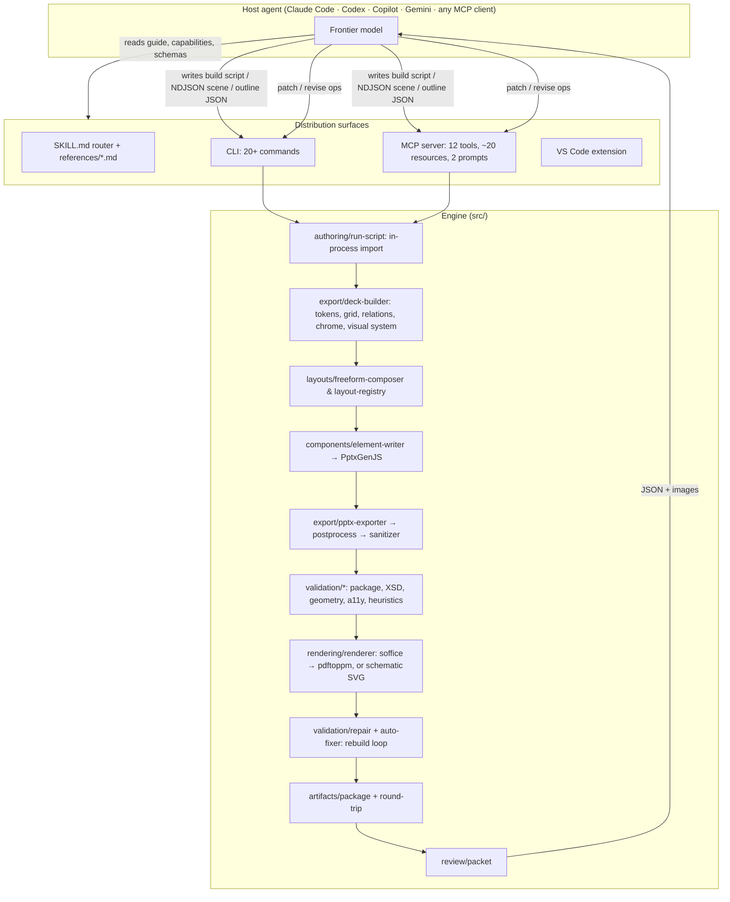

# 01 — Current system audit (V1, 0.15.0)

Part of the [Slide Agent V2 plan](README.md). IDs: strengths `K-*`, findings
`F-*`, security `S-*`. Evidence cites `file:line` at commit `f85fae0`.

---

## 1. Scope and method

**Read:** every module under `src/` (24,710 lines across 31 directories and 8
top-level files), the contract and generated guide, `SKILL.md`, the four ADRs,
the 0.11, 0.13, and 0.15 roadmaps, the 0.15.0 results report, the changelog,
CI, security policy, test configuration, the VS Code extension manifest, and
the example scripts and scenes.

**Ran** (macOS arm64, Node 24.11, LibreOffice and Poppler from Homebrew):

- the full test suite;
- builds of both shipped example scripts, with and without `--render` and `--round-trip`;
- `review` on a rendered deck;
- contract, capability, and schema payload size probes;
- a structural inspection of the emitted `.pptx`: layouts, placeholders, colour references, fonts;
- a content-versus-mechanics split of the example scripts.

**Researched:** current commercial tools, open-source generators, 2025–2026
research on slide generation, editing, and evaluation, and current practice for
agentic tool design. Sources are listed in
[`03 §9`](03-v2-roadmap.md#9-sources).

**Not done:** no live host-model sessions were run for this audit. Numbers
that depend on a host model are either quoted from the project's own
measurements (`docs/roadmap-0.13.0.md`, `docs/roadmap-0.15.0.md`,
`docs/0.15.0-results.md`) or explicitly modelled. Phase 0 task `V2-006`
replaces the modelled numbers with measured ones.

---

## 2. What Slide Agent is today

A TypeScript library, CLI, and MCP server that turns a **model-authored**
description of a deck into an editable `.pptx`, then validates it, renders it,
and packages it. **It contains no model and makes no model calls.** All
judgement — narrative, art direction, coordinates, type sizes, colours, and the
review of renders — is the host agent's.

### 2.1 Component inventory

| Area | Lines | What it does | Assessment |
|---|---:|---|---|
| `validation/` | 3,410 | Package integrity, ECMA-376 XSD via `xmllint-wasm`, manifest geometry, accessibility, heuristics, readiness, repair, issue grouping | Strong, but mostly detects defects after they were built |
| `design/` | 2,851 | Tokens, grid, formats, brand kits, `.potx` import, bilingual, font metrics, graph layout, routing, relations, chrome, visual system | Some of the best code in the repo (graph layout, routing); font metrics are approximations |
| `contract/` | 2,215 | Zod schemas, JSON Schema export, authoring guide as data, capability facets | Good single-source idea; types still duplicated elsewhere |
| `types/` | 1,658 | 104 hand-written exported types plus request schemas | Duplicates the Zod contract (`F-11`) |
| `editing/` | 1,483 | Scene patch ops; OOXML inspector; regex-based PPTX editor | Scene patching is sound; the PPTX editor is fragile (`F-09`) |
| `layouts/` | 1,212 | Freeform composer; 15 built-in fallback layouts | Fallback layouts are explicitly "drafts, not a design system" |
| `rendering/` | 1,162 | LibreOffice/Poppler pipeline, schematic SVG, hand-written PNG codec, preview tiers, contact sheets | Cold process per render (`F-06`); custom PNG codec (`F-22`) |
| `export/` | 963 | Deck builder, exporter, OOXML post-processing, sanitizer | Compensates for PptxGenJS output (`F-08`) |
| `authoring/` | 835 | Build-script API: `defineDeck`, `measureText`, `columns/rows/grid/split/distribute`, `flow`, `card`, `graph` | A good programmatic surface, but still coordinate-level |
| `diagrams/` | 767 | Diagram builder; 5 grammars (layered, swimlane, sequence, hierarchy, quadrant) | Keep |
| `review/` | 677 | Review packet: hashes, fidelity, census, issues, questions | Rich but large (`F-15`) |
| `evaluation/` | 583 | Token estimates; visual signature (silhouettes, variety) | Useful; thresholds uncalibrated (`F-17`) |
| other | ~2,400 | Serialization (NDJSON, revise, diff), images (SSRF-aware fetch), artifacts, themes, data connectors, charts, planner, generators, config, logging, utils | Mixed; the planner and generators are placeholder scaffolding |
| entry points | 2,313 | `pipeline.ts` (884), `mcp-server.ts` (623), `cli.ts` (600), `doctor.ts`, `extensions.ts`, `installer.ts`, `index.ts` | `pipeline.ts` is a monolith (`F-10`) |
| tooling | 2,456 | 33 scripts: release, audits, installers, docs and showcase generation | Mature release hygiene |
| tests | 70 files | 681 passing, 3 skipped, 17.1 s wall on 8 cores; coverage floors per area | Healthy |

### 2.2 Capability inventory

| Capability | V1 status |
|---|---|
| Input formats | Build script (JS module), NDJSON scene, outline JSON, structured request JSON, prompt (placeholder draft only) |
| Elements | Text with rich runs, shapes (any PptxGenJS preset), images (crop, mask, duotone, focal point), tables, native charts (bar, stacked, horizontal, line, area, pie, doughnut, scatter, radar; editable waterfall), connectors with routing, logical groups, symbols |
| Layout help | Absolute inches; `place` relations; `columns/rows/grid/split/distribute/inset`; `flow`; `card`; `graph` (rank, order, place, route); `slideChrome` |
| Design system | Free-form `creativeDirection` plus arbitrary `visualSystem` variables and styles with `$var` references; brand kit JSON or `.potx` import (palette and fonts) |
| Formats | 16:9, 4:3, 9:16, A4 landscape, A4 portrait |
| Languages | Bilingual rendering (parallel, stacked, notes); RTL and script-aware fonts |
| Editing | `patch` (element ops by id), `revise` (replace a slide's records), `edit` (OOXML ops on any PPTX: replace-text, add/duplicate/remove/import/reorder slides, apply-theme, replace-image, update-table, update-chart), `diff` |
| Validation | ECMA-376 XSD, package parts and relationships, geometry, overflow estimate, contrast through translucency, 9 pt floor, alt text, render text fidelity via `pdftotext`, heuristics (hierarchy, contrast, density, variety, evidence, accessibility), readiness verdict |
| Rendering | LibreOffice → PDF → Poppler PNG; schematic SVG when LibreOffice is absent; tiered previews; contact sheet |
| Packaging | Content-addressed assets, relative scene paths, artifact graph with hashes, `--round-trip` rebuild check, reproducible builds via `SOURCE_DATE_EPOCH` |
| Imagery | Local files; opt-in remote fetch with SSRF protection; `ImageResolver` extension seam; provenance and licence fields |
| Data | CSV/TSV/JSON connectors that produce chart and table specs with provenance |
| Extension points | `DiagramGrammar`, `ChartRenderer`, `QualityCheck`, `ImageResolver`, `RenderBackend`, `DesignTokenizer`, `VisualReviewer` |
| Distribution | npm package, user-local installer, skill registration for Codex, Claude, Copilot, and Gemini, MCP server, VS Code extension, Codex plugin, `doctor` |
| Not present | Model calls; document ingestion (PDF/DOCX/web → deck); icon library; speaker-notes generation; animations and transitions (flagged as unsupported); slide masters and placeholders in output; theme-colour references; template-fill or data-bound recurring decks; HTML or Google Slides export; server or API mode; telemetry |

---

## 3. The workflow, and what it costs

The generated `SKILL.md` prescribes a ten-step loop for every deck whose quality matters:

1. read capabilities and the guide sections the deck needs;
2. research, then write claim and source ledgers;
3. invent **at least two** structurally different visual theses;
4. choose one, then write the sequence and silhouette plan;
5. author the deck as a build script (or NDJSON);
6. build with rendering enabled;
7. `review` with the contact sheet;
8. open the suspicious slides one at a time at full detail;
9. patch the specific defects;
10. rerun readiness and the clean-directory round-trip, then deliver.

Steps 2–4 and 7–9 are model turns. Steps 6, 9, and 10 each rebuild the whole
deck. In a host agent, every turn re-reads the entire conversation so far.
Prompt caching makes most of that re-read cheap per token, but not free. So the
bill scales with **turns × context size**, not only with the payload sizes that
0.13 and 0.15 optimised. A 16-turn session whose context grows to ~90k tokens
re-reads ~800k input tokens, even when every individual payload is small (see
[`02 §9.3`](02-v2-architecture.md#93-cost-model)).

The project's own record of a real session (`docs/roadmap-0.15.0.md`): a
17-slide proposal took **5 review rounds**, a **19,133-token** build script, and
**~403,000 tokens** of review evidence on 0.14.0, before counting context
re-reads.

---

## 4. Measured performance and token profile

### 4.1 Build and render time

| Deck | Slides | `build` (no render) | `build --render` | `build --render --round-trip` |
|---|---:|---:|---:|---:|
| `examples/scripts/rollout-deck.mjs` | 4 | 0.40 s | 4.40 s | — |
| `examples/scripts/product-introduction.mjs` | 12 | 0.50 s | 4.95 s | 5.05 s |

The engine itself is fast. **The LibreOffice cold start is ~90% of a rendered
build** (`src/rendering/renderer.ts:76` starts a new `soffice` with a fresh
profile on every call). The same cost is paid again for every repair iteration
that renders, and for every `patch` or `revise` with `--render`.

### 4.2 What a build result costs to read (CLI stdout)

`product-introduction`, rendered, 12 slides: **28,457 characters (~7.1k tokens)**.

| Field | Characters | Note |
|---|---:|---|
| `validation.issues` (flat) | 6,852 | The in-memory report carries both flat and grouped forms |
| `validation.issueGroups` | 1,808 | The same findings, grouped |
| `warnings` | 2,852 | The same messages again (`src/pipeline.ts:678–679`) |
| `validation.quality` | 966 | Byte-identical to `validation.heuristics` (deprecated alias) |
| `validation.heuristics` | 966 | |
| `artifacts` + `generatedFiles` | 6,462 | Overlapping lists of absolute paths |
| `validation.artifacts` | 3,631 | Hashes for every file |
| `validation.render` | 2,556 | |
| everything else | ~2,400 | |

About **45% of the result duplicates something else in the same result.**
0.15.0 grouped findings in `report.json` on disk but not in the returned
result.

### 4.3 What a review costs to read

`slide-agent review` on the same deck: **39,549 characters (~9.9k tokens)** for
a deck with no errors — `slides[]` 29,483, `reviewQuestions` 4,273,
`artifacts` 3,895. The project's own measurement for one full review round on a
16-slide deck after 0.15.0 is **16,462 tokens** (report plus packet).

### 4.4 What a build leaves on disk

| File | Bytes | Note |
|---|---:|---|
| `manifest.json` | 108,889 | Every element with geometry and editability |
| `scene.ndjson` | 75,967 | The canonical blueprint |
| `metadata.json` | 73,954 | Holds the **entire outline again**, plus the request |
| `validation.json` | 11,315 | Grouped report |
| `deck.pdf` + 12 PNG previews | ~1.3 MB | |

An agent that opens these files to "check" a build pays for them.

### 4.5 What authoring costs to write (model output)

Measured on the shipped scripts. "Content" means string literals that contain a
space and are at least 12 characters long, excluding hex colours: a generous
upper bound on the words that appear on slides.

| Script | Slides | Tokens without comments | Per slide | Content tokens per slide | Content share |
|---|---:|---:|---:|---:|---:|
| `rollout-deck.mjs` | 4 | 2,549 | 637 | 126 | 20% |
| `product-introduction.mjs` | 12 | 9,064 | 755 | 145 | 19% |

The project's own split of a real 17-slide script (content 55%, mechanics 33%,
scaffolding 12%) counts content *structures* as content. By either measure,
**most output tokens re-derive layout and style**, and output tokens are billed
at 5× input on current frontier pricing. 0.15.0's `flow` and `card` primitives
reduced a 16-slide script from 10,942 to 10,841 tokens (**−1%**, against a
projected −37%).

### 4.6 What the package contains

Inspection of both built example decks (`rollout-deck.pptx`, 4 slides;
`product-introduction.pptx`, 12 slides):

| Property | Found | Consequence |
|---|---|---|
| Slide layouts | 1 (blank) in each | No layout semantics to reapply or restyle |
| `<p:ph>` placeholders across all slides | **0** in each | PowerPoint sees no slide title: outline view, navigation, the Accessibility Checker's "missing slide title", Designer, Copilot, and section zoom all degrade |
| Colour references | **105 and 564 `a:srgbClr`; 0 `a:schemeClr` in either** | "Change theme" or a corporate template swap does not restyle the deck; rebranding means regenerating |
| Fonts | Literal per-run typefaces | Theme font changes do not propagate |
| Autofit | `normAutofit` set on text bodies | PowerPoint may shrink text differently from what the engine measured |

"Everything stays editable" holds for **objects**. It does not hold for the
**design system**, which is what corporate users edit.

### 4.7 Static surfaces a host reads

| Surface | Size |
|---|---:|
| Whole guide (`contract --format prompt`) | 27,004 chars (~6.8k tokens); the router says ~9.4k with examples |
| `capabilities` (CLI) | 8,952 chars (~2.2k tokens) |
| JSON Schema `outline` / `sceneRecord` / `canvasElement` | 42,535 / 49,421 / 25,370 chars |
| `SKILL.md` + `references/*.md` | 87,045 chars on disk |

The lazy-loading router introduced in 0.13 is a good design. The cost that
remains comes from how much a model must know to place elements by hand.

---

## 5. Strengths to preserve

| ID | Strength | Evidence | V2 treatment |
|---|---|---|---|
| K-01 | Native, editable output. Nothing is flattened to an image. | ADR-0004, `components/element-writer.ts` | Keep, and extend to masters, placeholders, and theme references |
| K-02 | Offline ECMA-376 schema validation with bundled XSDs | `validation/schema-validator.ts`, `assets/ooxml-schemas/` | Keep as a writer conformance gate; cache per part |
| K-03 | Honest verdicts: `packageStatus` separate from `presentationReadiness`; heuristics labelled as heuristics; schematic previews say so | `validation/readiness.ts`, ADR-0001 | Keep the vocabulary; make `ready` reachable deterministically |
| K-04 | Hash-bound evidence and stale-report protection | ADR-0003, `pipeline.ts:718` | Keep, via the content-addressed artifact store |
| K-05 | Portable, content-addressed packages; reproducible builds | `artifacts/package.ts`, `utils/reproducible.ts` | Keep |
| K-06 | Round-trippable scene and semantic diff | `serialization/*`, `artifacts/round-trip.ts` | Keep as SceneGraph v2 plus a V1 importer |
| K-07 | Deterministic diagram intelligence: layered graph layout with crossing reduction, obstacle-aware connector routing, relations solver, 5 grammars | `design/graph-layout.ts`, `design/routing.ts`, `design/relations.ts`, `diagrams/grammars.ts` | Port into the `diagram` leaf, `free` placement, and recipes |
| K-08 | Native charts, including an editable waterfall; data connectors with provenance | `charts/`, `data/connectors.ts` | Keep behind the chart adapter |
| K-09 | Accessibility and contrast rigour, including translucency | `validation/accessibility.ts`, `utils/color.ts` | Move from detection to construction (token pairs) |
| K-10 | Token-awareness culture: budgets, tiered previews, contact sheets, CI budget gates, measurement before claims | `evaluation/token-budget.ts`, 0.13 and 0.15 reports | Keep; switch to provider-reported usage |
| K-11 | Security posture for remote assets: default off, private ranges blocked, magic-byte checks, size caps; hyperlink scheme allowlist | `images/image-manager.ts`, `utils/links.ts` | Keep; close `S-03` and `S-04` |
| K-12 | Brand kit from `.potx`, bilingual/RTL, claim and source ledgers | `design/template.ts`, `design/bilingual.ts` | Keep; brand import becomes the template-native path |
| K-13 | Extension registry concept, `doctor`, multi-host installer, CI on 3 OSes × 2 Node versions, release verification, dependency audit with expiring exceptions | `extensions.ts`, `.github/workflows/`, `scripts/` | Keep and generalise into a plugin system |
| K-14 | Engineering documentation: ADRs with "what would make this wrong", generated docs, measured release reports | `docs/adr/`, `docs/0.15.0-results.md` | Keep the practice |
| K-15 | **No house style.** Art direction belongs to the model; the engine never applies preferences; a reviewer should not be able to tell two decks used the same toolkit | ADR-0001; `docs/roadmap-0.15.0.md` | Keep as V2's first principle. Make it cheap to follow by raising the authoring language, and measure it with designer panels |

---

## 6. Architecture critique

### 6.1 Product thesis: the division of labour is inverted

ADR-0001 draws a line: the engine enforces hard constraints (package integrity,
bounds, legibility floor, contrast, alt text, truthfulness) and never applies
**preferences** (type scale, radius, spacing rhythm, density, palette,
composition). The 0.15.0 roadmap tightens it: the toolkit ships "mechanics only
… never proportion, colour, type, or composition", and "if a reviewer can look
at two decks built on the kit and tell they used the same toolkit, the kit has
overreached."

The intent — avoid a house style — is legitimate. The consequences are
measurable, and they work against every goal of V2:

- **Cost.** The model must emit every proportion, colour, and type decision as a
  literal, for every element, for every deck (§4.5). Output tokens are the most
  expensive tokens, and they are regenerated from nothing for each deck.
- **Latency.** Output-token generation dominates wall time. A deck that is
  75–80% mechanics takes 4–5× longer to author than its content requires.
- **Misplaced effort.** Models are good at deciding what a slide should look
  like and weak at the arithmetic of placing it and at spotting pixel-level
  defects in renders. Vision-language models detect slide design flaws at F1
  0.33–0.66 (SlideAudit), and strong models such as Claude 4.5 Opus reach 45%
  success on PowerPoint tasks (PPT-Eval). V1 asks the model for both
  arithmetic and defect-hunting, and makes "the model looks at the render" its
  quality gate.
- **The measured result.** 0.15.0 shipped primitives within the line and saved
  1%. The finding — "every `fixable: false` prose warning is a design the
  toolkit declined to encode" — is correct. The line prevents acting on it.

**The fix is not to take decisions away from the model.** Products that move
taste into the engine get polish and speed, and pay for it with a recognisable
house look and layouts users cannot escape (§9.1). That trade would remove the
reason to run Slide Agent inside a frontier agent at all. The fix is to change
**how decisions are expressed**: a composition language in grid units, roles,
and named tokens; a design language written once per deck; components defined
once; and an engine that computes geometry, measures text, and verifies the
result. The line ADR-0001 and the 0.15.0 roadmap drew — the model decides
proportion, colour, type, and composition — was right. The primitives shipped
within it still worked in inches and literals, which is why they saved 1%.

### 6.2 The quality model detects instead of constructs

The pipeline is *build → validate → (repair) → render → review → patch →
rebuild*. Consequences:

- Every defect class needs a check, a report entry, a review read, and a patch
  round. `rounded-corner-overhang` (0.14.0) needed three new manifest fields and
  an OOXML preset-geometry reader. A primitive would have prevented it.
- `presentationReadiness` requires host visual findings when the run authored the
  deck. A deck cannot be `ready` on deterministic evidence alone, so every deck
  costs at least one image review round.
- Heuristic thresholds were recalibrated repeatedly without labelled data: the
  0.93 cosine cut over an all-positive feature vector (roadmap-0.15.0, finding 2),
  and floors of 58. The human evaluation protocol was written but has no
  recorded results.

### 6.3 Orchestration is a monolith with no incremental build

`SlideAgent.create()` (`src/pipeline.ts:386–701`) runs, in one method:
- config loading;
- script execution;
- brand application;
- a build–export–validate loop that includes render and repair attempts;
- rollback on regression;
- a reconciliation pass;
- portable packaging;
- scene emission;
- the artifact graph;
- a round-trip rebuild that calls `create()` again;
- report writing;
- result assembly.

`patch()` and `revise()` are thin wrappers that call `create()` on the whole
deck (`:298`, `:357`). There is no cache of any stage, no per-slide work unit,
and no DAG to parallelise. It works at 12 slides. It will not stay responsive at
60 slides with images, and it cannot become a service without being taken
apart.

### 6.4 The writer is a third-party library plus two repair layers

PptxGenJS writes the package. `pptx-postprocess.ts` then adds what PptxGenJS
cannot express: text columns, source crops, masks, duotone. `pptx-sanitizer.ts`
(347 lines) repairs what it emits incorrectly: notes master themes, element
order, chart series sequences. This is capable engineering, and it is also three
layers where one is needed. It explains why the output has no placeholders and
no theme colour references: the abstraction the whole engine is built on does not
model them well.

### 6.5 Text measurement is an approximation doing a measurement's job

`design/font-metrics.ts` embeds Adobe AFM advance widths for Helvetica and
Times, with per-family scale factors and line-height constants. It is far better
than the constant it replaced. It still does not shape text:
- no kerning;
- no ligatures;
- no real advance widths for Aptos, Inter, Calibri, or any display face;
- approximate handling of CJK and complex scripts.

Every overflow verdict inherits the error. That is why render-based fidelity
checks and review rounds are needed to confirm what a shaping engine could
compute.

### 6.6 Editing foreign decks uses regular expressions over XML

`editing/pptx-editor.ts` (753 lines) locates relationships, shapes, tables, and
charts with regular expressions (for example `:54`). OOXML producers vary
namespace prefixes, attribute order, whitespace, and extension lists, so this
breaks on real-world decks. Research systems that edit through an object model
report both higher accuracy and lower cost: Talk-to-Your-Slides is ~87%
cheaper per instruction than vision-driven editing, and PPTArena's PPTPilot
routes between programmatic tools and deterministic XML operations and gains
more than 10 points over VLM agents.

### 6.7 The contract and type system drift

Zod schemas in `contract/schemas.ts` are the published contract. The engine is
written against 104 hand-maintained types in `types/index.ts` (1,472 lines), and
only three `z.infer` uses connect them. The request schemas live in a third file
(`types/schemas.ts`). Three sources for one shape is how silent mismatches
happen — for example a field validated by Zod but ignored by the engine, or the
reverse.

### 6.8 The interface surface is wide and overlapping

The surface includes:
- 20+ CLI commands;
- 12 MCP tools, ~20 resources, and 2 prompts;
- a VS Code extension;
- five input formats;
- three editing mechanisms with different semantics: element ops, slide
  replacement, and OOXML operations.

Each surface is hand-wired: `cli.ts` and `mcp-server.ts` each parse options and
shape results independently. Improvements land in one surface and miss the
other — 0.15.0 found that compact serialisation had reached MCP in 0.13 but not
the CLI.

### 6.9 Release cadence is faster than a contract can stabilise

The project went from 0.0.1 to 0.15.0 between 2026-08-02 and 2026-08-14. It has
two migration guides, and deprecations are accumulating: `quality`,
`includeImages`, `autoFix`, `create --prompt file.json`, and the legacy
`intermediate_files/` and `logs/` paths. For a tool whose product is a contract
that agents are trained or prompted against, churn is a cost to every host.

---

## 7. Weakness and technical-debt register

Severity reflects impact on V2's goals (cost, quality, reliability, scale,
security), not effort.

| ID | Sev. | Finding | Evidence | Impact | V2 disposition |
|---|---|---|---|---|---|
| F-01 | Critical | The only authoring surface is coordinate-level: the model expresses every design decision as inches and literals, repeated per element | §4.5; `docs/0.15.0-results.md` (−1% from primitives) | Most authoring output is arithmetic and repetition, not decisions; slow; costly | D1–D4; `V2-103`, `V2-202`, `V2-204` |
| F-02 | Critical | Quality is detected after build and render, not constructed; `ready` needs host visual findings | §6.2; `validation/readiness.ts`; both example decks end at `review` | Mandatory image review rounds; unreliable gate | D6; `V2-107`, `V2-204`, `V2-305`, `V2-306` |
| F-03 | High | Output is not template-native: 1 blank layout, 0 placeholders, 0 theme colours | §4.6 | Poor fit for corporate use; PowerPoint features blind; rebrand means regenerate | D5; `V2-103`, `V2-104`, `V2-503` |
| F-04 | High | No headless path to a finished deck; prompt mode produces placeholders | `pipeline.ts` `DRAFT_NOTE`; `generators/content-generator.ts` | No API, batch, recurring, or low-cost usage | D7; Phase 4 |
| F-05 | High | Every patch, revise, repair attempt, and round-trip rebuilds the whole deck | `pipeline.ts:298`, `:357`, `:456–540`, `:645` | Latency and render cost grow with deck size × rounds | D8; `V2-301` |
| F-06 | High | Cold `soffice` per render (~4 s floor); LibreOffice ≠ PowerPoint; schematic fallback lacks typography | `rendering/renderer.ts:76`; §4.1 | Slow loop; fidelity doubts; forces conservative review | `V2-208`, `V2-603` |
| F-07 | High | Text measured from embedded AFM tables and scale factors, not shaping | `design/font-metrics.ts` | Wrong overflow verdicts for non-core fonts and scripts; render checks needed to compensate | `V2-107` |
| F-08 | High | PptxGenJS plus post-processor plus sanitizer compensate for each other | `export/pptx-postprocess.ts`, `export/pptx-sanitizer.ts` | Blocks placeholders and theme references; fragile to library upgrades | D5; `V2-104`, `V2-105` |
| F-09 | High | Foreign-PPTX editing uses regex over XML; small operation set | `editing/pptx-editor.ts:54` and throughout | Breaks on real-world decks; not a base for NL editing | `V2-501`, `V2-502` |
| F-10 | Medium | `create()` monolith mixes 12 concerns | `pipeline.ts:386–701` | Hard to cache, parallelise, test, or serve | `V2-301` |
| F-11 | Medium | Types defined twice (hand-written interfaces vs Zod) | `types/index.ts` (104 types), `contract/schemas.ts` (3 `z.infer`) | Silent contract drift | `V2-101`, `V2-102` |
| F-12 | Medium | Wide, overlapping surface: 20+ commands, 12 tools, 5 input formats, 3 edit mechanisms | §6.8 | Learning and token cost for hosts; features land unevenly | D9; `V2-302` |
| F-13 | Medium | Prescribed 10-step loop multiplies turns | §3; `SKILL.md` | Context re-reads dominate cost once payloads are small | 02 §5; `V2-303`, `V2-304` |
| F-14 | Medium | Build results report findings three times, plus an alias and overlapping path lists | §4.2; `pipeline.ts:678–679` | ~45% of every result is duplication | `V2-005` |
| F-15 | Medium | Review packet ~9.9k tokens on a healthy 12-slide deck; delta review, `--check`, `--only` planned but not built | §4.3; `docs/0.15.0-results.md` "Not done" | Every round pays full price | `V2-303` verdicts and deltas |
| F-16 | Medium | Large, duplicative on-disk artifacts (`metadata.json` repeats the outline) | §4.4 | Agents that inspect files pay; storage at scale | RunRecord and compact manifest (`V2-301`) |
| F-17 | Medium | Uncalibrated heuristics; no human-labelled data; evaluation protocol never run | §6.2; `docs/human-evaluation.md` | Gates that cannot be trusted either way | `V2-006`, `V2-007`, `V2-407` |
| F-18 | Medium | Build scripts imported in-process with a cache-busting query; no isolation or timeout | `authoring/run-script.ts:50` | Module cache grows for the life of an MCP server; a hung script hangs it | `S-01`; `V2-606` |
| F-19 | Medium | Contract churn: 15 minor versions in 13 days, two migration guides, accumulating deprecations | `CHANGELOG.md`; §6.9 | Host instability; compatibility code | Stability policy (02 §13); remove list (03 §1) |
| F-20 | Medium | Token accounting is chars/4, MCP-only; no provider usage, no cost, no per-stage timings | `evaluation/token-budget.ts`; `pipeline.ts` metadata | Cannot optimise what is not measured per stage | `V2-401`, `V2-605` |
| F-21 | High | **Bug:** `exports["./contract"]` points at `dist/contract/index.js`, which the build never emits | `package.json:42`; tsup entries are `index`, `cli`, `mcp-server`; the import fails with "Cannot find module" | Published subpath unusable by consumers | `V2-000` |
| F-22 | Low | Hand-written PNG decoder, encoder, and resizer for contact sheets | `rendering/png.ts` (415 lines) | Maintenance; slower than libvips | Replace with `sharp` (`V2-208`) |
| F-23 | Low | Engine logs interleave with test output; no correlation IDs across invocations | test run output; `logging/logger.ts` | Debugging friction | `V2-605` |
| F-24 | Medium | Capability gaps against the market: no document ingestion, icon library, notes generation, template-fill or data-bound decks, animations, or HTML or Google Slides export | §2.2 | Less useful for the most common real-world jobs | 03 §1 "Add" |
| F-25 | Low | VS Code extension duplicates flows that MCP-capable hosts already provide | `extensions/vscode/` (separate build, audit, and release) | Release and maintenance surface for little unique value | Thin client over CLI/MCP, or retire (03 §1) |

---

## 8. Security findings

| ID | Sev. | Finding | Evidence | Fix |
|---|---|---|---|---|
| S-01 | Critical | **Code execution through MCP.** `slide_agent_run` accepts any structured request. `create` accepts `script`, which `runBuildScript` imports and runs inside the server process. The tool is annotated `destructiveHint: false`, which clients may treat as safe to auto-approve. A prompt-injected model can run any `.mjs` on disk — including one it just wrote — with the user's privileges, bypassing the host's shell-approval prompt. | `mcp-server.ts:337–349`; `types/schemas.ts:38`; `authoring/run-script.ts:50` | `V2-001`: refuse `script` over MCP unless the operator sets `SLIDE_AGENT_ALLOW_SCRIPTS=1`; correct annotations; sandbox scripts in V2 (`V2-606`) |
| S-02 | High | **Unconfined filesystem access.** Request paths (`output`, `reportPath`, `metadataPath`, `inspectPath`, `previewsDir`, `scene`, `brand`, `configDir`, image `path`) are resolved as given, with no root or `realpath` check, on both CLI and MCP. A request can overwrite any user-writable file or embed any readable image into a deck. `SECURITY.md` says paths are treated as untrusted, but only URLs are enforced. | `pipeline.ts:427–433`; `images/image-manager.ts` `locate` | `V2-001`: workspace roots (MCP `roots`, `--root`), `realpath` confinement, symlink-escape refusal, output extension allowlist |
| S-03 | Medium | **The untrusted party controls network opt-in.** `allowRemoteAssets` is a request field, so model-authored content can turn fetching on. | `types/schemas.ts` request schemas; `pipeline.ts:459` | `V2-004`: operator-only setting (env or config); a request flag can narrow the policy but never widen it |
| S-04 | Medium | **DNS rebinding window.** The host is resolved and checked, then `fetch` resolves again independently. | `images/image-manager.ts:217`, `:248` | `V2-004`: undici `Agent` with a `connect.lookup` that returns only the validated address |
| S-05 | Medium | **External processes without limits.** `runProcess` never times out, never kills, and buffers unbounded output. A hung LibreOffice (common on malformed input) hangs the CLI or the MCP server indefinitely. | `utils/process.ts:88–104` | `V2-002`: timeout, process-group kill, output cap, a per-command budget |
| S-06 | Medium | **Archive bombs.** Every PPTX is read fully into memory by `JSZip.loadAsync`, with no limits on entry count, uncompressed size, or compression ratio — across `validate`, `edit`, `import-slide`, `--brand x.potx`, and inspection. | `editing/pptx-inspector.ts:181`; `editing/pptx-editor.ts:73`, `:432`; `validation/schema-validator.ts:87`; `themes/theme-manager.ts:37`; `design/template.ts:188` | `V2-003`: read the central directory first; enforce caps; stream |
| S-07 | Medium | **Unsandboxed rendering of untrusted documents.** LibreOffice runs with the user's privileges and network access, with no container and no seccomp. Office suites have a history of document-triggered vulnerabilities and can follow external links. | `rendering/renderer.ts` | `V2-002` (local hardening: profile settings, link updates off); `V2-603` (containerised, no-network render workers) |
| S-08 | Low | **Executable discovery trusts PATH broadly.** `findExecutable` searches every PATH entry and several user-writable directories, so a relative or writable PATH entry can supply a planted `soffice` or `pdftoppm`. | `utils/process.ts` `executableSearchDirectories` | `V2-002`: ignore relative PATH entries; prefer configured absolute paths; log the resolved binary |

V2 adds new attack surface — model calls, document ingestion, plugins, a
multi-tenant server — addressed in [`02 §16`](02-v2-architecture.md#16-security-architecture).

---

## 9. How V1 compares with the field

### 9.1 Approaches in use (as of September 2026)

| Approach | Examples | How the model is used | Output | Strength | Weakness | Lesson for V2 |
|---|---|---|---|---|---|---|
| AI-native web or card formats | Gamma | Generates content into the product's own format; layout by the product | Web decks; PPTX export secondary (reviewers report that export breaks layouts) | Speed, polish | Weak PPTX fidelity and editability; the product's layouts set the look | Engine-computed layout gives polish; keep the design decisions with the model, and keep PPTX as the primary format |
| Office-embedded copilots | Microsoft Copilot in PowerPoint (agentic slide generation GA in April 2026) | Plans and fills inside the application | Native PPTX | Lives where users already work; enterprise distribution | Needs M365 and Copilot licences; bound to the Office host | Template and placeholder-native output is table stakes for enterprise |
| Constraint-template platforms | Beautiful.ai Smart Slides | Minimal; layouts adapt automatically | Proprietary with export | "Can't make an ugly slide": auto reflow, resize, contrast | Users cannot override layout logic, so decks share the platform's look | Adopt adaptive constraints as computation (reflow, fit, contrast), not as taste; every adjustment reported and refusable |
| Research-first agents | Genspark, Manus | Web research, outline, slides | Web or PPTX | Content quality (Manus led independent content tests) | Cost and latency of long agent runs | Keep research, content, and design decisions with models; move computation and verification to the engine |
| Image-rendered slides | NotebookLM Slide Decks (Gemini + Nano Banana Pro) | The model produces each slide as an image | PPTX export (February 2026) with **one image per slide** | Visual novelty; strong source grounding (top on PresentBench) | Not editable | Editability is a real differentiator worth keeping |
| General agent + skill | Anthropic `pptx` skill | The model writes PptxGenJS code or edits template XML; `validate.py`; thumbnail grid; LibreOffice → images for visual QA | Native PPTX | Simple, general, template-editing path | Same token and loop economics as V1; guidance by prose | V1 is a heavier version of this pattern; V2 must beat it on cost and correctness, not only on checks |
| Open-source generators | Presenton | LLM fills HTML/Tailwind templates; templates induced from existing PPTX or PDF; API; bring-your-own-key | PPTX and PDF | Template reuse; API and self-hosting | HTML → PPTX conversion limits native fidelity | Template induction from customer decks is expected; API mode is expected |
| Reference-induction and edit actions | PPTAgent / DeepPresenter (EMNLP 2025, ACL 2026; 9B model; MCP server) | Learns slide functional types and content schemas from reference decks, then emits edit actions on reference slides | PPTX | Strong on PPTEval (content, design, coherence); a small fine-tuned model | Research-grade tooling | Generate **into** existing layouts; small models suffice when the action space is structured |
| Program synthesis | AutoPresent / SlidesBench (CVPR 2025) | The model writes slide programs; an 8B tuned model approaches GPT-4o | PPTX via code | Programmatic beats image generation | Still coordinate-level code | A tighter, higher-level program space (grid units, roles, tokens) makes models more effective per token |
| Design-then-implement | DeepSlides (2026) | Design stage separated from code stage; RL-trained agents | Slides | Human-preference gains from decoupling design from code | Training-heavy | Decouple *deciding* the design (the model's composition and design language) from *realising* it (the engine's solver and writer) |
| Object-model editing | Talk-to-Your-Slides (ACL Findings 2026); PPTArena / PPTPilot | Edit through the structure, not pixels; route between programmatic tools and deterministic XML operations; plan → edit → check | PPTX | ~87% cheaper per instruction than vision-driven editing; +10 points on compound edits | Long-horizon, deck-scale edits remain hard | Leveled edit operations on an object model; verify only what changed |
| Evaluation practice | PPTEval, PresentBench (~54 binary checklist items per instance), SlideAudit (flaw taxonomy), PPT-Eval (rubrics, τ_b 0.77 with humans) | LLM or VLM judges with rubrics and taxonomies | — | Rubrics and taxonomies raise judge reliability | Judges remain weak alone (F1 0.33–0.66) | Deterministic checks first; taxonomy- and checklist-based critic only on flagged slides; calibrate against human labels |

### 9.2 Agentic-system practice relevant here

| Practice | State of the art | V1 | V2 |
|---|---|---|---|
| Progressive disclosure | Load tool and guide detail on demand. Code execution with MCP (Anthropic's example: 150k → 2k tokens); tool search / deferred tools. | Router `SKILL.md`, faceted capabilities | Catalog-first; grammar page with worked examples; recipe, font, and icon detail on demand; ≤ 7 tools |
| Structured outputs | Schema-constrained generation (strict tools, output formats) | JSON Schema published; NDJSON authored by hand | DeckIntent requested via structured outputs; zero invalid-JSON retries |
| Prompt caching | Stable prefixes first, volatile content last; 1-hour TTL for batch | Not designed for (no model in-process); MCP payloads not byte-stable | Byte-stable catalog, schema, and prompts; MCP `ttlMs`/`cacheScope` hints |
| Model routing and effort control | Route per task; try lower effort on one model before cascades; judge cost per completed task | n/a | Task → tier routing with profiles (02 §10) |
| Async long-running operations | MCP Tasks (experimental in 2025-11-25; an extension in the 2026-07-28 release candidate) | Blocking tool calls | `finalize` and `generate` as Tasks |
| Interactive UI in the host | MCP Apps extension (sandboxed HTML views) | Images returned inline | Optional preview and overlay app |
| Stateless, scalable MCP transport | 2026-07-28 release candidate removes the session handshake; round-robin load balancing | stdio only | Streamable HTTP, stateless workers |
| Server-side model use without keys | Sampling with tools (2025-11-25) | n/a | Engine-managed flows via host sampling when available |
| Batch economics | Batch APIs at ~50% | n/a | Bulk jobs through batch |

### 9.3 Where V1 leads, and where it trails

**Leads:**
- offline schema validation of every part;
- an honest two-axis verdict;
- hash-bound, portable, reproducible packages;
- a round-trippable scene;
- deterministic diagram layout with routing;
- first-class token accounting and budget gates.

Few tools in the landscape do any of these.

**Trails:**
- template and brand-native output;
- cost and latency per finished deck;
- ingestion of source documents;
- a headless or API path;
- robust editing of foreign decks;
- calibrated quality measurement;
- a compact authoring language for design decisions, and the vocabulary around
  it: fonts that reach the audience, icons, chart styling.

---

## 10. Summary

V1 answered the question "how can a host model express any slide and be told
the truth about what it built?" very well. V2 keeps that question and adds a
second: **"how can a model's design judgement become a correct, distinctive,
editable deck at a fraction of the tokens — and at volume when needed?"** That
calls for:
- moving computation, not decisions, from the model into code;
- a composition language and a design language compact enough that the tokens
  go to judgement;
- building correctness in, and spending the model's look on design;
- emitting PowerPoint's own design-system structures, including embedded fonts;
- a way to run without a frontier host that keeps a capable model directing.

V1's strongest assets — validation, packaging, diagram intelligence, and
honesty — carry into V2 almost intact.
