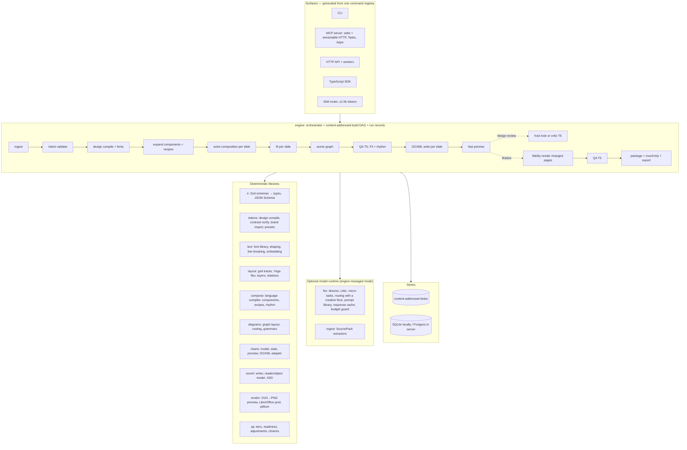
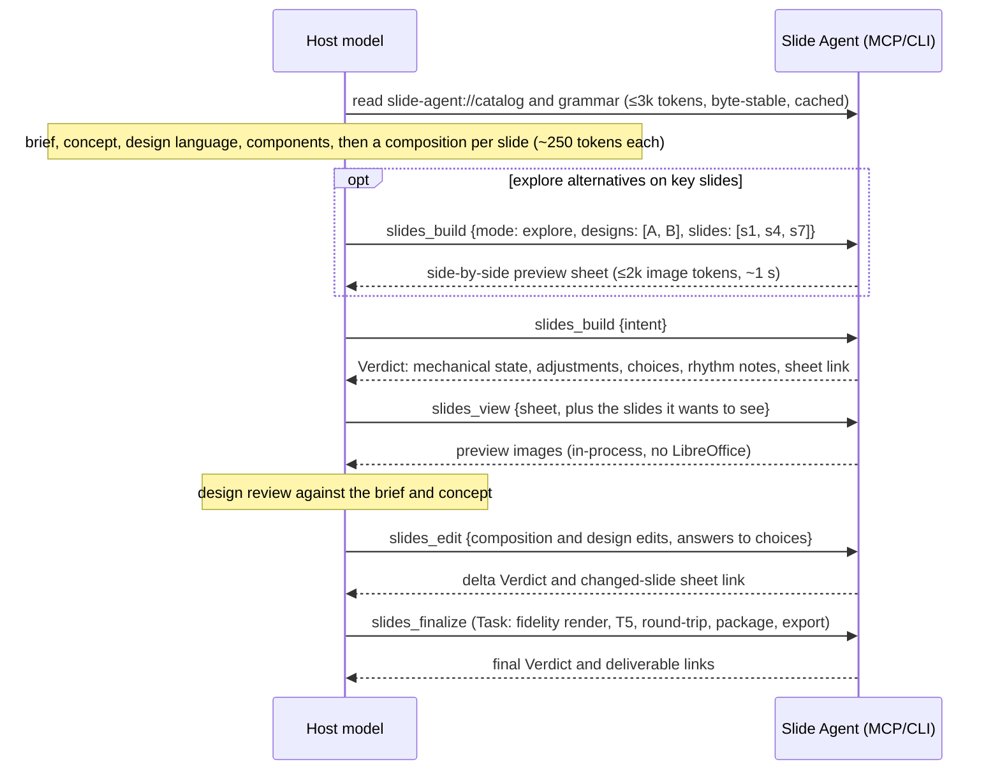
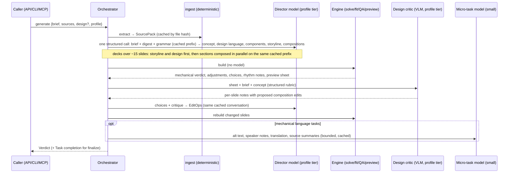
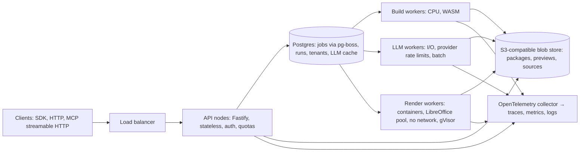

# 02 — V2 architecture

Part of the [Slide Agent V2 plan](README.md). Findings `F-*` and `S-*` are in
[`01`](01-current-system-audit.md); tasks `V2-*` are in
[`03`](03-v2-roadmap.md). Code blocks are **interface sketches**: they fix
names, shapes, and responsibilities, not final implementations.

---

## 1. Design principles

| # | Principle | What it rules in | What it rules out |
|---|---|---|---|
| P1 | **The model directs; the engine executes.** | The model decides everything a designer would argue about: message, emphasis, visual concept, design language, composition, rhythm. The engine computes everything that has a right answer: frames, text measurement, fitting, contrast verification, routing, OOXML. | The engine choosing taste on the model's behalf; the model doing arithmetic |
| P2 | **Spend tokens on judgement, not arithmetic.** | A compact composition language in grid units, roles, and named tokens; components defined once per deck; previews cheap enough to look at | Coordinates, point sizes, and colour literals repeated per element; review rounds spent hunting overflow |
| P3 | **No silent taste.** | Every engine change to a model decision is a reported, reversible *adjustment*. Design-changing fit moves come back as *choices*. Recipes and presets are opt-in, and every verdict says how much of a deck used them. | Automatic variant switching, auto-generated themes, or automatic sequencing in a directed deck |
| P4 | **Construct, check, then judge.** | Mechanics built correct and checked deterministically; the model's look spent on design judgement against the brief | A vision pass as the way to find overflow and collisions |
| P5 | **Quality gates before cost gates.** | Blind designer comparisons at every phase gate; a cost lever becomes a default only when it does not lose them | Shipping a cheaper default that makes decks generic; draft output presented as directed output |
| P6 | **Pay for surprise.** *(V1 principle 8, kept)* | Verdicts, deltas, and pull-on-demand detail | Returning evidence the caller did not ask for |
| P7 | **Native to PowerPoint's design system.** | Masters, layouts, placeholders, theme colours and fonts, embedded fonts, notes, alt text, reading order | Loose text boxes pretending to be titles |
| P8 | **Explainable and reproducible.** | Versioned grammar, recipes, and prompts; content-addressed stages; run records; `explain` | Unrecorded heuristics; hidden model decisions |
| P9 | **One core, many surfaces.** | A command registry that generates the CLI, MCP, HTTP, and SDK | Hand-wired surfaces that drift |
| P10 | **Measure before claiming.** *(V1 culture, kept)* | Eval harness, designer panels, and budget gates on every phase | Projected savings or quality accepted without measurement |
| P11 | **No ambient authority for model-authored input.** | Operator-owned policy; confinement; sandboxes | Request fields that widen permissions |

**The line V1 drew stays where it was.** ADR-0001 says the engine enforces hard
constraints and never applies preferences. The 0.15.0 roadmap says a reviewer
should not be able to tell that two decks came from the same toolkit. V2 keeps
both, because they protect the reason anyone runs this tool inside a frontier
agent: the model's design judgement.

What changes is **how decisions are expressed**. V1's primitives still worked in
inches and literals, so they saved 1% (audit §4.5). V2's composition language
works in grid units, roles, and named tokens, and the engine computes the rest.
The same decisions then cost about a third of the tokens, and the saving comes
from arithmetic, repetition, and defect-hunting — not from the decisions.

**Hard constraints are unchanged** (ADR-0001): package integrity, bounds (except
declared bleed), legibility floors, contrast, alt text, and truthfulness. The
engine repairs a contrast failure with the nearest passing value and reports it;
a model that pins the failing value gets a blocking finding, never a silent fix.

---

## 2. Target architecture



### 2.1 Package layout

```text
packages/
  ir/          Zod schemas (DeckIntent, composition nodes, DesignLanguage, SceneGraph, EditOp, RunRecord, Verdict) → types, JSON Schema, docs
  tokens/      design-language compiler (roles → theme slots, contrast verification, nearest passing values), DTCG import/export, brand import with locks, presets for draft mode
  text/        font library and resolver, harfbuzz shaping, UAX #14 line breaking, measurement cache, subsetting and embedding
  layout/      grid-track resolver, Yoga flex wrapper, layer and free placement (V1 relations solver), connectors
  compose/     composition language compiler, components, recipe library, draft-mode selector, rhythm analysis
  diagrams/    graph layout, connector routing, grammars (ported from V1)
  charts/      ChartModel, deterministic stats, SVG preview renderer, OOXML chart adapter
  icons/       licensed icon sets, SVG → custGeom converter, search index
  ooxml/       template-native writer, DOM reader/object model, XSD validation, compatibility rules
  render/      SceneGraph → SVG → PNG preview, contact sheets, exploration sheets, crops, fidelity backends
  qa/          check tiers T0–T6, readiness state machine, adjustments, choices and suggested edits, calibration data
  llm/         provider adapters, routing profiles, prompts, response cache, budget guard (optional install)
  ingest/      md, docx, pdf, pptx, xlsx, csv, html → SourcePack (optional install)
  engine/      orchestrator DAG, cache store, run records, edit application, explain/replay
  commands/    command registry: schemas, handlers, budgets, annotations
  cli/  mcp/  server/  sdk/     surfaces
  compat-v1/   scene/1 importer, DeckBuilder shim, V1 command aliases
  eval/        harness, corpus, designer-panel tooling, metrics, reports
  workbench/   composition workbench dev app
```

Dependency rule: libraries never import surfaces or the orchestrator.
`llm/` and `ingest/` are optional, so a host-mode install carries no provider
SDKs.

---

## 3. Data model: the IR stack

Each representation has one owner and one level of abstraction. Edits go to the
highest level that can express them.

| IR | Produced by | Consumed by | Level | Persisted as |
|---|---|---|---|---|
| **SourcePack** | `ingest` (deterministic) | director, citations | Source facts | `sources/*.json` + blobs |
| **DeckIntent** | Model (host or engine-managed director), template-fill bindings, or a human | orchestrator | What to say and how it is designed: direction, design language, components, and each slide's composition | `intent.json` (canonical, diffable) |
| **ThemeSpec** | `tokens` compiling the design language (or a brand, or a preset) | layout, writer, QA | Resolved tokens, fonts, theme-slot mapping | `theme.tokens.json` (DTCG) |
| **LayoutTree** | `compose` + `layout` + `text` | scene builder | Solved geometry per slide | Cache only |
| **SceneGraph v2** | scene builder | writer, QA, preview, diff | Every element, with semantics, token references, provenance, adjustments, and pins | `scene.json` (canonical, round-trippable) |
| **Package** | `ooxml` writer | people, PowerPoint | Native PPTX | `deck.pptx` |
| **RunRecord / Verdict** | orchestrator, QA | host, observability | What happened and whether it is ready | `run.json`; verdict returned inline |

### 3.1 DeckIntent

The primary authoring format. The model writes its decisions — the visual
concept, the design language, reusable components, and each slide's
composition — in grid units, roles, and named tokens. It never writes inches,
EMUs, or per-element colour and size literals, and it never has to: the engine
solves geometry from the composition. The intent is requested through
structured outputs, or validated at the edge when a host writes it by hand.

```ts
// packages/ir/src/intent.ts (sketch)
export const DeckIntent = z.object({
  schema: z.literal("slide-agent.intent/1"),
  brief: z.object({
    title: z.string().max(120),
    audience: z.string().max(160),
    goal: z.string().max(240),
    tone: z.string().max(60).optional(),
    language: z.string().default("en"),
    format: z.enum(["16:9", "4:3", "9:16", "a4-landscape", "a4-portrait"]).default("16:9"),
    archetype: z.enum(["board", "pitch", "report", "training", "technical", "sales", "keynote", "general"]).optional(),
  }),
  direction: z.object({
    concept: z.string().max(600)
      .describe("The visual idea in plain words: what the deck should feel like, and why that suits this audience and goal"),
    fit: z.enum(["ask", "auto"]).default("ask")
      .describe("ask: design-changing fit moves come back as choices; auto: the engine may apply them"),
  }),
  design: DesignRequest,                                  // §3.2
  components: z.record(ComponentName, ComponentDef).optional(),   // §6.3: defined once, used on many slides
  slides: z.array(Slide).min(1).max(300),
  sources: z.array(Source).optional(),                    // with SourcePack span references
  claims: z.array(Claim).optional(),                      // V1 honesty ledger, optional
  options: z.object({
    chrome: z.object({ slideNumbers: z.boolean(), footer: z.string().max(80).optional(), logo: z.string().optional() }).partial().optional(),
    speakerNotes: z.enum(["none", "authored", "generate"]).optional(),
    fonts: z.enum(["embed", "office-safe"]).optional(),   // §6.7; default embed when the design uses non-Office faces
  }).optional(),
});

const SlideBase = z.object({
  id: z.string().regex(/^[a-z0-9][a-z0-9-]{0,40}$/),
  message: z.string().max(200).describe("What the audience should take away from this slide"),
  notes: z.string().max(1500).optional(),
  sources: z.array(z.string()).optional(),
  pins: z.array(Pin).optional(),                          // refused adjustments and element overrides (§6.12)
});

export const Slide = z.union([
  SlideBase.extend({ compose: CompositionNode }),         // directed: the model's own composition (default, §6.2)
  SlideBase.extend({ recipe: RecipeId, content: z.record(z.unknown()), adjust: z.array(RecipeAdjust).optional() }),  // a starting point, adapted (§6.4)
  SlideBase.extend({ auto: TypedContent }),               // draft: the engine picks a recipe (§6.5), labelled in the verdict
  SlideBase.extend({ canvas: z.array(CanvasElementV1Compatible) }),  // compat-v1 only
]);
```

Schema maxima are structural limits. Capacity comes from measurement (§7.2):
when content does not fit a region, the verdict returns choices or a suggested
edit with an exact character budget.

**Example — the same slide three ways.** Slide 2 of `rollout-deck.mjs` (a
six-stage process with routed connectors) is ~60 lines of script plus a shared
`stage()` helper: **~700 output tokens**, most of them coordinates and literals.

*Directed (V2 default), ~180 tokens.* The model decides that the pilot is the
point of the slide, so it gets twice the width, the signal colour, and a larger
label:

```json
{"id":"route","message":"Every wave clears the same six gates; waves fail at the pilot",
 "compose":{"grid":"12x6","items":[
  {"at":"c1-9 r1","text":"Every wave clears the same six gates","role":"title"},
  {"at":"c1-12 r3-6","row":{"gap":"space.3","connect":"chevron","items":[
   {"use":"gate","n":"01","label":"Inventory","detail":"what talks to what"},
   {"use":"gate","n":"02","label":"Identity","detail":"one directory"},
   {"use":"gate","n":"03","label":"Policy","detail":"deny by default"},
   {"use":"gate","n":"04","label":"Pilot","detail":"one business unit","grow":2,"tone":"signal","size":"+2"},
   {"use":"gate","n":"05","label":"Expand","detail":"wave by wave"},
   {"use":"gate","n":"06","label":"Enforce","detail":"legacy paths off"}]}}]}}
```

The `gate` component is defined once for the whole deck (~70 tokens, §6.3). The
engine solves the grid and the row, measures every label, routes the chevrons,
binds the title placeholder, and emits theme-referenced shapes.

*Recipe (starting point or draft), ~125 tokens.*

```json
{"id":"route","message":"Every wave clears the same six gates","recipe":"process/chevrons",
 "content":{"title":"Every wave clears the same six gates","steps":[{"label":"Inventory","detail":"what talks to what"},
  {"label":"Identity","detail":"one directory"},{"label":"Policy","detail":"deny by default"},
  {"label":"Pilot","detail":"one business unit"},{"label":"Expand","detail":"wave by wave"},{"label":"Enforce","detail":"legacy paths off"}]},
 "adjust":[{"node":"steps[3]","set":{"grow":2,"tone":"signal"}}]}
```

The model spends its effort where the deck needs it: hero slides composed by
hand, routine slides (agenda, sources, Q&A) from recipes. That allocation is
itself a model decision, and the verdict reports it (`authoring`, §3.6).

### 3.2 DesignRequest, DesignLanguage, and ThemeSpec

```ts
export const DesignRequest = z.union([
  z.object({ language: DesignLanguage }),                                   // directed: authored by the model (default)
  z.object({ brand: z.string(), language: DesignLanguage.partial().optional() }),  // brand tokens + locks; the model directs within them
  z.object({ preset: z.string(), params: PresetParams.optional() }),        // draft: a generated theme, labelled
  z.object({ tokens: DtcgTokenDocument }),                                  // advanced: a full W3C DTCG 2025.10 document
]);

export const DesignLanguage = z.object({
  concept: z.string().max(400).optional(),               // defaults to direction.concept
  color: z.object({
    palette: z.record(ColorName, OklchOrHex),            // named colours: "paper", "ink", "signal", …
    roles: z.object({ background: ColorName, surface: ColorName, text: ColorName, muted: ColorName,
                      accent: ColorName, accentAlt: ColorName.optional(), rule: ColorName.optional() }),
    data: z.array(ColorName).max(8).optional(),          // series order for charts
  }),
  type: z.object({
    display: FontSpec,                                   // { family, weight, tracking?, case? }
    body: FontSpec,
    mono: FontSpec.optional(),
    scale: z.union([
      z.object({ base: z.number().min(12).max(32), ratio: z.number().min(1.1).max(1.8) }),
      z.record(TypeRole, z.number()),                    // explicit point sizes per role
    ]),
    leading: z.record(TypeRole, z.number()).optional(),
  }),
  space: z.object({ unit: z.number(), margin: Relative, gutter: Relative, baseline: z.number().optional() }),
  grid: z.object({ columns: z.number().int().min(1).max(24), rows: z.number().int().min(1).max(24) }),
  shape: z.object({ radius: z.number().min(0), stroke: z.number().min(0), shadow: z.enum(["none", "soft", "hard"]).optional() }),
  surfaces: z.record(SurfaceName, SurfaceSpec).optional(),   // e.g. "card", "band", "quiet"
  texture: z.array(TextureRule).max(6).optional(),        // model-authored decoration from primitives (§6.7)
  imagery: ImageTreatment.optional(),                     // default crop and treatment (duotone, grayscale, tint…)
  charts: ChartStyle.optional(),                          // axis weight, gridlines, highlight rule, label placement
  chrome: ChromeSpec.optional(),                          // footer, slide number, logo design
});
```

A design language is typically **800–1,500 output tokens, written once per
deck**. It carries every decision V1 made the model repeat on every element.

**Compile** (`tokens/compile.ts`), deterministic, **verifying rather than
choosing**:
1. **Fonts.** Resolve each family through the font registry (§6.7): bundled
   library, installed fonts, brand fonts, or an operator-allowed OFL download.
   A face that cannot be resolved is a finding with the closest available faces
   by classification and metrics. Metric-compatible substitutes (Carlito for
   Calibri) are applied only for layout-preserving substitution, and reported.
2. **Colour roles.** Map roles and palette colours onto the 12 theme slots
   (`dk1, lt1, dk2, lt2, accent1–6, hlink, folHlink`); extra named colours go to
   `a:custClrLst` and are counted as literals.
3. **Contrast.** Verify every declared foreground/fill pair, and later every
   pair actually used in a composition (T1). A failing pair gets the nearest
   passing value by OKLCH lightness (4.5:1 body; 3:1 large text and graphics),
   applied as a reported **adjustment**. A pin that refuses it becomes a
   blocking finding.
4. **Type.** Resolve the scale into point sizes per format; enforce legibility
   floors (body ≥ 14 pt at 16:9) as findings, not silent changes.
5. **Emit** the ThemeSpec (DTCG), `theme1.xml`, and master text styles.

The same DesignRequest always compiles to the same ThemeSpec (versioned
compiler).

**ThemeSpec token groups** (DTCG 2025.10 format):

| Group | Tokens | OOXML mapping |
|---|---|---|
| `color.palette` / `color.role` | The model's named colours and role assignments | Theme slots; extras in `a:custClrLst` |
| `color.on` | Verified foreground for each fill in use | Chosen per shape at solve time |
| `color.data` | Series order | `accent1..6`, then `lumMod`/`lumOff` tints |
| `font.family` | `display, body, mono`, resolved, with embed status | `a:fontScheme` major/minor; mono as an explicit latin face |
| `font.size` | Per role and format | Point sizes resolved at solve time |
| `space`, `grid` | Unit, margins, gutters, baseline; columns and rows | Inches at solve time |
| `radius`, `stroke`, `shadow` | From `shape` and `surfaces` | `adj` values; `a:ln w`; `a:effectLst` |
| `texture` | Rule ids plus parameters | Procedural decorative shapes, `decorative` flag |
| `chrome` | Footer, slide number, logo | Master placeholders |

**Brand import** (`tokens/import-template.ts`, extending V1 `design/template.ts`)
reads `theme1.xml` colours and fonts, master text styles, and layout
placeholders. It produces locked tokens plus a **LayoutMap** (§6.10). The model
still writes the concept, the unlocked parts of the design language, and every
composition — on-brand does not have to mean generic.

**Presets** (`tokens/presets.ts`) keep a deterministic generator (mood, seed
colour, mode, contrast, density) for **draft mode** and template-fill. A preset
theme is labelled in the verdict (`design: preset`). It is never chosen on a
directed deck's behalf.

### 3.3 Composition nodes, components, and recipes

One language serves the model, components, recipes, and third-party packs, so
a recipe is only a saved composition and the model can open and edit any of
them (§6.4).

```ts
// packages/ir/src/compose.ts (sketch)
export const CompositionNode: z.ZodType<CompositionNode> = z.lazy(() => z.union([
  Container("grid",   { grid: GridSpec.optional() }),            // "12x6" or the design grid
  Container("row",    FlexSpec), Container("column", FlexSpec),   // gap, align, justify, wrap, pad
  Container("layer",  { anchor: Anchor.optional() }),            // overlap in one box, in order
  Container("free",   {}),                                       // children carry box: [x, y, w, h] in grid units
  Leaf("text",    { text: RichText, role: TypeRole, size: Step.or(Pt).optional(), weight, tone, font, case, tracking,
                    align, valign, lines: z.number().optional(), balance: z.boolean().optional(), fit: FitPolicy.optional() }),
  Leaf("shape",   { preset: PresetShape.optional(), path: SvgPathInUnitBox.optional(), fill: ColorRef, stroke: StrokeRef, ratio }),
  Leaf("image",   { asset: AssetRef, alt: z.string(), crop: Crop.optional(), treatment: Treatment.optional(), fit: z.enum(["cover", "contain"]) }),
  Leaf("icon",    { name: IconName.or(IconQuery), size: SizeRef, tone }),
  Leaf("chart",   { data: ChartData, kind: ChartKind.optional(), highlight, annotate: z.array(FactRef).optional(), style }),
  Leaf("table",   { data: TableData, highlight, style }),
  Leaf("diagram", { grammar: DiagramGrammar, nodes, edges, groups, node: ComponentName.optional(), emphasis }),
  Leaf("use",     { component: ComponentName, props: z.record(z.unknown()) }),   // written as {"use": "gate", …props}
  Leaf("texture", { rule: TextureRuleId, params: z.record(z.unknown()).optional() }),
  Leaf("rule"), Leaf("space"),
]));

// Every node may carry placement and modifiers:
const Common = z.object({
  id: z.string().optional(),               // for edits, recipe adjustments, and explain
  at: CellRange.optional(),                // "c1-7 r2-6" inside a grid
  box: GridBox.optional(),                 // inside free: [x, y, w, h] in grid units, fractions allowed
  grow: z.number().optional(), basis: Relative.optional(),
  bleed: z.array(z.enum(["left", "right", "top", "bottom"])).optional(),
  surface: SurfaceName.or(SurfaceSpec).optional(),
  connect: z.enum(["line", "arrow", "chevron", "dots"]).optional(),   // containers: connectors between children, routed
  z: z.number().optional(), rotate: z.number().optional(), opacity: z.number().optional(),
  decorative: z.boolean().optional(), order: z.number().optional(),   // accessibility
});
```

Values are **named tokens** (`space.3`, `signal`, `muted`, `card`), **relative
units** (grid cells, `fr`, `%`, type steps such as `+2`), or — when the model
wants one — a **literal**, which is recorded as such (`size: 120` for a
poster-scale numeral). Literals are allowed, not required; §6.2 lists what the
language deliberately never asks for.

A **recipe** is a composition with named slots, a capacity table per slot, and
an auto-fit ladder for draft mode:

```json
{
  "id": "metrics/row", "family": "metrics", "version": "1.0.0",
  "slots": { "title": "text", "metrics": { "min": 2, "max": 5, "item": { "value": "text", "label": "text", "note": "text?" } }, "takeaway": "text?" },
  "root": { "column": { "gap": "space.6", "items": [
    { "id": "title", "text": "{title}", "role": "title" },
    { "id": "metrics", "row": { "gap": "space.5", "grow": 1, "align": "stretch", "each": "metrics", "item":
      { "column": { "surface": "card", "grow": 1, "gap": "space.2", "pad": "space.4", "items": [
        { "text": "{value}", "role": "display", "tone": "accent", "fit": { "minStep": -2 } },
        { "text": "{label}", "role": "h3" },
        { "text": "{note}", "role": "small", "tone": "muted", "optional": true } ] } } } },
    { "id": "takeaway", "text": "{takeaway}", "role": "body", "optional": true } ] } },
  "autoFit": ["reflow", "size:-1", "recipe:metrics/grid", "shorten"]
}
```

### 3.4 SceneGraph v2

The canonical, round-trippable record of what was built. It replaces
`scene.ndjson` as the engine's truth. A V1 scene imports into it (`compat-v1`).

```ts
export const SceneElement = z.object({
  id: z.string(),                         // stable: `${slideId}/${nodePath}` or the node's id
  kind: z.enum(["text", "shape", "image", "icon", "chart", "table", "connector", "group"]),
  role: z.enum(["title", "subtitle", "body", "label", "caption", "metric", "decorative", "chrome", "data", "media", "connector", "container"]),
  frame: Rect,                             // inches, solved
  placeholder: z.object({ type: z.string(), idx: z.number().optional() }).optional(),
  style: StyleWithTokenRefs,               // colours as theme references where possible
  content: ElementContent,                 // runs, table cells, chart model ref, image asset ref
  fit: z.object({ status: z.enum(["fit", "reflowed", "scaled", "choice-pending", "recipe-switched", "split", "shortened", "overflow"]), steps: z.array(z.string()) }).optional(),
  provenance: z.object({
    source: z.enum(["composed", "component", "recipe", "draft", "canvas"]),
    path: z.string(),                      // JSON pointer into the intent
    component: z.string().optional(), recipe: z.string().optional(), version: z.string().optional(),
  }),
  adjustments: z.array(z.object({          // engine changes to a model decision, always reported
    kind: z.enum(["contrast", "type-step", "snap", "font-substitute", "clamp-bounds"]),
    from: z.unknown(), to: z.unknown(), reason: z.string().max(120),
  })).optional(),
  pins: z.array(z.string()).optional(),    // properties set or adjustments refused by the author; kept across rebuilds
  alt: z.string().optional(),
  readingIndex: z.number().optional(),
});
```

### 3.5 EditOp: one operation model, four levels

| Level | Examples | Rebuild scope | Typical cost |
|---|---|---|---|
| `intent` | Change a message or text, add a metric, reorder slides, edit a composition node by JSON pointer, answer a choice, open a recipe as a composition | Changed slides | ~20–300 output tokens |
| `design` | Change a palette colour, a face, the scale, a surface, a texture rule; apply a brand | Whole deck from solve (text measurement stays cached where faces are unchanged) | ~20–200 tokens |
| `element` | Pin a solved value; refuse an adjustment; hide an element | Changed slide | ~30 tokens |
| `package` | Operations on foreign PPTX through the object model: text, table, chart data, image, reorder, layout reassign, theme remap | Changed parts | ~30–100 tokens |

```ts
export const EditOp = z.discriminatedUnion("level", [
  z.object({ level: z.literal("intent"), op: z.enum(["set", "insert", "remove", "move", "choose", "expand"]), path: JsonPointer, value: z.unknown().optional() }),
  z.object({ level: z.literal("design"), op: z.enum(["set", "remove", "brand"]), path: JsonPointer.optional(), value: z.unknown().optional() }),
  z.object({ level: z.literal("element"), slide: z.string(), element: z.string(), set: ElementOverride }),
  z.object({ level: z.literal("package"), op: PackageOp }),
]);
```

V1's `patch`, `revise`, and `edit` map onto these levels (see
[`03 §2`](03-v2-roadmap.md#2-migration-strategy)).

### 3.6 Verdict and RunRecord

The **Verdict** is what a caller reads inline. It is capped by the response
budget (§9.4).

```ts
export const Verdict = z.object({
  run: z.string(),                                   // run id; details in run.json
  state: z.enum(["broken", "needs-attention", "ready-unrendered", "ready"]),   // mechanical readiness (§8.2)
  slides: z.number(),
  changed: z.array(z.string()).optional(),           // slide ids changed by this run
  authoring: z.object({ composed: z.number(), recipe: z.number(), draft: z.number(), design: z.enum(["authored", "brand", "preset"]) }),
  designReview: z.enum(["none", "host", "critic"]),
  issues: z.array(z.object({ code: z.string(), severity: z.enum(["blocking", "major", "minor"]), count: z.number(), where: z.array(z.string()).max(8), hint: z.string().max(140) })).max(12),
  adjustments: z.array(z.object({ kind: z.string(), count: z.number(), where: z.array(z.string()).max(8) })).max(6),
  suggestedEdits: z.array(SuggestedEdit).max(10),    // choices, budgets, reconciliations (§8.3)
  rhythm: z.array(z.object({ slides: z.tuple([z.string(), z.string()]), similarity: z.number(), note: z.string().max(80) })).max(5),
  views: z.object({ sheet: ResourceLink.optional(), slides: z.array(ResourceLink).optional() }),
  cost: z.object({ engineMs: z.number(), modelTokens: z.object({ input: z.number(), output: z.number(), cached: z.number() }).optional(), usd: z.number().optional() }),
  more: z.string().optional(),                       // e.g. "14 minor findings: slides_view report"
});
```

The **RunRecord** (`run.json`) holds everything else:
- the DAG with per-stage timings and cache hits;
- decisions the engine made: recipe expansions, draft-mode selections with
  scores, adjustments, and choices returned;
- fit-ladder steps;
- the full grouped findings;
- artifact hashes (V1's artifact graph);
- model calls with usage and prompt versions;
- engine, grammar, recipe, font, and compiler versions.

---

## 4. Operating modes

One orchestrator, four ways in. They differ in **who directs the design** and
how much of the deck the model composes.

| Mode | Who directs | Model calls by Slide Agent | Best for | Cost per 12-slide deck (modelled, §9.3) |
|---|---|---|---|---|
| **Host-agent** | The host's model: concept, design language, compositions, design review | None | Developers and agents already inside Claude Code, Codex, Copilot, or Gemini | ≈ $0.53 directed, with one design review (Opus-5-class host); ≈ $0.27 draft |
| **Engine-managed** | Slide Agent's director model at the profile's tier, or the host via MCP sampling | Director, design critic, micro-tasks | APIs, batch, non-developers, recurring generation | ≈ $0.15 `balanced`; ≈ $0.42 `quality`; ≈ $0.035 `draft`; $0 marginal `local` |
| **Template-fill** | Nobody at fill time: bindings from data into an intent template — usually one a model directed once | None (optional phrasing micro-task) | Weekly reports, QBRs, per-account decks at volume | ≈ $0 |
| **Edit** | EditOps from a host or a person; natural-language design edits go to the director tier | Routing; design edits | Revising generated or foreign decks | ~$0.001–0.02 mechanical; ~$0.01–0.05 design edit |

**Directed and draft are labels, not hidden modes.** Every verdict reports how
many slides the model composed, how many came from recipes, and whether the
design language was authored, a brand, or a preset (§3.6). Draft output — a
small model filling recipes under a preset theme — is useful for internal
drafts and volume. It is never the default, and it is never presented as
directed work.

The V1 prompt-only "structural draft" mode is removed. Engine-managed mode is
its honest replacement (see [`03 §1`](03-v2-roadmap.md#1-features-keep-redesign-remove-add)).

---

## 5. Agent workflow redesign

### 5.1 Host-agent mode: direct, look, refine



Six to eight tool calls, one design review, and no defect-hunting rounds. The
**draft** path (recipes, preset theme, no review) takes three to five calls and
is labelled.

**What changes in the host's loop**, compared with V1's ten steps:

| V1 step | V2 |
|---|---|
| Read capabilities and guide sections (~5–9k tokens) | One catalog with the composition grammar and worked examples (≤ 3k), byte-stable so it caches; recipes, fonts, and icons searched on demand |
| Invent two visual theses | **Kept as a decision, made cheap to test.** The model writes a concept and a design language (~1–1.5k tokens). For high-stakes decks it writes two and previews both on key slides side by side before committing (`mode: explore`, ~1 s) |
| Write the sequence and silhouette plan | **Kept with the model.** The verdict returns rhythm notes (similar adjacent silhouettes, density monotony); the model decides whether they are a problem |
| Author coordinates, styles, and components | Compose in grid units, roles, and tokens; components defined once; the engine solves geometry, measures text, routes connectors |
| Render, then review a contact sheet and full slides | A fast preview sheet, reviewed for **design judgement** against the brief. Overflow, collisions, contrast, and bounds are already constructed or reported |
| Patch by element id after reading a packet | Edit compositions or the design language; answer choices (size down, widen the region, split) |
| Round-trip and readiness | Part of `finalize`, as an asynchronous Task |
| Claim and source ledgers | Still supported and still honest; optional unless the brief demands citations |

### 5.2 MCP tool surface v2

Seven tools, each with an `outputSchema`, `structuredContent`, accurate
annotations, and a response budget enforced in tests.

| Tool | Input | Output | Annotations | Response budget |
|---|---|---|---|---|
| `slides_catalog` | `{ include?: ["grammar", "components", "recipes", "fonts", "icons", "presets", "schema"] }` | Composition grammar digest with worked examples; starter components; recipe one-liners; font and icon search pointers; presets (draft) | `readOnlyHint` | ≤ 3,000 tokens default |
| `slides_build` | `{ intent \| intentRef, mode?: "check" \| "build" \| "explore", explore?: { designs: DesignRequest[] (≤ 3), slides: SlideId[] (≤ 4) } }` | Verdict; in `explore`, a side-by-side sheet link | writes under workspace root only | ≤ 800 tokens (≤ 30 slides, ≤ 10 codes) |
| `slides_edit` | `{ deck, ops: EditOp[] }`, or `{ deck, instruction }` in engine-managed mode | Delta Verdict and changed-slide sheet link | writes under root | ≤ 500 tokens |
| `slides_view` | `{ deck, what: "sheet" \| "slides" \| "crop" \| "rhythm" \| "expand" \| "report" \| "explain", slides?, issue? }` | Images, compact text, or a recipe expanded into its composition | `readOnlyHint` | Sheet ≈ 1.85k; crop ≈ 160; rhythm ≤ 300; expand ≤ 600 per slide; report paged |
| `slides_finalize` | `{ deck, exports?: ["pdf", "png"], fidelity?: "libreoffice" \| "plugin:<id>" }` | Task → final Verdict | long-running (Tasks) | ≤ 800 tokens |
| `slides_inspect` | `{ file }` (foreign PPTX or template) | Object-model summary: layouts, placeholders, brand tokens and locks, per-slide text outline | `readOnlyHint` | ≤ 1,500 tokens (paged) |
| `slides_generate` | `{ brief, sources?, design?, profile? }` (engine-managed) | Task → Verdict | `openWorldHint` when providers are used | ≤ 800 tokens |

Resources:
- `slide-agent://catalog` (byte-identical for a given version, with MCP
  `ttlMs`/`cacheScope` where supported);
- `slide-agent://grammar` (≤ 2,000 tokens: the composition language with worked
  examples — the most important page a host reads);
- `slide-agent://examples/{archetype}` (complete directed intents with their
  design languages, on demand);
- `slide-agent://fonts?q=` and `slide-agent://icons?q=` (search);
- `slide-agent://recipes/{id}` (slots, capacity, one example);
- `slide-agent://schema/intent` (full JSON Schema, for validators — not for
  reading);
- `slide-agent://runs/{id}` (RunRecord).

Previews are returned as **resource links**, never inline by default. An
optional **MCP Apps** view renders an interactive preview with element,
adjustment, and issue overlays for hosts that support it.

### 5.3 Engine-managed mode



- **The director is not a small model** in `balanced` or `quality`. Direction,
  composition, critique, and revision stay at the profile's tier; only
  mechanical language tasks go to small models (§10.2).
- **One critique-and-revise pass** is the default; a second pass is allowed by
  budget. The critic judges the deck against the brief and concept, not against
  a generic checklist.
- **Parallel composition** for large decks keeps wall time down without
  lowering the tier: the director fixes the concept, design language,
  components, and storyline first, so section composers share one design.
- **MCP sampling:** when the client supports sampling with tools, the same flow
  can run on the host's model with no API keys configured on the server.
- **Draft profile:** a small model writes content and recipe choices under a
  preset theme, with no critic. The verdict says `authoring.draft`.

### 5.4 Template-fill mode

An **intent template** is a DeckIntent with bindings (`{{account.name}}`,
`{{#each quarters}}`) plus data-shape assertions. The best templates are
**directed once and filled many times**: a model (host or `quality` profile)
designs the concept, design language, components, and compositions for a QBR
or weekly report, a person approves it, and `slide-agent fill --template
qbr.intent.json --data accounts.csv --out out/` produces one deck per row,
deterministically. Compositions declare which regions may grow or split with
the data. Optional per-slide takeaway phrasing uses a micro-task over
statistics that `charts/stats` computes, and is off by default. This is the
volume path: thousands of decks at near-zero model cost, with the design
quality of a directed deck.

### 5.5 Edit mode

1. **Route.** An EditOp passes through directly. A natural-language instruction
   is classified by rules, then a small model when rules are ambiguous, into
   **mechanical** edits ("change the Q3 number", "move slide 5 after 2") and
   **design** edits ("make slide 4 calmer", "this feels generic"). Mechanical
   edits become EditOps directly; design edits go to the director tier with a
   preview of the affected slides and the deck's concept.
2. **Apply** at the highest level possible (§3.5). Foreign decks go through the
   `ooxml` object model, never regular expressions.
3. **Verify only what changed**: rebuild changed slides, run T0–T4 on them,
   render only changed pages at finalize.
4. **Return** a delta Verdict and a semantic diff (V1 `diff`, extended with
   preview pixel diffs).

---

## 6. Design vocabulary: what the engine provides, what the model decides

### 6.1 Division of labour

The test for every row: *would two good designers argue about it?* If yes, the
model decides. If it has a right answer, the engine computes it.

| Concern | The model decides | The engine provides and computes | Model tokens no longer spent (vs V1) |
|---|---|---|---|
| Message and emphasis | The headline claim; what is big, what is quiet, what is cut | Measurement, capacity, exact character budgets | — |
| Visual concept | The idea, in words, and why it suits this audience and goal | Records it; shows it to the critic; never scores taste against a house style | — |
| Colour | Palette, roles, where the accent goes, data colours | Contrast verification, nearest passing value, theme-slot mapping, tints | Hex literals on every element |
| Typography | Faces, scale, weight, tracking, case, where display type goes | Font resolution, shaping, line breaking, embedding, legibility floors | Point sizes and font names on every run |
| Composition | Grid, regions, proportion, alignment, overlap, bleed, white space | Frames, track sizing, baseline snapping, connector routing, reading order, placeholders | ~400–500 tokens per slide of coordinates |
| Components | What a card, a stat, or a step looks like — defined once | Instantiation on every use; fitting inside each instance | Redefinition on every slide |
| Rhythm | Sequence, pacing, where to break the pattern | Silhouette and density analysis; notes on near-repeats | — |
| Charts | Form, what to highlight, the annotation, the takeaway wording | ChartModel, computed facts, axis maths, native chart parts | ~150–400 tokens per chart |
| Diagrams | Grammar, emphasis, node design | Layout, crossing reduction, obstacle-aware routing | ~300–800 tokens per diagram |
| Icons and imagery | Whether to use them at all; which; treatment and crop intent | Native icon geometry, focal crops, duotones, alt-text checks | Icon paths and image maths |
| Texture | The decorative idea: rules, marks, bands, frames | Primitives drawn from tokens, marked decorative | Drawing code |
| Routine slides | Whether a recipe is good enough for agenda, sources, or Q&A | Recipes | The whole slide |

### 6.2 The composition language

The composition language (`slide-agent.compose/1`) is how the model says what
it wants a slide to look like. It borrows from CSS grid and flexbox because
models already use those vocabularies fluently, and it stops before geometry.

**Containers**

| Container | Says | Solved by |
|---|---|---|
| `grid` | Place children in cells of the design grid (`"at": "c1-7 r2-6"`); unplaced children flow | Grid-track resolver (fixed, `fr`, `auto`) |
| `row`, `column` | Stack children with `gap`, `align`, `justify`, `wrap`, `pad`; children `grow` or take a `basis` | Yoga flexbox with text measure callbacks |
| `layer` | Overlap children in one box, in order, with an `anchor` | Layer solver |
| `free` | Art-directed placement: `box: [x, y, w, h]` in grid units, fractions allowed | V1 relations solver |

Any container can carry a `surface` (fill, stroke, radius, shadow, image),
`connect` (lines, arrows, chevrons, or dots between successive children, routed
by the engine), `bleed` to page edges, `rotate`, and `z`. Components and recipes
repeat a child over a list with `each` and `item`.

**Leaves:** `text` (role, size step or literal, weight, tone, case, tracking,
alignment, maximum lines, balanced wrapping, fit policy), `shape` (any ECMA-376
preset, or an SVG path in a unit box), `image`, `icon`, `chart`, `table`,
`diagram`, `use` (a component), `texture`, `rule`, and `space`.

**Semantics come from roles.** `role: "title"` binds the title placeholder;
document order is reading order unless `order` says otherwise; `decorative`
elements are excluded from reading order and alt-text checks.

**What the language never asks the model for:** inches or EMUs; the same colour
or size repeated per element (roles and tokens carry them); connector routes;
chart or icon geometry; placeholder XML; text measurements. Literal values are
still *allowed* for a deliberate exception and are recorded as literals.

**Example — a hero metric slide the model composes** (~190 tokens):

```json
{"id":"turn","message":"Churn fell 41% once onboarding moved in-product",
 "compose":{"grid":"12x6","items":[
  {"at":"c1-7 r1-4","layer":{"anchor":"bottom-left","items":[
    {"texture":"margin-rule"},
    {"text":"−41%","role":"display","size":180,"tone":"signal","tracking":-0.04}]}},
  {"at":"c1-6 r5-6","column":{"gap":"space.2","items":[
    {"text":"Churn fell 41% in two quarters","role":"title"},
    {"text":"after onboarding moved in-product","role":"body","tone":"muted"}]}},
  {"at":"c8-12 r1-6","bleed":["right","top","bottom"],"surface":"band","column":{"pad":"space.6","justify":"center","items":[
    {"chart":{"data":"churn-by-month","kind":"line","highlight":"after-launch","annotate":["change:2025-10..2026-03"]}},
    {"text":"Cohorts Jan–Jun 2026, n = 18,400","role":"caption","tone":"muted"}]}}]}}
```

**Expressiveness gate (`V2-202`).** Before 2.0, 30 showcase-class slides — V1
showcase slides and designer-made references — are re-expressed in the
language. At least 90% must be expressible without `free`, 100% with it, at a
median ≤ 300 tokens per slide, with designers judging the re-expression faithful.
A language that fails this pushes models back to bland layouts or to `free`
placement, and both defeat the plan.

### 6.3 Components

Components are compositions with parameters, **defined by the model once per
deck** in `components`:

```json
"components":{
 "gate":{"params":["n","label","detail"],"root":{"column":{"surface":"card","pad":"space.3","gap":"space.1","items":[
   {"text":"{n}","role":"label","font":"mono","tone":"muted"},
   {"text":"{label}","role":"h3"},
   {"text":"{detail}","role":"small","tone":"muted"}]}}}}
```

- An instance can override any property (`{"use":"gate", …, "tone":"signal"}`).
- The engine fits text inside every instance and reports the instance that
  needs a choice, not the component.
- A component can be promoted to an organisation library
  (`slide-agent components promote`) and reused across decks. Promotion is a
  person's decision; nothing is promoted automatically.
- The catalog ships a small set of **starter components** (stat, quote block,
  step, person, logo row) as examples of the language, not as a house style.

### 6.4 Recipes: starting points and draft mode

A recipe is a saved composition with named slots, a capacity table, and an
auto-fit ladder. Recipes serve three purposes:
1. **Draft mode and template-fill**, where the engine fills them.
2. **Routine slides in directed decks**, where the model judges a recipe good
   enough and adapts it with `adjust`.
3. **A starting point to open and edit.** `slides_view {what: "expand"}` returns
   the composition behind a recipe, so the model can rework any part of it.

Initial families at 2.0 (~24 families, ~60 variants):

| Family | Variants (initial) | Slots (summary) | Ported from V1 |
|---|---|---|---|
| `title` | centred, left-anchored, image-bleed, split, typographic | title, subtitle, kicker, image?, date? | fallback `title` |
| `section` | number-led, full-colour, image | title, number?, lead? | fallback `section` |
| `agenda` | list, numbered cards, strip | items[2–8] | — |
| `statement` | big claim, claim plus support | title, support? | `quote` partly |
| `bullets` | one column, two columns, icon bullets | items[1–8] {text, icon?, sub?} | `executive-summary` |
| `comparison` | 2-col, 3-col, 2×2, before/after, pros/cons | items[2–4] {name, points[], verdict?} | `comparison` |
| `metrics` | row, grid, hero plus supporting | metrics[2–6], takeaway? | `kpi` |
| `chart` | full, chart plus takeaways, chart plus callout | chart (data), takeaways[0–3] | `chart`, waterfall |
| `table` | standard, highlight, compact | table, highlight? | `table` |
| `timeline` | horizontal, vertical, milestones | events[2–10] {date, label, detail?} | `timeline` |
| `process` | chevrons, numbered cards, connected nodes, cycle | steps[2–7] | `process`, graph + routing |
| `roadmap` | quarters swimlane, now/next/later | lanes[], items[] | `roadmap`, swimlane grammar |
| `matrix` | 2×2 quadrant, SWOT | quadrants or axes plus points | quadrant grammar |
| `diagram` | layered architecture, flow graph, hierarchy, sequence, swimlane | nodes[], edges[], groups[] | all 5 grammars, graph layout, routing |
| `image` | full-bleed caption, half-bleed, gallery | images[1–6] {asset, alt, caption?} | `text-image` |
| `quote` | pull quote, testimonial | quote, attribution, portrait? | `quote` |
| `people` | team grid, profile | people[1–8] | — |
| `case` | challenge/solution/result | three blocks, metrics? | — |
| `tiers` | 2–4 tiers | tiers[] {name, price?, features[]} | — |
| `risks` | table, heat map | risks[] {risk, likelihood, impact, mitigation} | — |
| `decision` | options plus recommendation, ask summary | options[], recommendation, ask | — |
| `qa` | two-column Q&A | pairs[] | — |
| `sources` | references list | sources[] | — |
| `closing` | call to action, contact | title, actions[], contact? | `closing` |

**Governance:** semantic versions; fixtures (short, nominal, long, and maximum
content × 3 design languages × 3 formats); LayoutTree snapshots; pixel
snapshots of a curated subset; an accessibility reading-order test; a capacity
table published to the catalog.

### 6.5 Draft-mode selection

Used only for `auto` slides (draft mode and template-fill without an explicit
recipe). In directed decks the same rules run as **checks and suggestions**,
never as decisions.

| Content shape | Draft-mode selection | In a directed deck |
|---|---|---|
| 2–5 short metrics | `metrics/row`; 6 → `metrics/grid` | — |
| Items with dates, ordered | `timeline`; > 7 events → vertical or split | — |
| 2–4 parallel groups of points | `comparison` (2 → 2-col, 3 → 3-col, 4 → 2×2); > 5 points per item → `table/compact` | Capacity choices when the model's regions cannot hold the points |
| Numeric series over time | `chart` (line); categorical ≤ 7, single series → bar; parts of a whole ≤ 5 → doughnut; two numeric fields → scatter; additive decomposition → waterfall | `chart-type-mismatch` finding when the chosen form misrepresents the data (a 9-slice pie), with alternatives |
| Nodes and edges | `diagram` with a grammar chosen from edge structure (DAG layers → layered; roles → swimlane; ordered messages → sequence; tree → hierarchy) | Grammar suggestion only when the chosen one cannot lay out the graph |
| A single claim with no evidence | `statement` | — |

Every selection writes a scored trail to the RunRecord (`slide-agent explain --slide s4`).

### 6.6 Rhythm analysis

- **Signature:** a centred occupancy vector over a 12×7 grid, weighted by role
  (title, text, media, data), computed from the LayoutTree before anything is
  written. This fixes V1's saturated cosine (finding 2 of the 0.15 roadmap).
- **In directed decks:** the verdict returns up to five rhythm notes (adjacent
  near-repeats, a long run of equal density, no visual break across a section),
  and `slides_view {what: "rhythm"}` returns a compact strip of silhouettes and
  densities (≤ 300 tokens). Repetition can be deliberate; the model decides.
- **In draft decks:** the planner chooses variants by beam search (width 8) to
  minimise adjacent similarity plus an archetype rhythm penalty, with a
  reproducible seed.

### 6.7 Fonts, colour, and texture primitives

**Fonts.** The model can choose any face the engine can measure and deliver:
- a **bundled library** of ~80 OFL/Apache families with classification
  metadata (serif, sans, grotesque, humanist, slab, mono, display, script) plus
  CJK, Arabic, and Devanagari packs;
- **metric-compatible Office substitutes** for measurement (Carlito for Calibri,
  Caladea for Cambria, Liberation for Arial and Times);
- **installed and brand fonts** where their licences allow embedding;
- **allowlisted OFL downloads** (for example Google Fonts), when operator
  policy permits, cached and hash-pinned.

Chosen non-Office faces are **subset and embedded** by default (`fonts: embed`,
spike `V2-107b`), so the audience sees what was measured. Pairing examples in
the guide are inspiration, not a catalog to pick from.

**Colour.** The engine verifies and maps; it does not generate palettes for
directed decks (§3.2). Colour tools the model can call on: OKLCH tints and
shades of named colours (`signal/20`), a colour-blind simulation in
`slides_view`, and data-colour ordering checks.

**Texture primitives** (~15, each parameterised and marked `decorative`):
hairline rules, corner ticks, bands, dot and line grids, bracket frames,
numbered margins, large numerals, shapes along a path, image masks, gradient
washes, and paper tones. The model combines them into
`design.texture` rules, such as "a 0.5 pt signal rule in the left margin of
every evidence slide".

**Presets (draft mode).** The deterministic theme generator (mood, seed,
mode, contrast, density; OKLCH palettes; type scales by mood) is kept for draft
mode and for callers who explicitly ask for a preset.

### 6.8 Icons

- **Sets:** Lucide (ISC), Tabler (MIT), and Phosphor (MIT) subsets. A licence
  manifest is shipped with every release.
- **Optional by design:** icons appear only where the model places them. There
  is no default "icon bullet" style.
- **Conversion** from SVG to `a:custGeom`:
  - path commands map to `moveTo/lnTo/cubicBezTo/quadBezTo/close`;
  - arcs are converted to cubics;
  - stroke icons become `a:ln` with round caps and joins;
  - fill comes from `schemeClr`.

  Result: the icons are native, recolourable, and editable. Complex multi-colour
  artwork falls back to an SVG blip with a PNG fallback, and `editability:
  "embedded-vector"` is declared honestly.
- **Search:** a local name, tag, and synonym index; optional local embeddings.
  A composition names an icon (`"icon": "shield-check"`), or asks by concept
  (`"icon": "?security"`) and gets the top matches in the verdict when the
  match is ambiguous.

### 6.9 Charts

- **The model decides** the chart form, what to highlight, which computed facts
  to annotate, and the takeaway wording.
- **ChartModel** `{kind?, categories, series[{name, values, unit}], axes,
  annotations}` is built from inline data or V1's data connectors (provenance
  kept).
- **Stats** (`charts/stats.ts`) computes facts deterministically: max, min,
  change, CAGR, share, rank, outliers. **A model never produces a number.** It
  may only phrase facts the stats module computed.
- **Style** comes from `design.charts` (axis weight, gridlines, label placement,
  highlight rule), so charts look like part of the deck, not like a library
  default.
- **Rendering:** native OOXML charts with an embedded workbook ("Edit Data"
  works), behind an adapter. Initially this reuses PptxGenJS chart generation;
  it moves to a first-party chart writer later (`V2-105`, `V2-703`). A
  deterministic SVG preview mirrors the styling.

### 6.10 Customer templates and brand packs

`slides_inspect` and `slide-agent brand import template.potx` produce:
- **Locked tokens** — colours, fonts, and master text styles;
- **LayoutMap** — each customer layout's placeholders (type, index, bounding
  box), classified by deterministic geometry and placeholder-type rules. A
  one-time labelling micro-task runs only on ambiguous layouts and is cached by
  template hash;
- **Locks** — what the brand forbids (fonts, colours, logo zones, off-grid
  placement).

The model still directs inside the brand: it writes the concept, the unlocked
parts of the design language, and every composition. Titles and body regions
bind to the customer's placeholders; compositions solve inside the layout's body
region; extra shapes use theme colours. This is the PPTAgent insight — generate
into reference layouts — with the model still deciding what each slide should
look like.

### 6.11 Quality and distinctiveness: measured, with the model in charge

"Is V2 better, and does it avoid a house look?" is measured, not argued.

- **Blind pairwise preference.** Designers compare decks for the same brief
  without knowing which system made them: V2 directed vs V1, V2 directed vs V2
  draft, and engine-managed profiles against host-directed decks.
- **Brief fit.** "Was this designed for this audience and goal?" on a 5-point
  scale.
- **"Same tool?"** Designers shown sets of decks from different briefs say
  whether they came from one tool (`docs/human-evaluation.md` Q5, kept).
- **Inter-deck similarity** of visual signatures (§6.6) across the 30-brief
  corpus, as a cheap nightly proxy.
- **Protocol** (`V2-010`): randomised order, rater calibration on anchor decks,
  κ reported, ≥ 5 designers per gate. A model judge calibrated against the
  panel runs nightly as a proxy and never gates alone.

**Gates** (every phase that changes authoring or models):
- V2 directed is **non-inferior to V1** in blind preference (target: preferred
  in ≥ 60% of pairs);
- brief fit ≥ V1;
- "same tool" identification ≤ the V1 baseline;
- median inter-deck similarity ≤ the V1 baseline + 10%;
- draft decks are measured and reported separately, and never counted toward
  directed results.

**Levers when a gate fails:** a more expressive language; better worked
examples in the grammar page; more fonts and texture primitives; exploration;
a second design-review pass. **Never:** moving design decisions into engine
defaults to hit a cost target.

### 6.12 Escape hatches, adjustments, and pins

- **`free` placement** inside any composition covers art-directed overlap and
  deliberate misalignment in grid units.
- **`canvas`** slides accept V1 canvas elements (`compat-v1`), validated by the
  same T0–T4 checks.
- **Adjustments are reversible.** The model refuses one by pinning the original
  value. If the refused adjustment protected a hard constraint (contrast,
  legibility floor, bounds), the pin produces a blocking finding instead.
- **Element overrides** (`EditOp` level `element`) are recorded as pins. They
  survive rebuilds and design changes, and they show in `explain`.

---

## 7. Rendering and generation pipeline

### 7.1 Stage DAG

| # | Stage | Input → output | Deterministic | Cache key | Parallel |
|---|---|---|---|---|---|
| 1 | ingest | files → SourcePack | yes | file sha256 + extractor version | per file |
| 2 | intent-validate | DeckIntent → normalised intent | yes | intent hash + schema version | — |
| 3 | design-compile | DesignRequest → ThemeSpec, resolved fonts, OOXML theme parts, contrast report | yes | request hash + compiler version + font versions | — |
| 4 | expand | components, recipes, and `auto` slides → composition trees (draft: selection and rhythm plan) | yes | slide hash + component and recipe versions + seed | per slide |
| 5 | solve | composition + ThemeSpec → LayoutTree | yes | expanded hash + theme hash + solver version + format | per slide |
| 6 | fit | LayoutTree → fitted LayoutTree + adjustments + choices | yes (except delegated shortening) | solve key + text engine version + fit policy | per slide |
| 7 | scene | LayoutTrees → SceneGraph v2 | yes | fitted hashes | — |
| 8 | qa-static | SceneGraph → findings T0–T4 + rhythm notes | yes | scene slide hash + check versions | per slide |
| 9 | write | SceneGraph → slide parts + masters/layouts/theme + embedded font subsets | yes | scene slide hash + writer version | per slide |
| 10 | package | parts → `.pptx` (streamed zip, deterministic order and timestamps) | yes | part hashes | — |
| 11 | preview | SceneGraph → SVG → PNG, sheet, exploration sheet, crops | yes | slide part hash + preview version + size | per slide |
| 12 | design review (T6) | sheet + brief + concept → notes and proposed edits | no (host or critic model) | sheet hash + model + prompt version | deck |
| 13 | fidelity (finalize) | pptx → PDF pages → PNG + text layer | backend-dependent | slide hash + backend version | changed pages |
| 14 | qa-render (T5) | render + scene → findings | yes | page hash + check versions | per slide |
| 15 | round-trip + export | package → rebuild check, PDF/PNG exports | yes | package hash | — |

An edit that changes one slide recomputes stages 4–11 for that slide only, then
re-zips; rhythm analysis re-runs on the deck's signature table in microseconds.
A design edit recomputes stages 3–11 for every slide, with text measurement
cached wherever the faces did not change.

### 7.2 Text system and the fit ladder

**Measurement** (`packages/text`):
- `harfbuzzjs` shapes runs: advances, kerning, ligatures, complex scripts.
- `linebreak` (UAX #14) supplies break opportunities, including CJK.
- Paragraph layout follows PowerPoint's model: `lnSpcPct`, `spcBef`/`spcAft`,
  insets, bullets, indents.
- Fonts are resolved through the font registry (§6.7). The font actually used
  for measurement is recorded per element.
- Results are memoised by (font, size, features, text, width).
- A **calibration suite** compares line breaks and heights against LibreOffice
  PDF text positions and a PowerPoint-rendered corpus. It gates any font whose
  error exceeds tolerance (target ≤ 2% width, 0 line-count mismatches on the
  corpus), and applies a safety margin to fonts without calibration.

**Fit ladder.** Steps that preserve the model's design run automatically. Steps
that change the design come back as **choices** in directed decks
(`direction.fit: "ask"`, the default) and run automatically only in draft mode,
template-fill, or when the author set `fit: "auto"`.

| Step | Action | Directed (`ask`) | Draft / `auto` | Recorded as |
|---|---|---|---|---|
| 1 | Measure at the authored size | automatic | automatic | `fit` |
| 2 | **Reflow** within the flexibility the composition declared (`grow`, `fr` tracks, `wrap`) | automatic | automatic | `reflowed` |
| 3 | **Balance** line breaks; avoid widows and orphans | automatic | automatic | — |
| 4 | **Size down** within the node's `fit.minStep` (default −1 step; never below the role floor, e.g. body ≥ 14 pt at 16:9) | automatic, reported as an adjustment | automatic | `scaled` |
| 5 | **Structural change**: widen a region, switch recipe variant, split onto a new slide | returned as a choice with options and effects | automatic where the recipe allows | `choice-pending` / `recipe-switched` / `split` |
| 6 | **Shorten** copy | suggested edit with an exact character budget, written by the model | micro-task with that budget | `shortened` |
| 7 | **Residual** | `needs-attention`, with the budget and choices | same | `overflow` |

The writer emits `a:bodyPr` autofit that **matches** the measured result (no
autofit when the text fits, `normAutofit` with the computed `fontScale` when
scaled). PowerPoint therefore does not re-decide what the engine already decided.

### 7.3 Template-native OOXML writer

`packages/ooxml/writer` replaces PptxGenJS, the post-processor, and the
sanitizer for everything except charts (adapter).

- **Base package:** generated from ThemeSpec (`theme1.xml`, one master, a
  compact layout set: Title, Section, Title+Content, Two Content, Comparison,
  Title Only, Big Number, Picture+Caption, Blank), or cloned from a customer
  template (§6.10).
- **Placeholders:** every slide title goes in `<p:ph type="title"/>` (or
  `ctrTitle`); body regions use `type="body" idx=…` where a composition or
  recipe binds them by role. Footer, slide number, and date come from the
  master.
- **Colours:** the design language's roles and palette colours become
  `a:schemeClr` with `lumMod`/`lumOff` where tints are needed. Only named
  colours beyond the 12 theme slots, data colours beyond the scheme, and pins
  are `a:srgbClr`. Target: ≥ 90% of colour references are theme references.
- **Fonts:** `+mj-lt` / `+mn-lt` theme references for the display and body
  faces; explicit faces only for mono and pins. Non-Office faces the model chose
  are subset and embedded (`p:embeddedFontLst`) by default (§6.7, `V2-107b`).
- **Accessibility:** `descr` alt text; the `a16:decorative` flag for decorative
  shapes; `spTree` order equal to reading order; table header rows marked.
- **Notes:** a notes slide per slide when notes exist.
- **Hyperlinks:** V1's scheme allowlist, kept.
- **Determinism:**
  - stable part naming and zip entry order;
  - `SOURCE_DATE_EPOCH` timestamps;
  - shape ids assigned from slide-local sequences;
  - streaming zip with `fflate`.
- **Conformance:** every emitted part is validated against the bundled
  ECMA-376 XSDs in CI (at runtime on `--strict`, cached per part hash).
  V1 sanitizer knowledge (element ordering, chart series sequences, notes-master
  theme) becomes **writer invariants with tests**, not post-hoc repairs.

### 7.4 Images

- **Sources:** local path (confined), `ImageResolver` plugins (stock APIs,
  digital asset management, generation) with licence and credit carried
  (V1 `provenance`, kept), or remote URL under operator policy.
- **Processing:** `sharp` — orientation, colour-space normalisation, smart crop
  (focal point if given; otherwise libvips attention strategy), downscale to 2×
  display size at ≤ 220 DPI equivalent.
- **Honesty:** generated images are labelled `generated: true` and carried into
  alt text and notes when the brief requires disclosure.

### 7.5 Previews: fast, in-process, font-accurate

`render/preview`: SceneGraph → SVG → PNG.
- **Text** is laid out from the *same* shaped glyph runs the fit engine used, so
  the preview shows exactly what was measured.
- **Shapes:** a generic evaluator for ECMA-376 `presetShapeDefinitions` covers
  any preset (V1's schematic covered a handful).
- **Charts** come from the chart preview renderer; **images** are embedded.
- **Rasterisation** uses `@resvg/resvg-js`, loading the bundled fonts directory.
- **Outputs:** per-slide PNG (sizes per tier), contact sheet, and **issue crops**
  (the finding's bounding box plus a margin, ≤ 400×300 px).
- **Exploration:** because a preview costs milliseconds, `slides_build {mode:
  "explore"}` renders up to 3 design languages × 4 slides into one side-by-side
  sheet. Trying two visual directions becomes a normal step, not a luxury.
- **Labelling:** the verdict and image metadata call this a *preview*, not a
  PowerPoint render (V1 honesty, kept). A CI job pixel-diffs previews against
  LibreOffice renders on the corpus to catch preview drift (SSIM threshold per
  slide).

### 7.6 Fidelity rendering: pooled, sandboxed, incremental

`render/fidelity` backends implement `RenderBackend v2`:

```ts
export interface RenderBackend {
  id: string;
  fidelity: "office-true" | "office-compatible" | "preview";
  render(pkg: PackageRef, pages: number[] | "all", opts: { dpi: number; timeoutMs: number }): Promise<RenderedPage[]>; // PNG + text layer
  health(): Promise<BackendHealth>;
}
```

- `libreoffice-pool` (default when available):
  - N warm instances with isolated profiles, driven through `unoserver` (sidecar
    in containers; local fallback: `soffice --headless` with a pre-initialised
    profile copy and hard timeouts);
  - **per-page PDF export** via the `PageRange` export filter option, so only
    changed slides are rendered;
  - rasterisation and text extraction via PDFium WASM (Poppler optional);
  - external link updates disabled; macros disabled; no network in containers.
- `graph-convert` plugin (opt-in): Microsoft Graph file conversion to PDF for
  PowerPoint-true renders inside a Microsoft 365 tenant. Data leaves the machine,
  which the operator policy must allow.
- `aspose` plugin (opt-in, commercial) for on-premises office-true rendering.

### 7.7 Exports

PPTX (primary); PDF and PNG from the fidelity backend; HTML (from SceneGraph,
2.x); Google Slides via API plugin (2.x). Every export is recorded in the
artifact graph with hashes (V1 ADR-0003, kept).

---

## 8. Quality control and validation

Two questions, answered separately:
- **Is the deck mechanically sound?** Answered by deterministic tiers T0–T5,
  without a model. This is `state` in the verdict.
- **Is it well designed for this brief?** Answered by a model's judgement — the
  host's own look, or the engine-managed critic — and by designer panels at
  phase gates. This is `designReview` in the verdict.

Mixing them was V1's problem: vision passes spent on overflow, and readiness
held until a model had looked.

### 8.1 Check tiers: cheapest first, stop early

| Tier | When | Cost | Checks | Blocks `ready` |
|---|---|---|---|---|
| **T0 Schema** | Intent ingest; every EditOp | < 5 ms | Zod validation with JSON-pointer errors (`/slides/3/compose/items/1/at: column 14 outside a 12-column grid`); unknown component, recipe, icon, or font ids with the closest alternatives named | Yes |
| **T1 Construction invariants** | Design compile, solve, fit | built in | Contrast of every pair actually used; bounds (except declared bleed); legibility floors; fit status; required alt text for media; reading order; placeholder bindings; font embeddability | Yes, when violated |
| **T2 Package** | Write | < 50 ms incremental | ECMA-376 XSD per changed part; relationships; content types; writer invariants (element order, chart sequences); hyperlink allowlist | Yes |
| **T3 Geometry and rhythm** | Scene | < 20 ms | Collisions not declared intentional (`layer`/`free` overlap is intentional); connector through text (V1); overlap with chrome; image upscaling (DPI); rhythm notes (§6.6) | Collisions and DPI failures; rhythm notes never block |
| **T4 Content** | Scene | < 50 ms | Placeholder or `TODO` text; lorem; number consistency (same metric, different values across slides); unsourced numeric claims when `claims` mode is on; chart-type mismatch; headline is a claim, not a topic (heuristic, minor); spelling (optional dictionaries); duplicate slides; empty slots | Blocking: placeholders, inconsistency; others minor |
| **T5 Render** | Finalize (fidelity backend) | ~1 s per changed slide | Text survived the render (V1 fidelity via text layer); clipping (render text boxes vs scene frames); blank or failed pages; pixel contrast behind text; preview-vs-render divergence (SSIM) → font-substitution warning | Yes |
| **T6 Design review** | Directed decks: after the first build (host) or in engine-managed runs (critic) | Host: one sheet ≈ 1.85k image tokens; critic ≈ $0.02 `balanced` | Judged against the brief and the concept: fit to audience and goal, hierarchy and focus per slide, rhythm across the deck, craft (alignment intent, type pairing, colour use), what feels generic. Output: per-slide notes and proposed composition or design edits | Never blocks mechanical readiness; recorded as `designReview` |

An optional **flaw checklist** (SlideAudit categories as binary items with
element ids) can run on sampled slides for visual defects deterministic checks
cannot see, such as a badly cropped face. Items below 0.8 precision on `V2-007`
labels are disabled.

### 8.2 Readiness v2

```text
broken            package fails T2, or an unrecoverable build error
needs-attention   any blocking finding, a fit residual (step 7), or an unanswered choice that blocks fit
ready-unrendered  T0–T4 pass, no fidelity backend available (explicitly labelled)
ready             T0–T5 pass

designReview      none | host | critic      who judged the design against the brief
authoring         composed / recipe / draft slide counts; design authored | brand | preset
```

`ready` means mechanically sound and says nothing about taste. A host's design
review is recorded (`reviewed: {by, at, notes}`, V1 `visualFindings` renamed)
and is part of the **default directed workflow**, but it is not required for
`ready`. This replaces V1's rule that an authored deck is held at `review`
until a host records findings, without pretending that a deck nobody looked at
was designed well.

### 8.3 Suggested edits and choices

Every finding the engine should not resolve on its own carries a
machine-applicable edit:

```json
[
  {"id":"se-1","kind":"choose","path":"/slides/6","why":"3 columns × 5 points exceed the region at 20 pt",
   "options":[{"do":"size","path":"/slides/6/compose/items/1/column/items/1/size","value":"-1","effect":"body 20 → 18 pt"},
              {"do":"span","path":"/slides/6/compose/items/1/at","value":"c1-12 r2-6","effect":"region +3 columns"},
              {"do":"split","effect":"continue on a new slide"}]},
  {"id":"se-2","kind":"shorten","path":"/slides/3/compose/items/2/text","maxChars":62,"currentChars":91,
   "why":"region c8-12 at body 20 pt"},
  {"id":"se-3","kind":"provide","path":"/slides/8/compose/items/0/image/alt","why":"media requires alt text"},
  {"id":"se-4","kind":"reconcile","paths":["/slides/2/compose/items/0/text","/slides/9/compose/items/1/table/data/rows/3/2"],
   "why":"ARR shown as $4.2M and $4.1M"},
  {"id":"se-5","kind":"font","path":"/design/language/type/display/family","options":["Fraunces","Newsreader","Source Serif 4"],
   "why":"'Canela' is not available to measure or embed"}
]
```

A host applies these with `slides_edit`. In engine-managed mode the director
resolves `choose`, `font`, and design-related `shorten` edits; `provide` goes to
a micro-task; `reconcile` is always escalated. In draft mode and under
`fit: "auto"`, `choose` resolves deterministically.

### 8.4 Calibration: making checks and judges trustworthy

- A **labelled flaw set** (`V2-007`) of 300 slides, split across V1 output, V2
  output, and human-designed decks. Two annotators label each against the flaw
  taxonomy. Cohen's κ is reported.
- **Every heuristic check (T3–T4)** publishes precision and recall against the
  set. A check below 0.8 precision cannot block.
- **Designer panels** (`V2-010`) calibrate the design critic and the nightly
  judge proxy: agreement with the panel's pairwise preferences is published,
  and a critic whose notes do not improve blind preference after revision is
  disabled by default.
- **Quarterly recalibration** (`V2-707`) — thresholds are data, versioned in
  `qa/calibration/*.json`, never constants in code (V1's 0.93 lesson).

### 8.5 Quality gates in CI

- **Solver and recipes:** 0 overflow, 0 out-of-bounds, 0 contrast failures at
  every fixture length within budget (property tests generate content up to the
  published budget); solved frames deterministic for any valid composition.
- **Writer:** 0 XSD errors; corpus opens without repair in LibreOffice (per PR)
  and in PowerPoint (weekly job); embedded fonts render in both.
- **Eval corpus (nightly):** readiness distribution, adjustment and choice
  rates, inter-deck similarity, judge-proxy preference against the last panel
  baseline, preview/render divergence, and model-dependent metrics under a
  spend cap.
- **Designer panels** at the Phase 2, 3, 4, and 5 gates (§6.11).

---

## 9. Token and cost optimisation strategy

### 9.1 What is saved, and what is not

**Saved:** arithmetic, repetition, and defect-hunting. **Not saved:** direction,
the design language, composition, and design review — the work a user runs a
frontier model for. A tool that economises on those produces decks the user
could have had from a template gallery without spending tokens at all.

**Where model output goes** (host mode, 12-slide deck, Opus-5-class host;
modelled from audit §4.5 and the tables in §9.3):

| Output | V1 | V2 directed | V2 draft |
|---|---:|---:|---:|
| Slide words, data, and ledgers | ~2.7k | ~1.7k (ledgers optional) | ~1.7k |
| **Design decisions**: concept, design language, components, composition, emphasis | **~3.5k**, mixed into scripts and theses | **~3.3k**, explicit | ~0.7k (recipe names and structure) |
| Coordinates, sizes, and repeated style literals | ~5.8k | ≈ 0 | 0 |
| Defect patches | ~3k | ~0.3k (choices) | ~0.3k |
| Design review and refinement | 0 (V1 review hunts defects) | ~1.2k | 0 |
| Reasoning and prose between calls | ~15k | ~6k | ~4k |
| **Total** | **~30k** | **~12.5k** | **~6.7k** |

The design-decision budget stays roughly where it was. Everything around it
shrinks: arithmetic goes to the engine, defect rounds go to construction, and
reasoning shrinks with half the turns.

**Guardrail.** A lever that reduces cost but loses a blind designer comparison
(§6.11) does not become a default. It can ship as a draft-mode option, labelled.

### 9.2 Levers, ranked by expected effect

| # | Lever | Mechanism | Reduces | Expected effect (to be measured by `V2-006`) | Tasks |
|---|---|---|---|---|---|
| L1 | **Arithmetic out of model output** | Composition language, design tokens, components defined once | Output tokens | 637–755 → ~250 tokens per composed slide (examples: 180–195); ~125 per recipe slide | `V2-101`, `V2-202` |
| L2 | **Correct by construction** | Shaping, fit ladder, contrast verification | Turns, images | 2–5 defect rounds → 0; one design review round instead | `V2-107`, `V2-204`, `V2-305` |
| L3 | **Previews make looking cheap** | In-process sheet in ~1 s; exploration sheets; crops for findings | Wall time; image tokens | One sheet (~1.85k image tokens) answers most design questions; LibreOffice only at finalize | `V2-208`, `V2-312` |
| L4 | **Smaller static surface** | Catalog with grammar ≤ 3k, skill ≤ 1.5k, 7 tools | Input per turn | ~9k → ~4.5k static tokens | `V2-303`, `V2-304` |
| L5 | **Cache-stable prefixes** | Byte-stable catalog, grammar, schema, and prompts; volatile content last; stable key order; MCP `ttlMs`/`cacheScope` | Input price | Re-read prefix billed at ~0.1× | `V2-303`, `V2-403` |
| L6 | **Verdict-first, delta-only responses** | Response budgets (§9.4); resource links; `more` pointers | Input tokens | Build result ~7.1k → ≤ 0.8k; edit ≤ 0.5k | `V2-005`, `V2-302` |
| L7 | **Choices and budgets instead of reading assignments** | JSON pointer + options + exact budgets | Output, turns | A fix round ~1.5k → ~0.3k output | `V2-204` |
| L8 | **Route mechanical work, not judgement** (engine-managed) | Small models for alt text, summaries, translation, delegated shortening; the director tier keeps direction, composition, critique, and revision | $/token on mechanical tasks | Mechanical tasks priced 2.5–5× lower per token | `V2-401`, `V2-402` |
| L9 | **Direct once, fill many** | Template-fill from a model-directed intent template | Everything at volume | ~100% for recurring decks, with directed design | `V2-309` |
| L10 | **Response cache (exact input only)** | Key: task + model + prompt version + input hash | Calls | Re-runs and unchanged-slide edits cost nothing; ≥ 40% hit on re-runs | `V2-408` |
| L11 | **Batch APIs** | Bulk and scheduled jobs | $ | ~50% on batched calls | `V2-408` |
| L12 | **Deterministic preprocessing** | Extraction, tables, statistics, and citations computed locally; summarise only above budget | Input tokens | Source digests replace raw documents | `V2-405` |
| L13 | **Structured outputs** | Schema-constrained intent | Retries | Zero invalid-JSON retries | `V2-406` |
| L14 | **Parallel composition** | Director fixes design and storyline; sections composed in parallel on the cached prefix | Wall time | ~40% less generation time on decks over ~15 slides, same tier | `V2-406` |
| L15 | **Effort control on mechanical tasks** | Low effort where measured parity holds; creative tasks change effort only after a blind comparison | Thinking tokens | Tuned per task | `V2-402` |
| L16 | **Local models and embeddings** | Optional `local` profile | $ | $0 marginal | `V2-402` |

**Deliberately not used:** semantic caching of creative outputs (returning a
similar brief's design makes decks alike); downgrading the director when a
budget runs short (§10.2); automatic recipes or presets in directed decks.

### 9.3 Cost model

**Formula.** For a session of *n* model calls:

```text
cost ≈ Σ output tokens × P_out
     + unique context tokens × P_cache_write      (every new token enters the cached prefix once)
     + (Σ context re-read per call − unique context) × P_cache_read
```

**Prices used** — Anthropic first-party list prices as published in mid-2026.
Verify at implementation; equivalent tiers from other providers substitute
directly.

| Tier (example model) | Input $/MTok | Output $/MTok | Cache write | Cache read | Batch |
|---|---:|---:|---:|---:|---:|
| Frontier (`claude-opus-5`) | 5.00 | 25.00 | ≈ 1.25× input | ≈ 0.1× input | ≈ 50% |
| Mid (`claude-sonnet-5`) | 2.00 | 10.00 | ≈ 1.25× | ≈ 0.1× | ≈ 50% |
| Small (`claude-haiku-4-5`) | 1.00 | 5.00 | ≈ 1.25× | ≈ 0.1× | ≈ 50% |

Image input tokens ≈ width × height / 750 after downscaling to a 1,568 px long
edge (V1's `token-budget.ts` arithmetic, kept).

**V1, host-agent mode, 12 slides, Opus-5-class host, two review rounds** (modelled from §4 of the audit):

| Component | Tokens | Kind |
|---|---:|---|
| Static: tools, skill, guide sections, canvas capabilities | ~9,000 | input (unique) |
| Planning artefacts: ledgers, two theses, sequence plan | ~3,000 | output |
| Build script (measured 755 tokens/slide) | ~9,000 | output |
| Two patches (operations) | ~3,000 | output |
| Reasoning and prose between calls | ~15,000 | output |
| Build result (measured) | ~7,100 | input |
| Review: packet, contact sheet, 3 full slides | ~17,250 | input |
| Patch results with changed renders ×2 | ~11,400 | input |
| Re-review (defects) + final validate/round-trip | ~15,000 | input |
| **Unique context** | **~90,000** | |
| **Model calls / average context / total re-read** | **16 / ~50,000 / ~800,000** | |
| Cost | output $0.75 + writes $0.56 + reads $0.36 | **≈ $1.67** (≈ $4.75 uncached) |

**V2, host-agent mode, directed with one design review (the default), same deck:**

| Component | Tokens | Kind |
|---|---:|---|
| Static: 7 tools, skill, catalog with composition grammar and examples | ~4,500 | input (unique) |
| Direction: brief, concept, design language, components | ~2,000 | output |
| Slide compositions (12 × ~250, of which ~140 are words) | ~3,000 | output |
| Choices and suggested edits | ~300 | output |
| Design review notes and refinement edits | ~1,200 | output |
| Reasoning and prose | ~6,000 | output |
| Verdicts: build, edit delta, finalize | ~2,100 | input |
| Design review images: contact sheet, 2 full slides, changed-slide sheet | ~7,300 | input |
| **Unique context** | **~26,400** | |
| **Model calls / average context / total re-read** | **8 / ~16,000 / ~128,000** | |
| Cost | output $0.31 + writes $0.17 + reads $0.05 | **≈ $0.53** (≈ $0.95 uncached) |

**V2, host-agent mode, draft (recipes and a preset, no review), same deck:**

| Component | Tokens | Kind |
|---|---:|---|
| Static: 7 tools, skill, catalog (recipes) | ~3,700 | input (unique) |
| DeckIntent (12 × ~200) | ~2,400 | output |
| One edit round (suggested edits applied) | ~300 | output |
| Reasoning and prose | ~4,000 | output |
| Build verdict + edit verdict + finalize verdict | ~1,600 | input |
| One contact sheet (optional) | ~1,850 | input |
| **Unique context** | **~13,850** | |
| **Model calls / average context / total re-read** | **6 / ~9,000 / ~54,000** | |
| Cost | output $0.17 + writes $0.09 + reads $0.02 | **≈ $0.27** (≈ $0.44 uncached) |

**V2, engine-managed mode, 12 slides:**

| Profile | Direction (one structured call) | Design critique | Revise (same conversation) | Micro-tasks | **Total** | Batched |
|---|---|---|---|---|---:|---:|
| `quality` | Opus 5, medium effort: 6k in / 9k out ≈ $0.26 | Opus 5 on the sheet: 3.5k in / 1k out ≈ $0.04 | Opus 5: 1.5k new in / 2k out, cached context ≈ $0.12 | Haiku ≈ $0.005 | **≈ $0.42** | ≈ $0.21 |
| `balanced` | Sonnet 5: 6k in / 8k out ≈ $0.09 | Sonnet 5: 3.5k in / 0.9k out ≈ $0.02 | Sonnet 5: 1.5k new in / 1.5k out ≈ $0.04 | Haiku ≈ $0.005 | **≈ $0.15** | ≈ $0.08 |
| `draft` | Haiku 4.5, recipes and preset: 4.7k in / 4.1k out ≈ $0.025 | off | off | Haiku ≈ $0.01 | **≈ $0.035** | ≈ $0.02 |
| `local` | Local open model | Local VLM or off | Local | Local | **$0 marginal** | — |

`balanced` without the critique-and-revise pass is ≈ $0.10. Add ≈ $0.06 per 40k
tokens of source material that must be summarised (small model, chunked, cached
by file hash).

**Template-fill:** $0 per deck; directing the template once costs one directed
deck (≈ $0.15–0.53).

**Scaling behaviour.**
- V1's cost grows with **review rounds**: each round adds ~25k unique context
  and two or more calls, ≈ +$0.25–0.35.
- V2's cost grows mainly with **slide count**: ~250 output tokens per composed
  slide, plus a larger contact sheet per ~16 slides.
- A mechanical edit round costs ≈ $0.02; a design edit round ≈ $0.05–0.10 in
  host mode.

At 10,000 decks per month:

| | Cost |
|---|---:|
| V1 host-agent (if it could run headless) | ≈ $17k |
| V2 engine-managed `quality` | ≈ $4.2k |
| V2 engine-managed `balanced` | ≈ $1.5k |
| V2 `balanced`, batched | ≈ $750 |
| V2 `draft` (labelled) | ≈ $350 |
| Template-fill from directed templates | ≈ $0–60 |

**Latency (modelled; output generation dominates).**

| | Output tokens | Time |
|---|---:|---:|
| V1 host | ~30k | ~6–9 min of generation, plus ~5 s per render round |
| V2 host, directed | ~12.5k | ~2.5–4 min, previews in ~1 s |
| V2 host, draft | ~6.7k | ~1.5–2 min |
| V2 engine-managed `balanced` | ~9.5k director + critic | ~2–2.5 min; ~1.5 min with parallel composition |
| V2 engine-managed `draft` | ~4k + parallel micro-tasks | ~40–70 s |

### 9.4 Response budget contract

Budgets are part of each command's definition (§13.3) and enforced by tests on a
healthy fixture **and** a defective one (V1 lesson `V015-31`).

| Response | Budget | Notes |
|---|---|---|
| `slides_catalog` default | ≤ 3,000 tokens | Byte-stable per version; includes the grammar digest |
| `slide-agent://grammar` | ≤ 2,000 tokens | Worked examples included; the page most worth its tokens |
| `slides_build` / `slides_finalize` verdict | ≤ 150 + 40 per issue code + 25 per suggested edit or choice; ≤ 800 up to 30 slides; hard cap 1,500 | Overflow becomes a `more` pointer |
| `slides_edit` delta verdict | ≤ 500 tokens | Changed slides only |
| `slides_view` rhythm / expand | ≤ 300 / ≤ 600 per slide | |
| `slides_inspect` | ≤ 1,500 tokens per page | Paged |
| Error | ≤ 120 tokens each | Code, JSON pointer, expected, got, fix |
| Crop image | ≤ 400×300 px (~160 image tokens) | |
| Contact sheet or exploration sheet | ≤ 1,568 px long edge (~1,850 image tokens) | |

Serialisation rules:
- compact JSON, stable key order, and empty fields omitted;
- enums instead of prose;
- no absolute paths, and resource links relative to the deck root;
- never inline a file body that has a resource link.

### 9.5 Image policy

- No images in any response by default.
- `sheet` answers design, sequence, and pacing questions; `explore` compares
  design languages; `crop` answers a specific finding; `slides` at review tier
  is an explicit request.
- The critic receives the contact sheet (design judgement needs the whole deck)
  and full slides only for the slides it names.
- Deliverable-resolution renders stay on disk and are never pushed into context.

---

## 10. Model-selection strategy

### 10.1 Task routing

Applies to engine-managed mode. In host-agent mode Slide Agent makes no model
calls; the host's model does the directing.

| Task | What it needs | `balanced` | `quality` | `draft` | `local` | Floor |
|---|---|---|---|---|---|---|
| `direct` (brief + digest → concept, design language, components, storyline, compositions) | Taste, narrative, spatial composition, schema adherence | Mid (Sonnet 5), medium effort | Frontier (Opus 5), medium effort | Small: content and recipe choices under a preset; no direction | Best local instruct model | **Director tier**; never a small model in `balanced` or `quality` |
| `compose-section` (parallel, decks over ~15 slides) | Same as `direct`, inside a fixed design language | Same model as `direct` | Same | — | Same as `direct` | Director tier |
| `resolve-choices` | Small design decisions | Director tier, low effort | Same | Deterministic | Deterministic | Director tier |
| `critique` | Vision and design judgement against the brief | Mid VLM | Frontier VLM | Off | Local VLM or off | Director tier |
| `revise` | Critique → composition and design edits | Director tier | Same | Off | Local or off | Director tier |
| `design-edit` (NL: "make slide 4 calmer") | Design judgement | Director tier, low effort | Same | Small (recipe swap only) | Local | Director tier |
| `summarize-source` (only above budget) | Faithful extraction | Small, batched | Mid | Small | ~8B | — |
| `shorten` (to exact character budget) | Constrained rewrite | Director resolves in directed decks; small when delegated | Same | Small | 3–8B | — |
| `translate` (with budget) | Translation plus length control | Mid, low effort | Mid | Small | — | — |
| `chart-takeaway` | Phrasing computed facts | Small | Small | Template | Template | — |
| `alt-text` | Vision | Small VLM | Mid VLM | Small VLM | Local VLM or skip with flag | — |
| `speaker-notes` | Writing from the intent | Small | Mid | Small | Local | — |
| `classify-edit` (NL → mechanical or design EditOps) | Classification | Rules → small | Rules → small | Rules | Rules/embeddings | — |
| `image-query` | Short generation | Small | Small | Template | Template | — |

### 10.2 Routing policy

1. **Judgement has a floor.** `direct`, `compose-section`, `resolve-choices`,
   `critique`, `revise`, and `design-edit` run on the profile's director tier.
   Nothing moves them to a smaller model to save money; only the caller can
   choose `draft`, and the verdict says so.
2. **Mechanical tasks go cheapest-first:** rules, then the cheapest model that
   meets the task's measured bar (for example `shorten` ≥ 98% within budget and
   meaning-preserving on a human spot-check sample).
3. **Creative bars are designer comparisons.** `balanced` direction must be
   non-inferior to `quality` within the margin agreed in Phase 0 (`V2-010`); a
   new model replaces a director only after the same blind comparison.
4. **Lower effort before a cascade — for mechanical tasks.** Effort changes on
   creative tasks need the same blind comparison.
5. **Judge cost per completed deck of a given quality**, including retries and
   revisions — not per call.
6. **Numbers never originate from a model.**
7. **Budget guard per job** (tokens and dollars). Degrade order: drop a second
   revise pass → drop the critic (`designReview: none`) → stop with
   `needs-attention` and the reason. Never: silently switch to draft.
8. **Fallbacks** on provider errors and refusals go to an equivalent-tier model
   from another provider, or fail; creative tasks never fall back to a lower
   tier. Provider-reported usage is recorded for every attempt.
9. **Profiles are data.** A scheduled eval job re-scores tasks when new models
   ship; profile changes are pull requests with eval and panel evidence.

```yaml
# .slide-agent/models.yaml (example)
profile: balanced
profiles:
  balanced:
    direct:           { model: anthropic/claude-sonnet-5, effort: medium, maxOutput: 16000 }
    compose-section:  { same: direct }
    critique:         { model: anthropic/claude-sonnet-5, maxOutput: 1500 }
    revise:           { same: direct, effort: low }
    design-edit:      { same: direct, effort: low }
    summarize-source: { model: anthropic/claude-haiku-4-5, batch: allowed }
    shorten:          { model: anthropic/claude-haiku-4-5, maxOutput: 200, cache: true, when: delegated }
    translate:        { model: anthropic/claude-sonnet-5, effort: low }
    alt-text:         { model: anthropic/claude-haiku-4-5 }
    classify-edit:    { rules: first, model: anthropic/claude-haiku-4-5 }
  quality:
    direct:           { model: anthropic/claude-opus-5, effort: medium, maxOutput: 24000 }
    critique:         { model: anthropic/claude-opus-5, maxOutput: 2000 }
  draft:
    direct:           { model: anthropic/claude-haiku-4-5, authoring: recipes, design: preset }
  local:
    direct:           { model: openai-compatible/<local-instruct-model>, baseUrl: http://localhost:11434/v1 }
budget: { perJobUsd: 1.00, perJobOutputTokens: 60000, degrade: [second-revise, critic, stop] }
```

### 10.3 Provider adapter

```ts
export interface LlmProvider {
  id: "anthropic" | "openai" | "google" | "openai-compatible" | (string & {});
  models(): Promise<ModelInfo[]>;   // vision, structured output, prompt caching, batch, context, price table version
  generate<T>(req: GenerateRequest<T>): Promise<GenerateResult<T>>;
  batch?<T>(reqs: GenerateRequest<T>[]): Promise<BatchJob<T>>;
}

export interface GenerateRequest<T> {
  task: LlmTask; model: string; effort?: string;
  prompt: { id: string; version: string; stablePrefix: PromptBlock[]; volatile: PromptBlock[] };  // cache-aware split
  schema?: z.ZodType<T>;                     // structured output; validated again on receipt
  images?: ImageRef[]; maxOutputTokens: number; timeoutMs: number;
}

export interface GenerateResult<T> {
  value: T;
  usage: { input: number; output: number; cacheRead: number; cacheWrite: number; imageTokens: number };
  costUsd: number;                            // from a versioned price table; reconciled in server mode
  model: string; latencyMs: number; promptVersion: string;
  cache: "response" | "prefix" | "none";
}
```

Adapters use each provider's official SDK so that prompt caching, structured
outputs, batch, and usage reporting are used natively rather than through a
lowest-common-denominator shim.

### 10.4 Optional: small fine-tuned models (Phase 7)

Research shows small tuned models work when the action space is structured:
AutoPresent's 8B model approaches GPT-4o on SlidesBench, and DeepPresenter
ships a 9B model. In V2 that evidence applies to **mechanical tasks and the
`draft` profile** (content into recipes, shortening, alt text), where a tuned
7–9B model can be adopted if it is non-inferior on the eval harness at ≤ 30% of
the current cost. A tuned **director** is a research track only: it is adopted
if it wins or ties blind designer comparisons against the `balanced` director,
and cost alone is not a reason.

---

## 11. Caching and reuse strategy

| Layer | Key | Store | Invalidation | Benefit |
|---|---|---|---|---|
| Provider prompt cache | Stable prefix: tools → system → catalog vN → theme | Provider | Prefix version bump | Re-read input billed at ~0.1× |
| LLM response cache | task, model, effort, prompt version, input hash | SQLite locally; Postgres or Redis in server | Version bump; 30-day TTL | Re-runs, retries, unchanged-slide edits cost nothing |
| Source extraction | file sha256 + extractor version | Blob store | Extractor version | Sources reused across decks |
| Design compile | DesignRequest hash + compiler version + font versions | Memory + SQLite | Version | Instant reuse of a design language across decks and explorations |
| Font files and subsets | family + version + licence hash; subset by glyph set | Blob | Version | Downloads and subsetting happen once per machine or tenant |
| Expansion + rhythm analysis | Slide hash + component and recipe versions + seed | Memory | Version | |
| Solve + fit per slide | Expanded slide hash + theme hash + solver version + text engine version + format | Memory LRU + SQLite | Any listed version | Edits rebuild only changed slides |
| Text measurement | font id + size + features + text hash + width | Memory LRU (optionally disk) | Font or engine version | 10–100× faster fitting |
| Slide XML part | SceneGraph slide hash + writer version | Blob | Version | Incremental packaging |
| XSD validation | Part hash + schema bundle version | SQLite | Version | Validate only changed parts |
| Preview PNG, sheet, crops | Slide part hash + preview version + size | Blob | Version | Instant `slides_view` |
| Fidelity page render | Slide content hash + backend id and version + DPI | Blob | Version | Render only changed pages |
| Assets (images) | Source URL or path + content sha256 | Blob, mode 0700 (V1 posture) | Content | Existing V1 behaviour |
| Icon geometry, chart previews | Spec hash + converter/renderer version | Blob | Version | |
| Organisation reuse | Brand packs; component and recipe packs; approved compositions and design languages (embeddings), offered as references the model may study, never applied automatically | Registry | Curation | Cross-deck and cross-team reuse without a house look |

**Rules.**
- **No semantic caching of creative outputs.** The response cache for `direct`,
  `compose-section`, `critique`, and `revise` hits only on byte-identical input
  (re-runs, retries, unchanged slides). Returning a similar brief's design would
  make decks alike.
- Every key includes the versions of everything that can change the output:
  engine, grammar, components and recipes, design compiler, fonts, writer,
  renderer, and prompt.
- Cache writes are atomic (temp file plus rename); readers verify the blob hash.
- Local store: `.slide-agent/cache.db` (SQLite) plus `.slide-agent/blobs/<sha256>`,
  size-bounded LRU (default 2 GB), `slide-agent cache prune|stats|clear`,
  and `--no-cache`.
- Server: per-tenant namespaces; **no cross-tenant deduplication by default**
  (it leaks existence of content); encryption at rest.
- Model response caching respects provider data-retention settings and can be
  disabled per tenant.

---

## 12. Performance and scalability

### 12.1 Service-level objectives

Local figures assume a warm process on an 8-core laptop; server figures are per
worker. V1 figures are from §4.1 of the audit.

| Operation | V1 | V2 SLO (p95) |
|---|---:|---:|
| Build 12 slides from input, cold caches, no render | 0.50 s (script) | ≤ 0.40 s |
| Rebuild after a one-slide change (warm) | whole deck (≥ 0.5 s; +4.5 s with render) | ≤ 80 ms |
| Fast previews, 12 slides (cold) | 4.4–5.0 s via LibreOffice | ≤ 1.0 s |
| Contact sheet | via LibreOffice | ≤ 150 ms |
| Fidelity render, 12 slides (warm pool) | ~4.5 s cold | ≤ 3.0 s |
| Fidelity render, one changed slide | whole deck | ≤ 1.2 s |
| 100-slide build, no render | not measured | ≤ 2.5 s, ≤ 600 MB RSS |
| Design exploration: 2 design languages × 3 slides, side-by-side sheet (warm) | not practical (a render round each) | ≤ 1.5 s |
| Engine-managed generate, 12 slides, before fidelity render | n/a | ≤ 150 s `balanced`, with one critique-and-revise pass; ≤ 45 s `draft` (model-dominated) |
| Finalize, 30 slides (render, T5, round-trip, export) | n/a | ≤ 20 s |

### 12.2 Techniques

- **Incremental DAG** (§7.1) with content-addressed stage caches.
- **Parallelism:**
  - solve, fit, write, and preview run per slide on a `worker_threads` pool
    (cores − 1) for decks over ~30 slides; smaller decks stay single-threaded,
    where the overhead is not worth it;
  - micro-task model calls run concurrently, with provider rate-limit awareness.
- **Streaming I/O:** zip written with `fflate` streams; images processed with
  `sharp` streams; no whole-package buffers above configured limits.
- **Warm resources:**
  - WASM modules (harfbuzz, Yoga, resvg, PDFium, xmllint) initialised once per
    worker;
  - LibreOffice instances pooled with health checks and a maximum job count
    before recycling.
- **Package size control:** image downscaling to display DPI; font subsetting;
  deduplicated assets (V1 content addressing, kept).
- **Benchmarks in CI:** `tinybench` suites for measure, solve, write, and
  preview, with a 10% regression gate on a pinned runner class.

### 12.3 Service topology (2.1)



- The API is stateless. MCP over streamable HTTP follows the 2026-07-28 release
  candidate's stateless model, so any node serves any request.
- Workers scale independently on queue depth. Render workers are the
  bottleneck resource and are sized separately.
- Idempotency keys on job creation; at-least-once job execution with idempotent
  stages (content addressing makes a repeated stage a cache hit).
- Capacity planning starts from `V2-607` load-test measurements, not estimates.

---

## 13. Developer experience

### 13.1 Repository and build

- A pnpm workspace with Turborepo task caching; Changesets for versioning and
  changelogs; TypeScript project references; `tsup` (or `tsdown`) per package.
- `pnpm verify` = typecheck + lint + unit + integration (no LibreOffice) +
  budget gates + docs check. The render-dependent suite runs in a container job
  (`pnpm verify:render`).
- A devcontainer and Docker image with LibreOffice, fonts, and PDFium, for
  reproducible render tests on any OS.

### 13.2 One source of truth

- `packages/ir` Zod schemas → types (`z.infer` only) → JSON Schema
  (`z.toJSONSchema` with `$ref` reuse) → generated reference docs and the
  catalog.
- A CI check (`V2-102`) fails on exported interfaces that structurally mirror an
  IR schema.
- V1's generated docs pipeline (`scripts/generate-docs.ts`) is kept and pointed
  at the new IR.

### 13.3 Command registry

```ts
export const build = defineCommand({
  name: "slides_build",
  cli: { name: "build", args: "<intent>" },
  http: { method: "POST", path: "/v2/decks/{deck}/build" },
  input: z.object({ deck: DeckRef, intent: DeckIntent.or(FileRef), mode: z.enum(["check", "build"]).default("build") }),
  output: Verdict,
  annotations: { readOnlyHint: false, destructiveHint: false, idempotentHint: true, openWorldHint: false },
  budget: { tokens: 800, defectiveFixture: "fixtures/defective-30.intent.json" },
  permissions: ["fs:write:workspace"],
  handler: (input, ctx) => ctx.engine.build(input),
});
```

From that one definition come the CLI flags and help, the MCP tool (schema,
`outputSchema`, annotations), the HTTP route with an OpenAPI entry, an SDK
method, reference docs, and a budget test.

### 13.4 Composition workbench

`slide-agent dev compose` opens a local workbench (Vite):
- **Live editing:** edit a composition, component, or design language as JSON
  and see the solved slide in ~100 ms.
- **Galleries:** every recipe × design language × fixture length × format; the
  worked examples from the grammar page; the expressiveness corpus (`V2-202`).
- **Overlays:** bounding boxes, roles, grid tracks, reading order, fit steps,
  adjustments, and capacity heat.
- **Export:** a fixture, or a failing case as a test.

It is where the grammar, its worked examples, components, and recipes are
designed and tested — the design work that decides how good directed decks
can be.

### 13.5 Testing strategy

| Layer | Tooling | What it proves |
|---|---|---|
| Unit | vitest | Design compile, shaping wrappers, composition compiler, writer builders |
| Property | fast-check | For any valid composition: deterministic frames, inside the page or declared bleed, never negative. For recipes and content within published budgets: no overflow, contrast passes. No design-changing fit step applied under `fit: "ask"` |
| Snapshot | LayoutTree JSON snapshots; a curated set of pixel snapshots via resvg (deterministic) | Solver, component, and recipe regressions |
| Conformance | xmllint-wasm XSD; LibreOffice open per PR (container); PowerPoint open weekly | Output validity |
| Contract | Command registry budget tests; schema compatibility tests between versions | Surface stability and cost |
| Model-dependent | Recorded cassettes in CI; nightly live eval with a spend cap and a calibrated judge proxy | Prompts and routing without flaky PR builds |
| Design quality | Designer panels at phase gates (`V2-010`) | Directed decks beat or match V1 and draft decks in blind comparison |
| Performance | tinybench + regression gate | SLOs |
| Security | Fuzzing the OOXML reader and archive limits (fast-check + corpus); path-confinement tests | `S-*` fixes stay fixed |

### 13.6 Stability policy

- IR documents carry `schema: "slide-agent.intent/1"`; every breaking change
  ships an upgrade function (`slide-agent migrate intent`).
- Deprecations live for at least two minor releases **and** 90 days, and they
  announce themselves in the verdict's `more` field — not in logs nobody reads.
- After 2.0: release trains every 2–4 weeks; a contract changelog separate from
  the engine changelog; hosts can pin a contract version.

### 13.7 Documentation

- Task-oriented guides: directing a deck (the composition language and design
  language, with worked examples), host quickstart, engine-managed quickstart,
  template-fill, brand import, writing a component or recipe, writing a plugin.
- Generated reference from the IR and the command registry.
- ADRs continue, with a "what would make this wrong" section in each (V1
  practice, kept).
- Examples ship as complete directed DeckIntents with their design languages —
  deliberately different from one another — plus templates, not 40 KB scripts.

---

## 14. Observability and debugging

### 14.1 Traces, metrics, and logs

- **OpenTelemetry spans** for: `run`, `ingest`, `intent.validate`,
  `design.compile`, `expand`, `solve[slide]`, `fit[slide]`, `qa[tier]`,
  `write[slide]`, `package`, `preview[slide]`, `render[page]`, `llm.call`
  (with task: direct, critique, revise, micro-task), and `export`.
- **Attributes:** deck and run ids, slide id, authoring source (composed,
  component, recipe, draft), recipe or component version, cache hit/miss per
  layer, fit steps, adjustments, model, prompt version, provider-reported
  tokens (input, output, cache read/write, image), cost in USD, and bytes.
- **Metrics:**
  - stage latency histograms;
  - cache hit ratio by layer;
  - composed / recipe / draft slide share, per mode and profile;
  - adjustment rate by kind, and choices returned vs applied automatically;
  - design review coverage and outcomes (notes per deck, edits applied);
  - font resolution and embedding failures;
  - readiness distribution;
  - critic agreement with the latest designer panel;
  - tokens and dollars per deck by mode and profile;
  - render pool saturation and failures;
  - job success rate.
- **Logs:** pino JSON with trace and span ids. Local default: human-readable to
  stderr only on `--verbose`; JSON lines on `--log json`. Tests capture logs
  instead of printing them (fixes `F-23`).
- **Privacy:** prompt and source text are **not** logged or exported by default
  (hashes and sizes only). `--debug-content` enables them locally.

### 14.2 RunRecord, `explain`, and replay

- Every run writes `run.json` (§3.6). The verdict carries only its id.
- `slide-agent explain --deck <d> [--slide <s>]` prints the decision trail
  without calling a model:

```text
s4 "Churn fell 41% once onboarding moved in-product"   composed by model · grid 12×6 · 3 regions · 0 free
  fit          title 30ch → fits · body 34ch → fits · caption 36ch → reflow ✓
  adjustments  contrast: muted on band 4.1 → 4.6:1 (L 0.46 → 0.41), reported · none refused
  choices      none pending
  rhythm       similarity 0.34 to s3 · 0.81 to s5 (note returned)
  design       authored · concept "field notebook" · display Fraunces 600 (embedded subset, 38 KB) · body IBM Plex Sans
  checks       T0–T4 pass · T5 pending finalize · design review: host, 1 note applied
  cache        solve hit · fit miss (text changed) · write miss · preview miss   41 ms
```

- `slide-agent replay run.json` rebuilds from the recorded IR and versions, using
  recorded model outputs rather than new calls. It proves determinism and
  reproduces bugs.
- `slide-agent diff --visual a b` combines V1's semantic diff with per-slide
  preview pixel diffs.

### 14.3 Debug UI

The same web view as the composition workbench, attached to a real deck: slide
preview with element overlays (frames, roles, pins, findings, reading order),
the decision trail, the fit steps, and version-to-version diff. It is exposed as
an MCP Apps view where hosts support it, and as `slide-agent dev deck <path>`
locally.

---

## 15. Extensibility and plugin architecture

### 15.1 Manifest

```json
{
  "name": "@acme/slide-agent-pack",
  "version": "1.3.0",
  "slideAgent": {
    "apiVersion": "2",
    "contributes": {
      "components": ["./components/*.json"],
      "recipes": ["./recipes/*.json"],
      "designs": ["./designs/acme-launch.design.json"],
      "brands": ["./brands/acme.brand.json"],
      "fonts": ["./fonts/manifest.json"],
      "icons": ["./icons/manifest.json"],
      "checks": ["./dist/checks.js"],
      "chartKinds": [],
      "diagramGrammars": [],
      "renderBackends": [],
      "llmProviders": [],
      "imageResolvers": [],
      "ingestAdapters": [],
      "exporters": []
    },
    "permissions": { "network": false, "fs": "package-only", "subprocess": false },
    "trust": "declarative"
  }
}
```

### 15.2 Contribution types

| Type | Interface | Declarative form | Deterministic required | Default isolation |
|---|---|---|---|---|
| Component | Composition with parameters | Composition JSON | yes | none |
| Recipe | Composition with slots, capacity, auto-fit ladder | Composition JSON | yes | none needed for JSON; code recipes run trusted-only |
| Design language | DesignLanguage (reference designs; offered, never applied automatically) | JSON | yes | none |
| Brand pack | DTCG tokens + LayoutMap + locks | JSON | yes | none |
| Preset generator | `PresetGenerator` (draft mode) | — | yes | trusted-only or isolate |
| Font pack | Manifest + font files + licence (embedding rights checked) | JSON + fonts | yes | none; fonts parsed by harfbuzz WASM |
| Texture primitive | `TexturePrimitive` (parameters → decorative shapes) | — | yes | trusted-only |
| Icon set | Manifest + SVGs + licence | JSON + SVG | yes | none |
| Chart kind | `ChartKind` (model, preview, OOXML emitter) | — | yes | trusted-only |
| Diagram grammar | `DiagramGrammar` (V1 interface, extended) | — | yes | trusted-only |
| QA check | `QaCheck` (tier, cost class, calibration metadata) | Rule DSL for simple checks | yes (T0–T5); no (T6) | isolate in server |
| Render backend | `RenderBackend` v2 | — | per backend | process or container |
| LLM provider | `LlmProvider` | — | no | process; secrets through the host |
| Image resolver | `ImageResolver` (V1, extended with licence metadata) | — | no | network permission required |
| Ingest adapter | `IngestAdapter` | — | yes | isolate in server |
| Exporter | `Exporter` | — | yes | isolate in server |
| Edit operation | `EditOpHandler` | — | yes | trusted-only |
| Hook | Lifecycle hook | — | declared | trusted-only |

### 15.3 Lifecycle hooks

`afterIntentValidated(intent)`, `afterDesignCompiled(theme)`,
`beforeSolve(slide)`, `afterFit(slide, layout)`, `beforeWrite(scene)`,
`afterQa(verdict)`, and `afterFinalize(package)`. Hooks may add findings,
adjustments, or choices; like the engine, they may not change a design decision
silently.
Hooks receive immutable inputs and return typed patches, so their effect is
recorded in the RunRecord and included in cache keys (a hook declares its own
cache key or disables caching for its stage).

### 15.4 Trust, isolation, and distribution

- **Declarative packs** (JSON components, recipes, design languages, tokens,
  icons, font packs with licences, rule-DSL checks) contain no code, so they
  are safe to load anywhere, including multi-tenant servers.
  This should be the default way organisations extend V2.
- **Code plugins:**
  - *Local:* in-process only when listed in the project policy
    (`plugins.allow`).
  - *Server:* run in `isolated-vm` isolates with memory and time limits, or in a
    separate process or container according to their declared permissions.
    `node:vm` is not a security boundary and is not used as one.
- **Version negotiation:** the engine refuses a plugin whose `apiVersion` it
  does not support, with a precise error. `slides_catalog` lists loaded
  contributions and their versions.
- **Distribution:** npm packages with provenance. Marketplace packs are signed
  (Sigstore) and their licence manifests are checked at load.

---

## 16. Security architecture

### 16.1 Threat model

| Asset | Threat actor | Threat | Controls |
|---|---|---|---|
| User's machine and files | Prompt-injected host model; malicious DeckIntent or scene | Code execution; arbitrary file read/write | No code execution through MCP or requests (§16.2.2); workspace confinement (§16.2.1); correct tool annotations |
| Local network and cloud metadata | Malicious URLs in intent or sources | SSRF, DNS rebinding | Operator-owned network policy; private-range blocking (V1); DNS pinning; redirect re-checks; size and type caps |
| Process availability | Malicious PPTX, template, or image | Zip bombs, XML bombs, hangs | Archive limits; XML size and depth limits; subprocess timeouts and kills; worker memory limits |
| Render host | Malicious documents targeting LibreOffice | Parser exploits, external link fetches, macros | Containerised no-network render workers (gVisor/seccomp); macros off; link updates off; `.pptm`/OLE/ActiveX stripped or refused on import |
| Tenant data (server) | Other tenants; outsiders | Data leakage | Authentication (OAuth 2.1/OIDC per the MCP authorisation spec, hashed API keys), RBAC, per-tenant cache and blob namespaces, encryption at rest, retention policies, audit log |
| Provider credentials | Logs, run records, plugins | Secret leakage | Secrets only from environment or a secret manager; never in IR, RunRecords, or logs; providers run through the host with scoped keys |
| Source content confidentiality | Model providers; logs | Unintended egress | Policy `dataEgress` per provider (regions, zero-retention options); no content logging by default; `local` profile |
| Model behaviour | Instructions embedded in source documents | Prompt injection changing actions | Sources passed as delimited data; models cannot choose tools or permissions in engine-managed flows; every output schema-validated; font names resolve only through the font registry (never paths or URLs); URLs in outputs pass the link allowlist; injection corpus in eval |
| Font supply | Malicious or unlicensed font files | Parser exploits; licence violations | Fonts only from the bundled library, brand packs, or allowlisted OFL sources; hash-pinned manifests; size caps; parsed by harfbuzz in WASM; embedding rights (`fsType`) checked before embedding |
| Supply chain | Compromised dependencies, fonts, icons, or packs | Malicious code or licence violations | Lockfile verification (V1); npm provenance (V1); SBOM (CycloneDX); Sigstore-signed releases and containers; dependency review; licence manifests for fonts, icons, and packs |

### 16.2 Controls in detail

1. **Confinement.**
   - All paths are resolved with `realpath` against allowed roots (MCP `roots`,
     `--root`, or the policy file).
   - Symlinks escaping a root are refused.
   - Output file extensions are allowlisted.
   - Existing non-generated files are never overwritten without `--force`.
2. **No ambient code execution.**
   - Build scripts (V1 compatibility) run only from the CLI with
     `--allow-script`, or when the operator policy sets `scripts: "trusted"`.
   - In server mode they run in isolates.
   - MCP never executes code.
3. **Operator policy file.** `.slide-agent/policy.json` (or its server
   equivalent) owns network, remote assets, scripts, plugins, render backends,
   model providers, and data egress. Requests can narrow policy, never widen it.

   ```json
   {
     "roots": ["./decks", "./assets"],
     "network": { "remoteAssets": "allowlist", "allowedHosts": ["images.acme.com"], "llmProviders": ["anthropic"] },
     "fonts": { "download": "allowlist", "sources": ["fonts.google.com"], "embed": "when-licensed" },
     "scripts": "deny",
     "plugins": { "allow": ["@acme/slide-agent-pack"], "code": "trusted-only" },
     "render": { "backends": ["libreoffice-pool"], "sandbox": "required" },
     "dataEgress": { "sourcesToModels": "allow", "logContent": false, "retentionDays": 30 }
   }
   ```

4. **Untrusted documents.** Checked before inflating:
   - central directory read first;
   - entry count ≤ 10,000;
   - total uncompressed size ≤ 512 MB (configurable);
   - per-part size ≤ 64 MB;
   - compression ratio ≤ 200:1.

   XML parts are also capped (size, depth, no DTDs). Macros and embedded OLE
   are refused on import unless the policy allows them.
5. **Network.**
   - V1 SSRF defences are kept.
   - DNS answers are pinned through an undici dispatcher.
   - The HTTPS-only option is on by default in server mode.
   - Content sniffing and size caps are kept.
6. **Subprocesses.**
   - Absolute binary paths are resolved once and logged; relative PATH entries
     are ignored.
   - Every call has a timeout (default 60 s render, 15 s rasterise), kills its
     process group, caps output buffers, and runs with a minimal environment.
7. **LLM-specific.**
   - Source text sits in clearly delimited data blocks with an instruction
     hierarchy.
   - An injection test corpus (sources that contain instructions) must show no
     change in tool calls or policy in eval.
   - Model outputs never become file paths, URLs, or permissions without
     validation.
8. **Security testing.**
   - Fuzz the OOXML reader and archive handling.
   - Path-confinement and policy tests for every command (generated from the
     command registry's `permissions`).
   - A threat-model review at the end of each phase.
   - An external penetration test before the 2.1 service release.

---

## 17. Technology choices

| Concern | Choice | Alternatives considered | Rationale |
|---|---|---|---|
| Language and runtime | TypeScript (already on TS 7), Node 24 LTS, ESM | Python with python-pptx; Rust core | Continuity with V1, the MCP SDK, and agent-host ecosystems (hosts ship Node); hot paths go to WASM/native (harfbuzz, Yoga, resvg, PDFium) instead of a rewrite |
| Schemas and types | Zod 4, `z.infer`, `z.toJSONSchema` with `$ref` | TypeBox, Valibot | Already the contract; structured-output schemas export directly |
| Design tokens | W3C DTCG 2025.10 as the compiled format; `culori` for OKLCH, contrast verification, and nearest passing values | Custom token format; chroma-js | Interoperates with design tools (Figma, Tokens Studio, Style Dictionary); perceptual colour maths |
| Composition language | First-party JSON grammar (`slide-agent.compose/1`) borrowing CSS grid and flexbox vocabulary; Zod schema; JSON-pointer errors | HTML/CSS rendered in a headless browser; a slide DSL in code | Models already write grid and flex fluently; no browser in the loop; deterministic; the same language for the model, components, recipes, and packs |
| Layout | `yoga-layout` 3 (WASM) for rows and columns; a first-party grid-track resolver (fixed, `fr`, `auto`); V1 relations solver for `free` and `layer` placement. Evaluate Taffy (Rust, flexbox and grid, via WASM) as a single engine | kiwi.js (Cassowary) everywhere; custom flex | Flexbox is fast, well understood, and supports measure callbacks; grid tracks are simple to resolve; Cassowary stays useful for relational placement |
| Text shaping | `harfbuzzjs` (WASM, includes subsetting) + `linebreak` (UAX #14) | fontkit or opentype.js alone; the V1 AFM tables | Real shaping (kerning, ligatures, complex scripts); subsetting enables font embedding |
| Fonts | A curated library of ~80 OFL/Apache families with classification metadata, plus CJK, Arabic, and Devanagari packs; metric-compatible Office substitutes (Carlito, Caladea, Liberation); installed and brand fonts; allowlisted OFL downloads; subset embedding by default | System fonts only; a 20-pairing catalog | The model's type choices must be measurable and must reach the audience; same measurement on every machine |
| OOXML writing | First-party typed builders + `fflate` streaming zip | PptxGenJS (V1), docxtemplater PPTX module, Aspose.Slides | Placeholders, theme references, and generating into templates; deterministic; removes two repair layers |
| OOXML reading | `@xmldom/xmldom` DOM (kept) with namespace-aware helpers; `saxes` streaming for very large parts | Regular expressions (V1 editor); fast-xml-parser | Correct namespaces; safe edits; bounded memory |
| XSD validation | `xmllint-wasm` + bundled ECMA-376 schemas (kept), cached per part | — | Offline, already proven |
| Charts | ChartModel + adapter (PptxGenJS chart generation first, first-party writer later); own SVG preview | Vega-Lite for previews | Native editable charts; previews that match native styling |
| Imaging | `sharp` (libvips) | V1 hand-written PNG codec; jimp | Fast crops, resizes, and contact sheets |
| Fast previews | `@resvg/resvg-js` on SceneGraph SVG | Headless Chromium; skia-canvas | Deterministic, fast, controllable fonts, no browser; cheap enough to preview alternative designs side by side |
| PDF raster and text | PDFium WebAssembly build (e.g. `@hyzyla/pdfium`); Poppler CLI as fallback | MuPDF (AGPL); pdf.js | Permissive licence; no system dependency |
| Fidelity rendering | LibreOffice (current release) + `unoserver` pool in containers; plugins for Microsoft Graph conversion and Aspose | Cold `soffice` per call (V1) | 2–4× throughput from persistent listeners (unoserver's published figure); per-page export; sandboxing |
| Icons | Lucide (ISC), Tabler (MIT), Phosphor (MIT) → `a:custGeom` | Icon fonts; generated icons | Redistributable, native, recolourable |
| Model runtime | Thin in-house interface + official provider SDKs (Anthropic, OpenAI, Google) + OpenAI-compatible endpoints for local models | Vercel AI SDK; LangChain | Native control of caching, batch, structured outputs, and usage; small dependency surface |
| Local embeddings (optional) | `@huggingface/transformers` (ONNX) small embedding model + `sqlite-vec` | Hosted embeddings | Free, private, offline |
| Local store | SQLite (`node:sqlite` once stable on the supported Node line; `better-sqlite3` until then) + content-addressed blob directory | Files only; LevelDB | Transactional caches, run records, response cache |
| Server | Fastify, `pg-boss` on Postgres, S3-compatible storage, OpenTelemetry, pino | BullMQ + Redis; Temporal | Fewer moving parts; durable jobs; move to Temporal only if workflows outgrow queues |
| MCP | Official TypeScript SDK v2 (kept); stdio + streamable HTTP; Tasks; Apps; output schemas | FastMCP and similar wrappers | Spec currency without an extra abstraction |
| Sandboxing | `isolated-vm` for JS scripts and plugins; containers with gVisor/seccomp for render and ingest workers | `vm2` (discontinued); `node:vm` (not a boundary) | Real isolation with limits |
| Monorepo tooling | pnpm, Turborepo, Changesets | Nx; Lerna | Simple and fast |
| Testing | vitest (kept), fast-check, tinybench, pixelmatch | Jest | Continuity; property tests for layout invariants |

