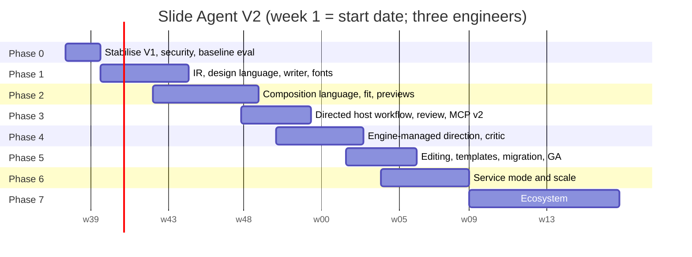

# 03 — V2 roadmap, tasks, migration, and risks

Part of the [Slide Agent V2 plan](README.md). Architecture references (§) point
to [`02-v2-architecture.md`](02-v2-architecture.md); findings `F-*`/`S-*` to
[`01-current-system-audit.md`](01-current-system-audit.md).

**Legend.**

| Key | Meaning |
|---|---|
| **P0** | Required for the release the phase produces |
| **P1** | Should ship with it; cut before letting the exit gate slip |
| **P2** | Opportunistic |
| **S** / **M** / **L** / **XL** | ≤ 3 days / ≤ 2 weeks / ≤ 4 weeks / > 4 weeks of engineer time |

---

## 1. Features: keep, redesign, remove, add

### 1.1 Keep (port with little change)

| Feature | Why | Where in V2 |
|---|---|---|
| **Model-authored art direction; no house style** (ADR-0001; the 0.15.0 "same toolkit" test) | It is the reason to run this tool inside a frontier agent. V2 keeps the principle and makes it cheap to follow | P1–P3; composition and design languages; designer-panel gates |
| Native editable PPTX output; no flattening | Core differentiator against image-rendered slide tools | `ooxml` writer |
| Offline ECMA-376 XSD validation (bundled schemas, `xmllint-wasm`) | Rare, cheap, prevents corrupt decks | `ooxml/validate`, cached per part |
| Separate package status from readiness; honest labels (preview ≠ render; heuristics ≠ scores) | Trust | `qa` readiness v2 vocabulary, plus `designReview` and `authoring` labels |
| Hash-bound artifact graph; stale-report protection | Evidence integrity | `engine` artifact store |
| Content-addressed portable packages; `SOURCE_DATE_EPOCH` reproducibility; round-trip check | Portability, reproducibility | `engine`, `finalize` |
| Graph layout, connector routing, relations solver, 5 diagram grammars | Best-in-class deterministic diagram intelligence | `diagrams`, `layout` (`free` and `layer` placement) |
| Native charts, including editable waterfall; data connectors with provenance | Editable data | `charts` |
| Contrast through translucency; accessibility checks; hyperlink allowlist; SSRF-safe image fetch | Safety and accessibility | `qa`, `render/assets` (hardened) |
| Brand kit from `.potx`; bilingual/RTL; claim and source ledgers | Real-world needs | `tokens/import`, compositions, `ir` |
| Contact sheets, tiered previews, token budgets, CI budget gates | Cost discipline | `render`, `commands` budgets |
| Semantic deck `diff`; `doctor`; multi-host installer; CI matrix; release verification; dependency audit with expiring exceptions | Engineering quality | `cli`, repo tooling |
| ADRs with "what would make this wrong"; measured release reports | Decision quality | `docs/adr`, `eval/reports` |

### 1.2 Redesign

| V1 | V2 | Findings addressed |
|---|---|---|
| Build scripts and NDJSON as the recommended authoring path | **DeckIntent with the composition language**: each slide's message, content, and composition in grid units, roles, and named tokens; components defined once; recipes optional; `free` placement for art-directed slides (§3.1, §6.2) | `F-01`, `F-13` |
| Free-prose `creativeDirection` + `visualSystem` literals | **Design language** authored by the model once per deck (concept, palette and roles, type, space, grid, shape, surfaces, texture, imagery, charts), compiled and verified into DTCG tokens; brand import with locks; presets only for draft mode (§3.2, §6.7) | `F-01`, `F-03` |
| Two visual theses + sequence and silhouette plan, written as prose | **Exploration and rhythm, still model-owned**: alternative design languages previewed side by side in ~1 s; rhythm notes returned for the model to judge (§5.1, §6.6) | `F-13` |
| 15 fallback layouts as "drafts" | **Starter components and a recipe library** in the same language — starting points the model can open and edit, and the engine's material for draft mode and template-fill (§6.3, §6.4) | `F-01`, `F-24` |
| AFM-table text estimates | **Shaping-based measurement** with a curated font library, embedding, and calibration (§6.7, §7.2) | `F-07` |
| Repair loop that rebuilds the whole deck | **Fit ladder** with an `ask` policy: design-preserving steps automatic, design-changing steps returned as choices (§7.2, §8.3) | `F-02`, `F-05` |
| Readiness that needs host visual findings; review rounds that hunt defects | **Readiness v2** reachable deterministically, plus a separate, recorded **design review** spent on judgement against the brief (§8) | `F-02`, `F-17` |
| Review packet (~10k tokens) | **Verdict** (≤ 800 tokens) + `slides_view` on demand + RunRecord (§3.6, §9.4) | `F-15`, `F-16` |
| Cold `soffice` per render; schematic fallback | **Fast in-process preview** + pooled, sandboxed fidelity renders of changed pages (§7.5, §7.6) | `F-06`, `S-05`, `S-07` |
| PptxGenJS + post-processor + sanitizer | **Template-native writer**: masters, layouts, placeholders, theme references, embedded fonts; charts via adapter (§7.3) | `F-03`, `F-08` |
| Regex OOXML editor; `patch` / `revise` / `edit` as separate mechanisms | **Leveled EditOps** on an object model (§3.5, §5.5) | `F-09`, `F-12` |
| Hand-wired CLI (20+ commands) and MCP (12 tools) | **Command registry** → CLI, MCP (7 tools), HTTP, SDK (§5.2, §13.3) | `F-12`, `F-14` |
| Hand-written types beside Zod | **Zod-only IR** (§13.2) | `F-11` |
| Heuristic thresholds as code constants | **Calibrated checks** with published precision; designer panels for design quality (§8.4) | `F-17` |
| chars/4 token estimates, MCP-only | **Provider-reported usage and cost** in RunRecords and traces (§10.3, §14) | `F-20` |
| `ExtensionRegistry` (7 interfaces) | **Plugin system** with manifests, permissions, declarative packs (§15) | — |
| VS Code extension with bespoke flows | Thin client over CLI/MCP, or retired (open question Q6) | `F-25` |

### 1.3 Remove

| Remove | Replacement | When |
|---|---|---|
| Prompt-only placeholder drafts (`create --prompt`, `RequestAnalyzer` regex inference, `ContentGenerator`, `OutlinePlanner`) | Engine-managed mode; template-fill | 1.0 |
| Built-in `LayoutRegistry` fallback layouts | Components and recipes in the composition language | 1.0 |
| Coordinate-level authoring as the documented path (inches, per-element literals) | The composition language; `canvas` stays in `compat-v1` | 1.0 |
| Mandatory defect-hunting review rounds (render → inspect → patch for overflow and collisions) | Construction and deterministic tiers; one design review for judgement | 1.0 |
| Deprecated aliases: `report.quality`, `includeImages`, `autoFix`, `create --prompt file.json`, legacy `intermediate_files/` and `logs/` discovery | — | `quality` in 0.16.0; the rest in 1.0 (kept in `compat-v1`) |
| Script execution through MCP or structured requests | CLI `--allow-script` (trusted local) and sandboxed server execution | 0.16.0 |
| Duplicate `issues` / `warnings` / `artifacts` / `generatedFiles` in results; full outline copy in `metadata.json` | Verdict + RunRecord | 0.16.0 (results), 1.0 (files) |
| Templated per-slide `reviewQuestions` | Design review against the brief and concept | 1.0 |
| Hand-written PNG codec (`rendering/png.ts`) | `sharp` | 1.0 |
| ADR-0004 clauses "no icon vocabulary" and "no components" | ADR-0007: an **opt-in** vocabulary (starter components, recipes, icons, font library, texture primitives), never applied to a directed deck without the model choosing it | Decided in Phase 0 |

### 1.4 Add

| Feature | Value | Phase |
|---|---|---|
| **Composition language and components** | The model's design decisions at ~250 tokens per slide instead of ~700 | 2 |
| **Model-authored design languages** with verification, a font library, and embedding | Distinctive typography and colour that reach the audience intact | 1, 2 |
| **Design exploration** (alternative design languages previewed side by side) | Trying two directions costs about a second and ~2k image tokens | 3 |
| **Design review loop**: host review on a fast sheet; engine-managed critic plus director revision | Judgement spent where it improves the deck | 3, 4 |
| Template-native output and **generation into customer `.potx`** (LayoutMap), with the model directing inside the locks | On-brand without generic | 1, 5 |
| **Engine-managed generation** with a director at the profile's tier, parallel composition, routed micro-tasks, budget guard, batch | Headless and API use without giving up design quality | 4 |
| **Document-to-deck ingestion** (md, docx, pdf, pptx, xlsx, csv, html) with citations to source spans | The most common real job | 4 |
| **Template-fill from directed templates** | Recurring reports at near-zero model cost, designed once by a model | 3 (local), 6 (scheduled) |
| **Recipe library**, **icon sets**, **texture primitives** (opt-in vocabulary) | Speed on routine slides; draft mode | 2, 7 |
| **Fit ladder, choices, and suggested edits** | Correct by construction without silent design changes | 2 |
| **Fast previews, issue crops, visual diff** | Sub-second loop; looking becomes cheap | 2, 5 |
| **Content QA:** number consistency, placeholders, citation coverage, readability | Fewer embarrassing decks | 3 |
| **Designer-panel evaluation** and a calibrated judge proxy | Quality measured, not assumed | 0, then every gate |
| **Speaker notes generation** (bounded) and **translation with refit** | Common requests | 4 |
| **Brand compliance QA for any PPTX** | Governance for decks not built by Slide Agent | 5 |
| **`explain`, `replay`, RunRecords, OpenTelemetry** | Debuggability, trust, operations | 3, 6 |
| **MCP v2**: output schemas, Tasks, resource links, Apps preview, streamable HTTP, sampling | Current protocol capabilities | 3, 4, 6 |
| **Server mode**: HTTP API, jobs, workers, tenants, quotas | Large-scale usage | 6 |
| **Plugin SDK and declarative packs** (components, recipes, design languages, fonts) | Extensibility without forks | 3 (SDK), 7 (registry) |
| **Exports**: HTML, Google Slides (plugin) | Reach | 7 |
| **Basic builds/transitions**, authored in compositions (optional) | Presenting polish | 7 |

---

## 2. Migration strategy

### 2.1 Principles

1. **Strangler, not big bang.** V1 stays usable and gets security fixes while V2
   grows beside it in the same monorepo.
2. **Every V1 artifact has a path forward.** Scenes, scripts, outlines, brand
   kits, and patches convert automatically or run through `compat-v1`.
3. **Prove parity with data.** Dual-run the V1 corpus through `compat-v1` and
   compare structure, geometry, text, and XSD results before any deprecation.
4. **Hosts migrate by upgrading the skill and MCP server**, not by rewriting
   prompts. For one minor release, the V2 MCP server can expose V1 tool names
   behind `--compat-v1`.

### 2.2 Concept mapping

| V1 | V2 | Conversion |
|---|---|---|
| `slide-agent.scene/1` NDJSON | SceneGraph v2 (`canvas` slides with pinned geometry) + minimal DeckIntent | Automatic (`compat-v1` importer, `V2-108`) |
| Build script (`defineDeck`) | `compat-v1` DeckBuilder shim → SceneGraph `canvas` slides; recommend rewriting as compositions | Runs as-is under `--allow-script`; rewrite guide in `MIGRATION-1.0.md` |
| Outline JSON with `kind` + fields | DeckIntent: `kind` → a recipe where a mapping exists (the author can expand it into a composition); `canvas` → `canvas` slide | Automatic with a report of unmapped slides (`V2-505`) |
| `creativeDirection` (prose, palette, typography) | Design language: prose → `direction.concept`; palette → `color.palette` and roles; typography → `type` | Automatic, heuristic, reported |
| `visualSystem` variables and styles | Design-language tokens and surfaces; repeated style groups lifted into components where they map | Automatic, with a report of what stayed literal |
| `slideChrome` | Master placeholders (footer, slide number, logo) | Automatic for standard elements; others become custom chrome |
| Symbols and groups | Components (recommended) or logical groups inside `canvas` slides | Automatic where parameters are inferable; otherwise `canvas` |
| Brand kit JSON / `.potx` | Brand pack (DTCG + LayoutMap + locks) | Automatic (`slide-agent brand import`) |
| `patch` operations | EditOp `element` or `intent` level | Automatic operation mapping |
| `revise --slide n --records` | EditOp `intent` set, or a `canvas` slide replacement | Automatic |
| `edit` operations (OOXML) | EditOp `package` level on the object model | Automatic |
| `review` packet | `slides_view` + Verdict + RunRecord | New calls |
| `validate` | `slides_build --mode check` (authored decks) or `slides_inspect` + QA (foreign decks) | New calls |
| `render` | `slides_view` (preview) or `slides_finalize` (fidelity) | New calls |
| `capabilities`, `contract` | `slides_catalog`, `slide-agent://schema/intent` | New calls |
| `visualFindings` | `reviewed` evidence on the Verdict (optional) | Same shape, renamed |
| `ExtensionRegistry` interfaces | Plugin contributions; V1 `DiagramGrammar`, `QualityCheck`, `ImageResolver`, `RenderBackend` get adapters | Adapters in `compat-v1` |

### 2.3 Code reuse map

| V1 module(s) | V2 destination | Treatment |
|---|---|---|
| `design/graph-layout.ts`, `design/routing.ts`, `diagrams/*` | `packages/diagrams` | **Port** with tests; emit LayoutNodes |
| `design/relations.ts`, `design/resolve-relations.ts` | `packages/layout` (`free` and `layer` placement) | **Port** |
| `design/font-metrics.ts` | `packages/text` | **Replace**; keep tables only as a last-resort fallback for unknown fonts |
| `design/tokens.ts`, `design/grid.ts`, `themes/*`, `config/*.json` | `packages/tokens` (design compile, presets) and `packages/layout` (grid) | **Replace** token defaults with the design-language compiler; **port** grid maths; keep `SLIDE_FORMATS` |
| `design/template.ts`, `design/brand.ts` | `packages/tokens/import` | **Extend** (LayoutMap, locks) |
| `design/bilingual.ts` | `compose` option (parallel, stacked, notes) + `translate` task | **Port** |
| `design/slide-chrome.ts` | Writer master placeholders | **Replace** |
| `design/visual-system.ts`, `layouts/freeform-composer.ts` | `packages/compose` (components, `free` placement) + `compat-v1` | **Port** |
| `authoring/*` | `compat-v1` shim; `measureText` → `packages/text` | **Compat** |
| `layouts/layout-registry.ts`, `planner/*`, `generators/*` | — (recipes are written fresh in the composition language) | **Remove** |
| `components/*`, `export/*` | `packages/ooxml/writer` (knowledge becomes invariants) | **Rewrite**; charts through adapter |
| `charts/*`, `utils/chart-schema.ts`, `data/connectors.ts` | `packages/charts` | **Port** |
| `validation/schema-validator.ts`, `validation/package-validator.ts`, `assets/ooxml-schemas/` | `packages/ooxml/validate` | **Port** |
| `validation/manifest-validator.ts`, `geometry.ts`, `accessibility.ts`, `quality.ts`, `fidelity.ts` | `packages/qa` T1–T5 | **Port and recalibrate** |
| `validation/readiness.ts`, `issue-groups.ts` | `packages/qa` readiness v2, Verdict | **Rewrite** (keep vocabulary) |
| `validation/repair.ts`, `auto-fixer.ts` | Fit ladder | **Replace** |
| `evaluation/visual-signature.ts` | `compose` rhythm analysis + `qa` T3 | **Port** with centred vectors |
| `evaluation/token-budget.ts` | `commands` budgets; `llm` usage | **Port** |
| `rendering/renderer.ts`, `text-extraction.ts` | `packages/render/fidelity` | **Rewrite** (pool, timeouts, PDFium) |
| `rendering/schematic.ts`, `png.ts` | `packages/render/preview` | **Replace** (resvg, sharp) |
| `rendering/preview-delivery.ts` | `packages/render` sheet and crops; `slides_view` | **Port** |
| `review/*` | Verdict, `slides_view`, RunRecord | **Replace** |
| `editing/patch-scene.ts` | `engine` EditOps | **Port** |
| `editing/pptx-inspector.ts`, `pptx-editor.ts`, `parse-edit-prompt.ts` | `packages/ooxml/reader` + edit router | **Rewrite** |
| `serialization/scene-ndjson.ts`, `revise-scene.ts` | `compat-v1` importer | **Compat** |
| `serialization/diff.ts`, `artifacts/*` | `engine` | **Port** |
| `images/*`, `utils/links.ts`, `utils/color.ts`, `utils/reproducible.ts` | `render/assets`, shared utils | **Port** (+ `S-03`, `S-04` fixes) |
| `contract/*` | `packages/ir` + generated catalog | **Replace** |
| `cli.ts`, `mcp-server.ts`, `pipeline.ts` | `packages/cli`, `packages/mcp`, `packages/engine` | **Rewrite** via registry |
| `doctor.ts`, `installer.ts`, `scripts/install-*` | `packages/cli` | **Port** |
| `extensions.ts` | Plugin system | **Replace** (+ V1 adapters) |

### 2.4 Dual-run validation (before 1.0 GA)

`V2-505` runs every V1 example, showcase deck, and fixture through V1 and
through `compat-v1`. It compares:
- slide and element counts;
- element geometry (tolerance 0.01 in);
- text runs;
- XSD results;
- readiness;
- preview pixel similarity (SSIM ≥ 0.98 for `canvas` slides).

Differences are triaged into "V1 bug", "intended change", or "V2 bug", and
blocking V2 bugs gate GA.

### 2.5 Release and deprecation schedule

| Milestone | V1 line | V2 line |
|---|---|---|
| Week 2 — `0.16.0` | Security fixes (`S-01`–`S-06`, `S-08`), `F-21`, result deduplication, `quality` removed | — |
| Week 11 — `1.0.0-alpha` | `0.16.x` maintenance | Engine + CLI build from directed DeckIntents; composition language; design languages and fonts; previews; recipes |
| Week 14 — `1.0.0-beta` | V1 README points to the V2 beta | MCP v2, skill v2 (directed workflow), design exploration and review, QA tiers, readiness v2, `compat-v1` |
| Week 17 — `1.0.0-rc` | — | Engine-managed direction, critic and revision, ingestion |
| Week 20 — `1.0.0` | `0.x` enters **security-only maintenance for 6 months** | GA with editing, template induction, `slide-agent migrate`, `MIGRATION-1.0.md` |
| Week 23 — `2.1.0` | — | Service mode |
| 1.0 + 6 months | `0.x` end of life | `compat-v1` retained through 1.x |

---

## 3. Phase overview and prioritised roadmap

Dates are illustrative; phases end on **exit gates**, not dates.

**Tracks (three engineers, plus a part-time designer and annotators).**

| Track | Engineer | Scope |
|---|---|---|
| A | A | Writer, OOXML reader, render backends, service workers |
| B | B | Text and fonts, layout, the composition language, components, recipes, icons, charts preview, workbench — with a part-time **presentation designer** (the grammar's worked examples, components, and recipes are design work) |
| C | C | IR, orchestrator, QA, command registry, MCP; then the model runtime and ingestion; then the server API |
| — | Annotators and designers (contract) | `V2-007` flaw labels; `V2-010` designer panels at the Phase 0, 2, 3, 4, and 5 gates |

### 3.1 Now / Next / Later

| Horizon | Outcomes | Tasks (P0 unless marked) |
|---|---|---|
| **Now** (weeks 1–7) | V1 safe and measured, including its design quality; the V2 foundation that everything else stands on | `V2-000`–`V2-010`; `V2-101`, `V2-103`–`V2-107b`; `V2-102`, `V2-108` (P1) |
| **Next** (weeks 6–17) | A host agent directs a better-than-V1 deck in 6–8 calls at about a third of the cost; engine-managed direction holds that quality | `V2-201`–`V2-210`; `V2-301`–`V2-312`; `V2-401`–`V2-410` |
| **Later** (weeks 17+) | GA with editing, templates, and migration; then scale and ecosystem | `V2-501`–`V2-507`; `V2-601`–`V2-607`; `V2-701`–`V2-709` |

### 3.2 Priority rationale

1. **Security first** (`V2-001`–`V2-004`): `S-01` is exploitable today through
   prompt injection.
2. **Measurement second** (`V2-006`, `V2-007`, `V2-010`): every later gate
   needs a baseline — for design quality as much as for cost — and V1's culture
   of measured claims is worth keeping.
3. **Quality gates before cost gates:** no V2 default is chosen until the
   designer protocol exists, and every phase gate checks quality first.
4. **Writer and fonts before the language is signed off:** compositions are
   only as correct as the measurement and emission beneath them.
5. **Host-agent mode before engine-managed mode:** it has the existing users,
   and it proves the composition language and the directed workflow without
   model-runtime risk.
6. **Templates and editing before service mode:** enterprise usefulness matters
   more than hosting.

---

## 4. Phase-by-phase plan

### Phase 0 — Stabilise V1 and measure (weeks 1–2) → `0.16.0`

**Goal.** Close the exploitable security gaps, fix the broken export, stop
paying for duplicated output, and record a measured baseline — for cost and for
design quality — for V2's gates.

#### V2-000 · Fix the `./contract` subpath export · P0 · S
- **Do:** add `src/contract/index.ts` to the tsup entry list in `package.json`
  `build` (or remove the export if it is not meant to be public). Extend
  `scripts/verify-consumer-install.mjs` to `import()` every key in `exports`.
- **Done when:** importing `@slide-agent/core/contract` from a packed tarball
  succeeds in the `consumer-install` CI job.

#### V2-001 · MCP and path security hotfix · P0 · M · fixes `S-01`, `S-02`
- **Do:**
  1. Reject `script` in requests arriving through MCP and structured request
     files unless `SLIDE_AGENT_ALLOW_SCRIPTS=1`.
  2. Set `destructiveHint: true` on tools that write files and `openWorldHint:
     true` where remote fetching is possible.
  3. Add `resolveConfined(path, roots)` to `src/utils/files.ts`. Roots come from
     MCP `roots/list`, `--root`, or the working directory. Apply it to every
     request path (`output`, `reportPath`, `metadataPath`, `inspectPath`,
     `previewsDir`, `scene`, `brand`, `configDir`, `input`, image `path` in
     `images/image-manager.ts` `locate`).
  4. Refuse symlink escapes via `realpath`.
- **Tests:** MCP integration test proving script refusal; traversal cases
  (`../`, absolute, symlink) for each path field on CLI and MCP.
- **Done when:** tests pass; `SECURITY.md` describes confinement accurately; a
  GitHub security advisory is published for `≤ 0.15.0`.

#### V2-002 · Subprocess hardening · P0 · S · fixes `S-05`, `S-08`; partial `S-07`
- **Do:**
  - `runProcess` (`src/utils/process.ts`) gains `timeoutMs` (defaults: 60 s
    `soffice`, 15 s `pdftoppm`/`pdftotext`), a process-group kill (SIGTERM,
    then SIGKILL after 5 s), a 2 MB output cap, and a minimal environment.
  - `findExecutable` ignores relative PATH entries and logs the resolved
    absolute path.
  - Seed the LibreOffice profile with link updates disabled and macro security
    set to high.
- **Tests:** a fake hanging binary is killed within timeout + grace; noisy
  output is capped; a relative PATH entry is ignored.

#### V2-003 · Archive and XML limits · P0 · M · fixes `S-06`
- **Do:** add `openPackageSafely(path, limits)` in `src/utils/ooxml.ts`.
  - Read the central directory first (for example with `yauzl`, or `fflate`
    `unzip` with a filter).
  - Enforce entries ≤ 10,000, total uncompressed size ≤ 512 MB, part size
    ≤ 64 MB, and compression ratio ≤ 200.
  - Replace every `JSZip.loadAsync` call site (`pptx-inspector.ts:181`,
    `pptx-editor.ts:73`, `:188`, `:432`, `schema-validator.ts:87`,
    `theme-manager.ts:37`, `template.ts:188`, `pptx-sanitizer.ts:315`).
  - Refuse DTDs in XML parts.
- **Tests:** a crafted zip bomb, a 50k-entry zip, a part with a DTD.

#### V2-004 · Network policy hardening · P0 · S · fixes `S-03`, `S-04`
- **Do:**
  - Fetch images through an undici `Agent` whose `connect.lookup` returns only
    the address that passed `isPrivateAddress`.
  - The effective remote policy becomes `env/config AND request`: a request
    field can narrow the policy but never enable it.
- **Tests:** a stub resolver that answers public then private is still refused;
  a request flag cannot enable fetching when the environment disables it.

#### V2-005 · Stop reporting findings three times · P0 · S · fixes `F-14`
- **Do:**
  - Build results carry grouped findings only (flat under
    `--issues flat`).
  - `warnings` excludes messages already present in findings.
  - Remove `validation.quality`.
  - Replace the `artifacts` and `generatedFiles` path lists with `deliverables`
    plus `artifactsRoot` and paths relative to it.
  - Apply the same to MCP results.
- **Done when:** the rendered `product-introduction` build result is ≤ 12,000
  characters (from 28,457), with a budget test on a defective fixture.

#### V2-006 · Evaluation harness and measured V1 baseline · P0 · L
- **Do:** create `eval/`:
  - **Corpus:** 30 briefs across 8 archetypes (board decision, pitch,
    QBR/report, training, technical architecture, sales, keynote, research
    summary), with source documents for 12 of them.
  - **Runner:** headless host sessions with at least two host models (for
    example through the Claude Agent SDK and one other agent CLI), using fixed
    preambles from `docs/model-evaluation-prompts.md`.
  - **Collectors:** provider-reported tokens (input, output, cache read and
    write), cost, turns, tool calls, wall time, readiness, findings, and
    rendered decks.
  - **Rubric slots** that link to `V2-007` labels; a report generator; a
    configurable spend cap.
- **Done when:** `eval/reports/baseline-v1.md` publishes medians and IQR per
  archetype and model; the rendered V1 decks are archived as the `V2-010` panel
  baseline; the run stays under the approved spend cap.

#### V2-007 · Human-labelled slide quality set · P0 · M (starts week 1, runs in parallel)
- **Do:**
  - Adapt the SlideAudit flaw taxonomy (layout, typography, colour, imagery,
    information) into a labelling guide.
  - Label 300 slides: 100 V1 outputs, 100 human-designed slides, and 100
    reserved for V2 outputs later. Two annotators per slide.
  - Store in `eval/labels/` with a version.
  - Define the human panel protocol, reusing `docs/human-evaluation.md`.
- **Done when:** Cohen's κ ≥ 0.6 on layout, typography, and colour; the dataset
  is versioned.

#### V2-008 · Decision records ADR-0005 to ADR-0007 · P0 · S
- **Do:** write ADR-0005 (the model directs; the engine executes), ADR-0006
  (DeckIntent with a composition language), and ADR-0007 (an opt-in design
  vocabulary). ADR-0005 keeps and sharpens ADR-0001; ADR-0007 relaxes the named
  ADR-0004 clauses. Each cites `docs/0.15.0-results.md` and this audit. Content
  outline in §7.

#### V2-009 · Monorepo skeleton · P0 · M
- **Do:**
  - pnpm workspace, Turborepo, and Changesets.
  - Move V1 to `packages/core-v1` without code changes and adapt CI.
  - Create empty V2 packages with lint and dependency-boundary rules (libraries
    may not import surfaces).
- **Done when:** V1 `verify` passes in the new layout, and the published
  `@slide-agent/core` tarball's file list is unchanged.

#### V2-010 · Design-quality benchmark and designer panel · P0 · M (starts week 1)
- **Do:**
  - A blind pairwise preference protocol: randomised order and side, decks
    shown as contact sheets plus three full slides, rater calibration on anchor
    pairs, and κ reporting.
  - A brief-fit rubric ("designed for this audience and goal", 5 points) and
    the "same tool?" identification task (`docs/human-evaluation.md` Q5).
  - Rate the `V2-006` V1 decks as the baseline, with ≥ 5 designers.
  - Pilot the statistics and agree the non-inferiority margin (Q12).
  - A model judge proxy for nightly runs, with its agreement with the panel
    published; it never gates alone.
- **Done when:** `eval/reports/baseline-v1-design.md` publishes the V1
  baseline, the protocol, the agreed margin, and the judge proxy's agreement.

**Phase 0 exit gate.**
- `0.16.0` released with `S-01`–`S-06` and `S-08` fixed, `S-07` partially
  mitigated, and `F-14` and `F-21` fixed.
- The V1 cost and design-quality baseline reports are published.
- The labelling κ threshold is met, or a remediation plan is agreed; the
  designer protocol and margin are agreed.
- ADR-0005 to ADR-0007 are accepted.

---

### Phase 1 — Foundations: IR, design language, writer, fonts (weeks 3–7)

**Goal.** Establish the data model, the design-language compiler, measurement
with a real font library, and the PowerPoint-native writer, so that compositions
built later are correct by construction and the model's typography reaches the
audience intact.

#### V2-101 · IR package · P0 · M
- **Do:** create `packages/ir` with:
  - Zod schemas for DeckIntent (direction, components, and `compose`, `recipe`,
    `auto`, and `canvas` slides), composition nodes, DesignRequest and
    DesignLanguage, preset parameters, the DTCG subset, SceneGraph v2 (with
    provenance, adjustments, and pins), EditOp, Verdict (with `authoring` and
    `designReview`), SuggestedEdit and choices, RunRecord, and SourcePack;
  - JSON Schema export with `$ref` reuse;
  - an intent-schema **digest** generator (≤ 1,500 tokens) for the catalog;
  - example documents for every slide form and a complete directed deck.
- **Done when:** parse → serialise → parse round-trips; the digest budget test
  passes; the schemas pass `ajv` strict mode.

#### V2-102 · Single-source-of-truth check · P1 · S
- **Do:** a `ts-morph` CI script that fails when an exported interface in any
  package structurally matches an IR schema but is not derived with `z.infer`.

#### V2-103 · Design-language compiler and brand import · P0 · L
- **Do:** create `packages/tokens` containing:
  - the compiler (§3.2): font resolution through `V2-107`; roles and palette
    onto the 12 theme slots, extras to `a:custClrLst`; contrast verification of
    declared and used pairs with nearest passing OKLCH values as reported
    adjustments (`culori`); type-scale resolution per format with legibility
    floors as findings; spaces, grid, shape, surfaces, texture parameters;
  - DTCG import and export;
  - ThemeSpec → `theme1.xml` + master text styles;
  - `.potx`/`.pptx` import → locked tokens + LayoutMap (placeholder inventory:
    type, idx, bbox) + locks, extending V1 `design/template.ts`;
  - presets for draft mode (mood, seed, mode, contrast, density).
- **Done when:**
  - a property test shows that for any valid DesignLanguage every used
    foreground/fill pair passes WCAG 2.2 after compile, and every change from
    the authored value is reported as an adjustment;
  - identical requests produce byte-identical ThemeSpec;
  - 20 design languages written by designers — deliberately different from one
    another — compile without unreported changes, and designers confirm the
    previews match what they wrote;
  - 5 real templates import with correct colours, fonts, and placeholders
    (golden files).

#### V2-104 · Template-native OOXML writer · P0 · XL
- **Do:** create `packages/ooxml/writer` (§7.3):
  - presentation, masters, and layouts, generated from ThemeSpec or cloned from
    a template;
  - slides with placeholders; `p:sp` (presets and `custGeom`); `p:pic` (crop,
    alt, decorative); tables styled from tokens; `p:cxnSp`;
  - notes; allowlisted hyperlinks; `schemeClr` mapping; theme font references;
    embedded font subsets (`V2-107b`); autofit emitted from fit results;
  - streaming zip via `fflate`; deterministic ids, order, and timestamps.
  - Port `pptx-sanitizer.ts` rules as writer invariants with tests.
- **Done when:**
  - 0 XSD errors across 200 generated slides;
  - LibreOffice opens all of them;
  - PowerPoint (Windows and Mac) opens without a repair prompt (`V2-106`);
  - 100% of slides have a title placeholder;
  - ≥ 90% of theme-role colour references are `schemeClr`.

#### V2-105 · Chart adapter · P0 · M
- **Do:** ChartModel → chart part + embedded workbook, generated with
  PptxGenJS inside `packages/charts/adapter` and grafted into writer packages.
  V1 `utils/chart-schema.ts` sequence rules become tests. Include the editable
  waterfall.
- **Done when:** every V1 chart kind round-trips; "Edit Data" opens in
  PowerPoint for the corpus.

#### V2-106 · Conformance and open-test suite · P0 · M
- **Do:**
  - Per PR: XSD per part, plus LibreOffice headless open and convert, in a
    container.
  - Weekly: a PowerPoint open job — Microsoft Graph conversion in a test
    tenant, or a licensed Windows runner — recording any repair prompt or
    conversion failure as a CI failure.

#### V2-107 · Font system and shaping · P0 · L
- **Do:** create `packages/text`:
  - a font library and registry: ~80 curated OFL/Apache families with
    classification metadata (serif, sans, grotesque, humanist, slab, mono,
    display, script); Carlito, Caladea, and Liberation as metric-compatible
    substitutes; installed and brand fonts; allowlisted OFL downloads under
    operator policy, hash-pinned and cached;
  - search by name and classification, and closest-face suggestions for
    unavailable families;
  - `harfbuzzjs` shaping and `linebreak` (UAX #14);
  - a paragraph model (line spacing, before/after, insets, bullets, indents);
  - a measurement cache;
  - a calibration harness against LibreOffice PDF text positions (and the
    PowerPoint corpus once `V2-106` provides it);
  - a font package split: `@slide-agent/fonts-core` (Latin subset) and optional
    script packs.
- **Done when:** on a calibration corpus of ≥ 2,000 text boxes across 12 fonts
  and 4 scripts, bundled fonts show 0 line-count mismatches and p95 width error
  ≤ 2%.

#### V2-107b · Embedded fonts · P0 · M
- **Do:** subset the faces a deck uses with harfbuzz subsetting, embed them
  through `p:embeddedFontLst`, check embedding rights (`fsType`), and verify
  rendering in PowerPoint (Windows and Mac), PowerPoint for the web, and
  LibreOffice. Measure package size per subset. Define the fallback when a
  viewer ignores embedded fonts (metric-compatible substitute, reported).
- **Done when:** 20 library families embed and render correctly in all three
  viewers, the median subset adds ≤ 60 KB per face, and ADR-0014 records the
  result. Directed decks depend on this: a typeface the audience never sees is
  not a design decision.

#### V2-108 · SceneGraph emission and V1 scene importer · P1 · M
- **Do:** SceneGraph v2 → writer; a `compat-v1` importer for
  `slide-agent.scene/1` → `canvas` slides with pinned geometry, styles, and
  assets.
- **Done when:** the 6 showcase decks and `incident-runbook.ndjson` import and
  emit with 0 XSD errors, element-count parity, and geometry within 0.01 in.

**Phase 1 exit gate.**
- V1 showcase decks re-emitted through the V2 writer: 0 XSD errors; open without
  repair in PowerPoint; 100% title placeholders; ≥ 90% theme colour references.
- The font calibration gate passes; embedded fonts render in all target
  viewers (`V2-107b`).
- 20 designer-authored design languages compile and render as authored.
- A 30-slide `canvas` deck writes in ≤ 300 ms warm.

---

### Phase 2 — Composition language, fit engine, previews, recipes (weeks 6–11) → `1.0.0-alpha`

**Goal.** Turn a directed DeckIntent into correct slides that look the way the
model composed them, with no model involvement; make looking at them nearly
free; and prove the language is expressive enough that models do not fall back
to bland layouts.

#### V2-201 · Layout engine · P0 · L
- **Do:** create `packages/layout`:
  - a grid-track resolver (fixed, `fr`, and `auto` tracks; spans; declared
    bleed);
  - a `yoga-layout` wrapper for rows and columns whose text nodes measure
    through `packages/text`;
  - `layer` and `free` placement using the V1 relations solver;
  - connectors between container children using V1 routing;
  - baseline snapping when the design language sets a baseline.
- **Done when:** property tests show that for any valid composition the solved
  frames are deterministic, inside the page or the declared bleed, and never
  negative; solving 12 slides takes p95 ≤ 60 ms warm.

#### V2-202 · Composition language, components, and grammar page · P0 · L
- **Do:**
  - the `slide-agent.compose/1` Zod schema and compiler (§3.3, §6.2);
  - components with parameters, instance overrides, and `each`/`item` repeats;
  - recipe expansion, `adjust`, and `slides_view {what: "expand"}`;
  - JSON-pointer errors that name the closest valid alternative;
  - the grammar page (`slide-agent://grammar`, ≤ 2,000 tokens) and a library of
    complete directed examples per archetype, written with the designer.
- **Done when (expressiveness gate):**
  - 30 showcase-class slides (V1 showcase slides and designer references)
    re-expressed: ≥ 90% without `free`, 100% with it, median ≤ 300 tokens per
    slide, and ≥ 90% judged faithful by designers;
  - a host model given only the grammar page writes valid compositions on the
    first attempt for ≥ 95% of 60 slide briefs.

#### V2-203 · Starter components and recipe library · P0 · L (tracks B + designer)
- **Do:** ~8 starter components and the 24 recipe families (~60 variants) in
  §6.4, all in the composition language. The `diagram` family ports V1
  `graph-layout`, `routing`, and the 5 grammars. Each recipe ships:
  - fixtures (short, nominal, long, and maximum content × 3 deliberately
    different design languages × 3 formats);
  - LayoutTree snapshots;
  - a published capacity table;
  - an accessibility reading-order test.
- **Done when:**
  - property tests pass for every variant (no overflow, out-of-bounds, or
    contrast failure for content within published budgets);
  - every variant appears in the workbench; the designer signs off each family;
  - rendered under three different design languages, five sampled families look
    like three different decks to a designer panel.

#### V2-204 · Fit ladder, adjustments, choices, and suggested edits · P0 · L
- **Do:** the §7.2 steps with `ask` and `auto` policies; adjustments recorded on
  SceneGraph elements; choices with options and effects; SuggestedEdit
  generation (§8.3) with JSON pointers; capacity and character budgets per
  region at each type step; split continuation for recipes that allow it.
- **Done when:**
  - under `fit: "ask"`, a property test proves no design-changing step is
    applied;
  - 100% of residuals carry a choice or an exact budget;
  - under `auto`, ≥ 97% of recipe slots on the eval intents fit without
    shortening.

#### V2-205 · Rhythm analysis · P1 · M
- **Do:** centred occupancy signatures from LayoutTrees; up to five rhythm
  notes in the verdict; `slides_view {what: "rhythm"}` (≤ 300 tokens); the
  draft-mode beam-search planner with a deterministic seed; decisions recorded
  for `explain`.
- **Done when:** on 20 decks marked by a designer panel, notes flag ≥ 90% of
  the adjacent near-repeats the panel marked, with ≤ 20% false notes; the draft
  plan is identical across runs.

#### V2-206 · Draft-mode selector and directed-deck suggestions · P1 · M
- **Do:** the content-shape rules in §6.5 for `auto` slides; the same rules as
  checks and suggestions in directed decks (capacity choices, chart-type
  mismatch, grammar suggestions); scored candidates written to the RunRecord.
- **Done when:** on 200 labelled slide contents, draft selection agrees with
  designer choices ≥ 85%; in directed decks, no suggestion changes a
  composition without an EditOp (test).

#### V2-207 · Icon system · P1 · M
- **Do:** create `packages/icons`: Lucide, Tabler, and Phosphor subsets
  (~1,500 icons) with a licence manifest; an SVG path → `a:custGeom` converter
  (arcs to cubics; stroke icons as `a:ln` with round caps and joins); a
  name/tag/synonym index; `?concept` resolution returning top matches.
- **Done when:** 100% of the shipped subset converts and opens in PowerPoint and
  LibreOffice, is recolourable through the theme, and matches the source SVG at
  SSIM ≥ 0.95 in previews.

#### V2-208 · Fast preview renderer · P0 · L
- **Do:** create `packages/render/preview`:
  - SceneGraph → SVG with text from shaped glyph runs;
  - a generic ECMA-376 `presetShapeDefinitions` evaluator;
  - a chart SVG renderer for native kinds; images; embedded-font rendering;
  - SVG → PNG with `@resvg/resvg-js` and the resolved fonts;
  - `sharp` for contact sheets, exploration sheets, and crops, replacing
    `rendering/png.ts`;
  - a per-slide cache.
- **Done when:**
  - p95 ≤ 80 ms per slide warm, and ≤ 1 s for 12 slides cold;
  - the CI drift job shows SSIM ≥ 0.9 against LibreOffice renders on the corpus;
  - preview images are labelled as previews in metadata.

#### V2-209 · Composition workbench · P1 · M
- **Do:** `slide-agent dev compose` (§13.4): live editing of compositions,
  components, and design languages; recipe × design × fixture × format
  galleries; overlays; export of a failing case as a test.

#### V2-210 · Directed-quality gate (alpha) · P0 · M
- **Do:**
  - Designers, and a host model with only the grammar page and examples, write
    directed intents for the 30-brief corpus.
  - Build them; run the `V2-010` protocol against the V1 baseline decks.
  - Compute inter-deck similarity.
  - Build draft versions of the same briefs and report them separately.
- **Done when:** `eval/reports/alpha-quality.md` is published with preference,
  brief fit, "same tool", and similarity results, and a nightly judge-proxy job
  tracks them.

**Phase 2 exit gate → `1.0.0-alpha`.** Quality gates first, on the 30-brief
corpus:
- directed V2 decks are non-inferior to V1 in blind designer preference (margin
  agreed in `V2-010`); brief fit ≥ V1; "same tool" identification ≤ the V1
  baseline; median inter-deck similarity ≤ the V1 baseline + 10%;
- the `V2-202` expressiveness gate passes.

Then mechanics:
- 100% XSD valid; 0 overflow, out-of-bounds, or contrast defects;
- 0 design-changing fit steps applied under `ask`;
- preview p95 ≤ 80 ms per slide; exploration sheet ≤ 1.5 s.

---

### Phase 3 — Directed host workflow, design review, MCP v2 (weeks 11–14) → `1.0.0-beta`

**Goal.** A host agent directs a deck — concept, design language, compositions
— looks at it, refines it, and finalizes it in 6–8 tool calls, at about a third
of V1's cost, with design at least as good as V1's.

#### V2-301 · Orchestrator, build DAG, caches, RunRecord · P0 · L
- **Do:** create `packages/engine`:
  - the §7.1 stage DAG with content-addressed caches (§11) in
    `.slide-agent/cache.db` + `.slide-agent/blobs/`;
  - incremental rebuilds: changed slides for intent edits; every slide from
    design compile for design edits, with text measurement cached where faces
    are unchanged;
  - `worker_threads` parallelism above 30 slides;
  - RunRecord emission, atomic writes, and cache commands (`stats`, `prune`,
    `clear`, `--no-cache`).
- **Done when:** a one-slide edit on a 30-slide deck recomputes only that slide
  (asserted through cache-hit metrics), and SLOs in §12.1 hold for build and
  rebuild.

#### V2-302 · Command registry · P0 · M
- **Do:** create `packages/commands` with `defineCommand` (§13.3). Generate:
  - CLI commands, flags, and help (commander);
  - MCP tool definitions (`inputSchema`, `outputSchema`, annotations);
  - HTTP route stubs;
  - SDK method signatures;
  - reference docs;
  - a budget test per command, running on a healthy and a defective fixture.
- **Done when:** a new command appears on every surface with no hand-written
  surface code.

#### V2-303 · MCP server v2 · P0 · L
- **Do:** create `packages/mcp`:
  - the 7 tools and resources in §5.2, including `explore`, `expand`, and
    `rhythm`, and the grammar and examples resources;
  - byte-stable catalog, grammar, and schema resources, with `ttlMs`/`cacheScope`
    when the client negotiates a spec version that supports them;
  - resource links for previews;
  - `slides_finalize` as a Task where supported, synchronous otherwise;
  - an optional MCP Apps preview view behind a flag;
  - roots-based confinement;
  - `--compat-v1` exposing V1 tool names mapped onto V2 commands.
- **Done when:** an MCP client integration test covers each tool; response
  budgets hold; a host without Tasks or Apps support still completes the flow.

#### V2-304 · Skill v2 and host installers · P0 · S
- **Do:** replace `SKILL.md` with a ≤ 1,500-token router:
  - the directed workflow: brief → concept → design language → components →
    compositions → build → look → refine → finalize;
  - when to explore alternatives; where to spend effort (hero slides composed,
    routine slides from recipes);
  - the draft workflow, and that it is labelled;
  - honesty rules.

  Update installers for Codex, Claude, Copilot, and Gemini; `doctor` checks the
  V2 surfaces.
- **Done when:** in `V2-006` runs, hosts follow the directed workflow without
  extra prompting in ≥ 90% of sessions.

#### V2-305 · QA tiers T0–T4 · P0 · L
- **Do:** create `packages/qa` with T0–T4 per §8.1:
  - port V1 geometry, accessibility, contrast, and connector checks onto
    SceneGraph, treating `layer` and `free` overlap as intentional;
  - new content checks: placeholders, number consistency, citation coverage,
    readability, duplicates, chart-type mismatch;
  - rhythm notes as non-blocking findings;
  - grouped compact findings, adjustments, choices, and SuggestedEdits;
  - calibration metadata per check.
- **Done when:** every check has fixtures (positive and negative) and a
  published precision on `V2-007` labels; checks below 0.8 precision are
  non-blocking.

#### V2-306 · Readiness v2, design-review record, and `explain` · P0 · M
- **Do:** the §8.2 state machine; the Verdict (§3.6) with `authoring` and
  `designReview`; recorded host reviews (`reviewed`); `slide-agent explain`
  (§14.2) reading RunRecords.
- **Done when:** golden tests cover every state transition and label; `explain`
  output is stable in snapshot tests.

#### V2-307 · EditOps with pins · P0 · M
- **Do:** apply `intent` (including composition nodes, `choose`, and
  `expand`), `design`, and `element` levels (§3.5); record pins that survive
  rebuilds and design changes; refuse adjustments through pins (blocking when a
  hard constraint is involved); return a delta Verdict; port V1
  `patch-scene.ts` operations onto the element level.
- **Done when:** a property test shows that applying an EditOp and rebuilding
  equals building the edited intent, and pins survive a design change.

#### V2-308 · Budget gates · P0 · S
- **Do:** CI measures the catalog (≤ 3,000), grammar page (≤ 2,000), guide,
  schema digest, build verdict (healthy and defective 30-slide fixtures), edit
  delta, rhythm and expand views, and inspect page. Estimates use chars/4 in CI,
  spot-checked monthly with provider token counting. A >10% regression fails
  the build.

#### V2-309 · Template-fill mode · P1 · M
- **Do:**
  - Intent templates: directed intents with bindings (`{{path}}`, `{{#each}}`),
    data-shape assertions (Zod), and regions declared as growable or splittable.
  - `slide-agent fill --template t.intent.json --data rows.csv|json --out dir/`.
  - One deck per row, in parallel.
  - Deterministic takeaways from `charts/stats` (phrasing templates; no model).
- **Done when:** 1,000 rows produce 1,000 valid decks with 0 model calls, and
  throughput is recorded in the RunRecord.

#### V2-310 · Catalog and guide v2 · P0 · S
- **Do:**
  - The catalog generator: grammar digest, starter components, recipe
    one-liners, font and icon search pointers, and presets (draft).
  - `slide-agent://guide` (≤ 1,500 tokens): directing a deck, headline as
    claim, where effort pays, and honesty.
  - Generated `docs/` reference.

#### V2-311 · Finalize: local fidelity pool, PDFium, T5, round-trip · P0 · M
- **Do:**
  - The `libreoffice-pool` backend for local use: warm profile, per-page
    `PageRange` export, timeouts from `V2-002`.
  - PDFium WASM rasterisation and text extraction, with Poppler as fallback.
  - T5 checks (§8.1) and a round-trip rebuild from the package.
  - `ready-unrendered` when no backend exists.
- **Done when:** finalizing a 12-slide deck takes p95 ≤ 3 s warm; one changed
  slide renders one page; T5 catches the V1 golden-defect fixtures; embedded
  fonts survive the render.

#### V2-312 · Design exploration · P1 · M
- **Do:** `slides_build {mode: "explore"}` renders ≤ 3 design languages × ≤ 4
  slides into one labelled side-by-side sheet, writes no package, and caches by
  design hash. The skill uses it on the high-stakes path.
- **Done when:** the sheet renders in ≤ 1.5 s warm at ≤ 2k image tokens, and
  choosing between explored directions takes one tool call.

**Phase 3 exit gate → `1.0.0-beta`.** Measured with `V2-006` and `V2-010`
against the Phase 0 baseline, on the same host models and briefs. **Quality
gates are evaluated first; cost gates count only if they pass.**
- Blind designer preference, directed V2 vs V1: non-inferior (target: ≥ 60%
  preferred); brief fit ≥ V1; "same tool" identification ≤ V1.
- Median cost per directed deck ↓ ≥ 55%; median model output tokens ↓ ≥ 45%.
- Median tool calls ≤ 8 directed, ≤ 5 draft.
- `ready` after the first build in ≥ 80% of runs; 0 review rounds spent on
  mechanical defects.
- Median wall time ↓ ≥ 40%.
- The draft workflow is reported separately and labelled on every verdict.

---

### Phase 4 — Engine-managed direction (weeks 13–17) → `1.0.0-rc`

**Goal.** Slide Agent directs a deck by itself from a brief and source
documents — concept, design language, compositions, critique, and revision — at
a model tier that holds design quality, with every call routed, cached,
budgeted, and measured.

#### V2-401 · Model runtime and provider adapters · P0 · L
- **Do:** create `packages/llm`:
  - the `LlmProvider` interface (§10.3);
  - adapters for Anthropic, OpenAI, and Google (official SDKs) and for
    OpenAI-compatible local endpoints;
  - structured outputs with re-validation;
  - provider-reported usage, and cost from a versioned price table;
  - retries with jitter, same-tier fallbacks on errors and refusals, timeouts;
  - rate-limit awareness.
- **Done when:** recorded-cassette tests pass for every adapter, and a live smoke
  test per provider runs nightly under the spend cap.

#### V2-402 · Routing profiles, creative floor, and budget guard · P0 · S
- **Do:** `.slide-agent/models.yaml` (§10.2) with profiles `quality`,
  `balanced`, `draft`, and `local`; the director-tier floor for `direct`,
  `compose-section`, `resolve-choices`, `critique`, `revise`, and
  `design-edit`; per-job token and dollar budgets with the degrade order
  (second revise pass → critic → stop) noted in the Verdict; effort settings per
  task.
- **Done when:** a test proves that no budget, fallback, or retry path runs a
  creative task below the profile's tier, and that draft output appears only by
  caller choice, with its label.

#### V2-403 · Cache-stable prompt library · P0 · M
- **Do:** versioned prompts per task, split into a byte-stable prefix (role,
  grammar page and examples, catalog, schema digest) and a volatile suffix
  (brief, source digest, design language, slide content); a CI test that the
  prefix is byte-identical across runs; a prompt-injection corpus in eval.
- **Done when:** repeated director calls report cache-read tokens for the full
  prefix in live smoke tests.

#### V2-404 · Micro-tasks · P0 · M
- **Do:** `shorten` (exact character budget, when delegated; rules for trivial
  trims first), `translate` (with budget, then refit), `alt-text` (small VLM;
  decorative detection is deterministic), `speaker-notes`, `chart-takeaway`
  (phrasing computed facts only), and `image-query`. Wire them into the fit
  ladder step 6 and the Verdict.
- **Done when:** `shorten` is ≥ 98% within budget with meaning preserved on a
  200-item human-checked sample, and no micro-task output contains a number
  absent from its input facts (automated check).

#### V2-405 · Ingestion to SourcePack · P1 · L
- **Do:** create `packages/ingest`:
  - extractors for Markdown, DOCX, PDF (text layer via PDFium; OCR optional),
    PPTX (via the `ooxml` reader), XLSX/CSV (tables), and HTML (readability
    extraction);
  - section and page anchors, hashing, and chunking;
  - summarisation only above budget (small model, batched, cached).
- **Done when:** a 50-page PDF and a 30-slide PPTX produce SourcePacks with
  correct anchors on a golden set, and repeat ingestion is a 100% cache hit.

#### V2-406 · Director and parallel composition · P0 · L
- **Do:**
  - `direct`: one structured call from brief + SourcePack digest + cached prefix
    to concept, design language, components, storyline, and compositions, with
    citations to source anchors;
  - `compose-section` for decks over ~15 slides: design and storyline first,
    then sections in parallel on the same prefix;
  - `resolve-choices` for fit choices and rhythm notes;
  - the `slides_generate` command; speaker notes on request.
- **Done when:** on the eval corpus, `balanced` produces schema-valid intents in
  100% of runs with 0 fabricated citations; `balanced` decks are non-inferior to
  host-directed Phase 3 decks in blind designer comparison; `balanced` costs
  ≤ $0.20 per 12-slide deck including critique and revision.

#### V2-407 · Design critic and revise loop · P0 · M
- **Do:** a critic at the profile's tier receives the contact sheet, brief, and
  concept and returns structured per-slide notes with proposed EditOps; the
  director revises; one pass by default, a second by budget; critic agreement
  with the `V2-010` panel is tracked.
- **Done when:** revised decks are preferred over unrevised ones in ≥ 55% of
  blind pairs (otherwise the critic is off by default), at ≤ $0.03 per deck for
  the critic on `balanced`.

#### V2-408 · Response cache and batch · P1 · M
- **Do:** the SQLite response cache (§11), exact-input only for creative tasks;
  a batch path for bulk `slides_generate` and template-fill phrasing; cache and
  batch stats in RunRecords.
- **Done when:** a re-run of the corpus shows ≥ 40% response-cache hits, and
  batch jobs record the discounted cost.

#### V2-409 · MCP sampling path · P2 · M
- **Do:** when the client supports sampling with tools, run `direct`, `critique`,
  `revise`, and micro-tasks through host sampling with user consent, and no
  server-side keys.

#### V2-410 · Draft profile · P1 · S
- **Do:** a small model writes content and recipe choices under a preset theme,
  with no critic; `authoring.draft` and `design: preset` on the verdict.
- **Done when:** ≤ $0.05 per 12-slide deck; draft decks are excluded from
  directed quality reports by construction (test); labels verified in golden
  tests.

**Phase 4 exit gate → `1.0.0-rc`.** On the eval corpus, quality gates first:
- `balanced` decks non-inferior to host-directed Phase 3 decks in blind designer
  preference; `quality` preferred over or tied with `balanced`;
- RunRecords show 0 creative-task calls below the profile's tier.

Then cost and reliability:
- `balanced` median cost ≤ $0.20 per 12-slide deck (measured), including one
  critique-and-revise pass; `draft` ≤ $0.05, labelled;
- p95 `slides_generate` ≤ 150 s on `balanced`;
- 0 schema-invalid model outputs reach solve;
- ≥ 40% cache hits on re-runs;
- the prompt-injection corpus causes no policy or tool change.

---

### Phase 5 — Editing, templates, migration (weeks 17–20) → `1.0.0`

**Goal.** Edit real decks robustly, generate into customer templates, and move
V1 users over.

#### V2-501 · OOXML object model: reader and editor · P0 · L
- **Do:** create `packages/ooxml/reader`:
  - a namespace-correct DOM model of presentation, slides, layouts, masters,
    shapes, text, tables, charts, images, and relationships;
  - package-level EditOps: text, table cells, chart data (including embedded
    workbook), image replace, reorder, layout reassign, theme remap, and
    import-slide with relationship remapping.
  - This replaces `editing/pptx-editor.ts`.
- **Done when:** V1 `edit` integration tests pass on the new implementation,
  and a 100-deck real-world corpus round-trips unchanged-when-unedited
  (byte-equal parts or a documented canonicalisation).

#### V2-502 · Natural-language edit router · P1 · M
- **Do:** a rule grammar for common edits, a small-model classifier fallback
  (`classify-edit`), and conversion to leveled EditOps; verify only changed
  slides; delta Verdict.
- **Done when:** on a 50-edit subset modelled on PPTArena task categories,
  success is ≥ V1 `edit` + 20 points, at ≤ $0.02 per instruction.

#### V2-503 · Template induction and generation into templates · P0 · L
- **Do:** LayoutMap classification (placeholder types, geometry rules; one-time
  labelling micro-task only for ambiguous layouts, cached by template hash);
  compositions and recipes solve into customer layouts while the model directs
  inside the locks (§6.10); brand locks enforced as blocking findings.
- **Done when:** 3 real customer-style templates produce decks with 100% title
  placeholders, body placeholders used where bound, 0 off-brand findings, and
  successful "change theme" behaviour in PowerPoint; designers prefer directed
  template-bound decks over recipe-only decks on the same template in ≥ 60% of
  blind pairs.

#### V2-504 · Brand compliance QA for any PPTX · P2 · M
- **Do:** checks for fonts and colours outside the brand pack, logo zones,
  footers, and off-master shapes; findings with EditOp suggestions.

#### V2-505 · Migration tooling and `compat-v1` · P0 · M
- **Do:**
  - `slide-agent migrate` (V1 artifacts → V2 package: `intent.json`,
    `scene.json`, `run.json`);
  - outline → DeckIntent conversion with a report;
  - the DeckBuilder shim;
  - V1 extension adapters;
  - dual-run validation (§2.4);
  - `MIGRATION-1.0.md`.
- **Done when:** every V1 example and showcase deck migrates and rebuilds with a
  passing round-trip, and the dual-run report has no blocking V2 bugs.

#### V2-506 · Visual diff · P2 · S
- **Do:** `slide-agent diff --visual` combining the V1 semantic diff with
  preview pixel diffs and changed-region crops.

#### V2-507 · 1.0 release hardening · P0 · M
- **Do:**
  - Documentation set (§13.7).
  - Examples as DeckIntents and templates.
  - A security review of all `S-*` fixes and the new surface.
  - Verification of every §12.1 SLO.
  - Final eval report comparing the V1 baseline with V2 in both modes,
    including designer-panel results for directed, engine-managed, and draft
    decks.

**Phase 5 exit gate → `1.0.0`.**
- The `V2-502` and `V2-503` gates pass.
- Designer panel: 1.0 directed decks (host and `balanced`) non-inferior to V1,
  with results published.
- All V1 examples migrate.
- 0 open Critical or High security findings.
- SLOs verified.
- Eval report published.

---

### Phase 6 — Service mode and scale (weeks 19–23) → `2.1.0`

#### V2-601 · HTTP API server · P0 · L
- **Do:** create `packages/server` (Fastify):
  - routes generated from the registry, with OpenAPI;
  - OAuth 2.1/OIDC and hashed API keys; tenants and RBAC;
  - quotas and rate limits; idempotency keys;
  - signed artifact download URLs.

#### V2-602 · Jobs, workers, storage · P0 · L
- **Do:** `pg-boss` queues; compose, LLM, and render worker pools; S3-compatible
  blob storage with per-tenant prefixes and encryption at rest; retention
  policies; no cross-tenant deduplication.

#### V2-603 · Render workers · P0 · M · completes `S-07`
- **Do:** a container image with LibreOffice, `unoserver`, fonts, and PDFium;
  gVisor or seccomp; no network; per-page export; health checks; recycle after
  N jobs; timeouts.

#### V2-604 · MCP over streamable HTTP · P1 · M
- **Do:** stateless serving per the 2026-07-28 release candidate (with a
  fallback for 2025-11-25 clients); Tasks backed by jobs; authentication per the
  MCP authorisation specification.

#### V2-605 · Observability · P0 · M
- **Do:** OpenTelemetry traces, metrics, and logs (§14.1); dashboards for
  latency, cost, cache, fit escalations, readiness, and render pool; alerting;
  a PII-redaction audit; cost reconciliation with provider invoices.

#### V2-606 · Security for service mode · P0 · L
- **Do:**
  - Threat model document; external penetration test.
  - SBOM (CycloneDX) and Sigstore signing for packages and containers.
  - Secret manager integration.
  - `isolated-vm` sandbox for scripts and code plugins.
  - Audit log.
  - Policy enforcement tests generated from command permissions.

#### V2-607 · Load and resilience testing · P0 · M
- **Do:** 1,000 decks per hour mixed workload (60% engine-managed, 30%
  template-fill, 10% edits); chaos tests (killed render workers, provider
  outages); capacity model.

**Phase 6 exit gate → `2.1.0`.**
- p95 `slides_generate` (12 slides, before fidelity render) ≤ 150 s on
  `balanced` and ≤ 45 s on `draft`.
- `finalize` p95 ≤ 20 s for 30 slides.
- Job success ≥ 99.5%.
- Cost dashboards reconcile with provider invoices within 5%.
- No High findings from the penetration test.

---

### Phase 7 — Ecosystem and continuous improvement (week 24+)

| ID | Task | Pri. | Size | Done when |
|---|---|---|---|---|
| V2-701 | Plugin SDK docs, templates (component pack, recipe pack, design-language pack, font pack, check, renderer, provider, exporter), and a signed declarative-pack registry | P1 | L | Third-party pack installs and passes conformance without code review |
| V2-702 | Exports: HTML (from SceneGraph) and Google Slides (API plugin) | P2 | L | Corpus exports with text and structure parity |
| V2-703 | First-party OOXML chart writer (retire the PptxGenJS adapter) plus combo, bubble, and funnel charts | P1 | L | Adapter removed; chart conformance tests pass |
| V2-704 | Recipe library to 40+ families; more starter components, texture primitives, and library fonts; industry packs (finance, education, engineering, sales) | P1 | L | Designer-panel and "same tool" gates still pass; workbench coverage 100% |
| V2-705 | Organisation library of approved compositions, components, and design languages, indexed with local embeddings and offered to the model as references | P2 | M | Retrieval precision@5 ≥ 0.8 on an org test set; nothing applied without an explicit EditOp (test) |
| V2-706 | Fine-tuned 7–9B models on consented traces for draft mode and mechanical tasks; a tuned director as research only (§10.4) | P2 | XL | Draft and mechanical: adopt if non-inferior at ≤ 30% of cost. Director: only if it wins or ties blind designer comparisons against `balanced` |
| V2-707 | Quarterly calibration of QA thresholds and critic items against refreshed human labels | P1 | S/quarter | Precision report published each quarter |
| V2-708 | Scheduled data-bound decks in service mode (template-fill + cron + delivery hooks) | P1 | M | Scheduled run produces and delivers decks with audit trail |
| V2-709 | Optional builds and transitions authored in compositions (default reveal order from reading order) | P2 | M | PowerPoint plays builds; XSD valid |

---

## 5. Sequencing rules and cut list

**Load-bearing orderings.**
1. `V2-001`–`V2-004` before any V2 work ships to users.
2. `V2-006` baseline and `V2-010` designer protocol before any V2 cost,
   performance, or quality claim, and before any default is chosen.
3. `V2-107` (measurement) and `V2-104` (writer) before `V2-203` recipes are
   signed off: recipes calibrated on approximate metrics would have to be redone.
4. `V2-202` expressiveness gate before `V2-304` (skill v2) and `V2-406`
   (director): both depend on a language models can compose in fluently.
5. `V2-204` (fit ladder) before `V2-303` (MCP v2): the tool surface assumes
   correct-by-construction builds with choices instead of repair rounds.
6. Phase 3 quality gate before Phase 4 director tuning: engine-managed design
   quality is bounded by the language and examples underneath.
7. `V2-505` dual-run before announcing V1 maintenance mode.

**Cut list, in order, if a gate is at risk.** Each cut is re-planned into the
next minor release.
1. `V2-409` MCP sampling path
2. `V2-504` brand compliance QA
3. `V2-506` visual diff
4. MCP Apps preview view (inside `V2-303`)
5. `V2-209` workbench polish (keep live editing and the basic gallery)
6. `V2-405` formats beyond Markdown, PDF, and DOCX
7. `V2-207` concept search (keep name lookup)
8. `V2-410` draft profile (keep draft mode for template-fill only)
9. Recipe variants from ~60 to ~40 (keep all 24 families)
10. `V2-206` draft-mode selector (recipes named explicitly)

**Never cut:** Phase 0 security fixes; the eval harness, flaw labels, and
designer protocol; the composition language and its expressiveness gate; font
embedding (`V2-107b`); writer conformance; the font calibration gate; the fit
ladder with choices; the design review loop (`V2-306`, `V2-407`); readiness v2;
budget gates; migration tooling.

---

## 6. Risks and trade-offs

### 6.1 Risk register

| ID | Risk | Likelihood | Impact | Mitigation | Early signal | Owner |
|---|---|---|---|---|---|---|
| R-01 | Decks look generic or alike | Low–Medium | High | The model directs the design language and composition by default; recipes and presets opt-in and labelled; font and texture breadth; exact-input caching only for creative outputs; blind preference and "same tool" gates at every phase (`V2-010`, `V2-210`) | Panel "same tool" answers above the V1 baseline; similarity rising in the nightly proxy | Track B + designer |
| R-02 | The composition language is not expressive enough, so models fall back to `free` placement or bland layouts | Medium | High | Expressiveness gate (`V2-202`); `layer` and `free` placement; worked examples; workbench; language changes driven by failing corpus slides | `free` share > 20% of composed nodes; faithful re-expression < 90% | Track B |
| R-03 | Writer produces files PowerPoint repairs | Medium | High | XSD per part, LibreOffice per PR, weekly PowerPoint job, sanitizer knowledge as invariants, V1 still available | Any repair prompt in `V2-106` | Track A |
| R-04 | Measured text differs from PowerPoint line breaking | Medium | High | Resolved or embedded fonts, calibration corpus, safety margins, autofit emission matching measurement | Calibration p95 > 2%; T5 truncation findings | Track B |
| R-05 | Language, component, and recipe effort underestimated | Medium | Medium | One language for everything; declarative JSON; workbench; designer; cut list items 5, 9, and 10 | < 50% of families signed off by week 9 | Track B |
| R-06 | Model or provider changes (pricing, deprecations, behaviour) | High | Medium | Adapters, profiles as data, nightly eval and panel re-checks on new releases, prompt versioning | Eval or judge-proxy regression after a provider update | Track C |
| R-07 | Evaluation validity (weak judges, costly or biased panels) | Medium | High | Deterministic metrics for mechanics; blind, randomised panels with rater calibration and κ; judge proxy never gates alone | κ < 0.6; judge/panel disagreement | Track C |
| R-08 | Design quality varies with the host model | High | Medium | Worked examples and the grammar page tuned per host family; the design review loop; exploration; engine-managed `quality` profile for weak hosts; results reported per host model | Per-host preference spread > 1 point on the 5-point scale | Track C |
| R-09 | Cost pressure moves design decisions into engine defaults over time | Medium | High | P1–P5; ADR-0005 with a measurable trigger; quality gates precede cost gates in every phase; the creative floor in routing (`V2-402`) | A PR that adds an automatic design choice to a directed path; draft share rising in directed runs | Maintainers |
| R-10 | Font freedom breaks fidelity or licensing (missing fonts, restricted embedding, package size) | Medium | Medium | Embedding by default after `V2-107b`; `fsType` checks; metric-compatible substitution reported; office-safe mode; subset size budget | Embedded-font render failures; licence review flags; package size over budget | Track B |
| R-11 | Existing users break | Medium | Medium | `compat-v1`, `migrate`, dual-run, six-month V1 maintenance, deprecation schedule | Migration issues filed during beta | All |
| R-12 | Two operating modes double the surface | Medium | Medium | One orchestrator, command registry, shared fixtures; `llm` and `ingest` optional | Features landing in one mode only | Track C |
| R-13 | LibreOffice fragility at scale | Medium | Medium | Pooling with recycling, timeouts, containers, alternative backend plugins; previews make fidelity renders rarer | Render failure rate > 1% | Track A |
| R-14 | Plugin or script sandbox escape in service mode | Low | High | Declarative-first packs, isolates, containers, penetration test | Pen-test findings | Track A/C |
| R-15 | Scope creep (service, registry) delays 1.0 | Medium | High | 1.0 GA defined at the Phase 5 gate; service is 1.1; cut list | Phase 3 gate slips > 2 weeks | Maintainers |
| R-16 | Host support for Tasks, Apps, sampling, or cache hints varies | High | Low | Graceful fallbacks: synchronous finalize, resource links, no sampling path, plain resources | Host matrix tests | Track C |

### 6.2 Trade-offs accepted

| ID | Decision | Benefit | Cost | Why accepted | Reversibility |
|---|---|---|---|---|---|
| T-01 | The model directs design by default (D1) | Distinctive, brief-specific decks; uses the capability users pay for | About twice the tokens of a recipe-driven deck (≈ $0.53 vs ≈ $0.27 in host mode); quality varies with the host model | A cheap tool that does not use the model's judgement produces decks users could get from a template gallery for free. Draft mode keeps the cheap path, labelled | Per deck (draft mode) |
| T-02 | First-party writer instead of PptxGenJS (D5) | Placeholders, theme references, embedded fonts, template generation; no repair layers | Owning OOXML emission | The team already maintains OOXML repair logic; charts stay on an adapter until `V2-703` | Low once shipped |
| T-03 | Own a composition language instead of HTML/CSS or code | Compact, deterministic, no browser; one language for model, components, recipes, and packs | Designing and documenting a DSL | Models already know grid and flex vocabulary; the expressiveness gate keeps the DSL honest | Medium |
| T-04 | In-process previews in the loop; LibreOffice only at finalize | Sub-second iteration; exploration becomes affordable | Preview ≠ PowerPoint | Labelled as preview; fidelity gate; drift CI | High |
| T-05 | Fit asks instead of acting in directed decks | No silent design changes | An occasional extra decision (~50–300 output tokens) | Choices are small structured edits; authors can opt into `fit: "auto"` | High (policy) |
| T-06 | Font library, downloads, and embedding | The model's type choices reach the audience | Install size, licensing work, package size | Typography is a large part of a deck's identity; split font packages and subsetting limit the cost | Medium |
| T-07 | `ready` without mandatory review; design review recommended by default | Mechanical readiness is deterministic; judgement is spent on design | One sheet review (~1.85k image tokens) in the default workflow | The review is the part of looking worth paying for | High (policy) |
| T-08 | Model runtime inside the project (optional package) | Headless, API, batch, weak hosts | Provider maintenance; new security surface | Needed for large-scale usage; isolated in `llm/` | High (optional) |
| T-09 | A creative-tier floor in engine-managed routing | Design quality holds under budget pressure | Higher cost per deck than routing everything cheaply (≈ $0.15 vs ≈ $0.035) | The cheaper route is `draft`, available by choice and labelled | High (profile) |
| T-10 | SQLite local store | Atomic caches and run records | Native module or experimental API | `node:sqlite` when stable, `better-sqlite3` until then | High |
| T-11 | Monorepo with optional packages | Host installs carry no provider SDKs; clear boundaries | Release complexity | Changesets plus a meta CLI package | Medium |

---

## 7. Decision records to write

| ADR | Title | Decides | Supersedes |
|---|---|---|---|
| 0005 | The model directs; the engine executes | The model owns every decision a designer would argue about; the engine owns computation with right answers; no silent taste (adjustments reported and refusable, design-changing fit steps returned as choices); recipes and presets opt-in and labelled; quality gates before cost gates. **What would make this wrong:** directed decks fail to beat or match draft decks in blind comparison | Keeps and sharpens ADR-0001; replaces coordinate-level primitives (0.15.0) as the authoring surface |
| 0006 | DeckIntent with a composition language | Grid, flex, layer, and free placement in grid units, roles, and tokens; components; recipes as saved compositions; `canvas` in `compat-v1` | Build script as recommended path |
| 0007 | An opt-in design vocabulary | Starter components, recipes, icons, font library, texture primitives, and presets; licensing; never applied to a directed deck without the model choosing it | ADR-0004 "no icon vocabulary" and "no components" clauses |
| 0008 | Template-native OOXML writer | Masters, layouts, placeholders, theme references, embedded fonts; generation into customer templates; chart adapter | PptxGenJS as writer |
| 0009 | Readiness v2 and design review | Deterministic mechanical readiness; a separate, recorded design review; `authoring` labels | 0.10/0.11 readiness requiring host findings |
| 0010 | Engine-managed model runtime | Director, critic, and micro-task roles; a creative-tier floor; profiles as data; budget guard degrade order; "numbers never from a model" | "No model in this process" |
| 0011 | Operator-owned policy and confinement | Roots, no code over MCP, font sources, requests may only narrow policy | Implicit trust of request paths and flags |
| 0012 | SceneGraph v2 and V1 compatibility | Canonical scene format with provenance, adjustments, and pins; importer guarantees | `scene/1` as canonical |
| 0013 | Command registry as the single interface definition | One definition → CLI, MCP, HTTP, SDK, docs, budgets | Hand-wired surfaces |
| 0014 | Fonts, measurement, and embedding | Font library and resolver, calibration gate, embedding by default for non-Office faces, `office-safe` mode | AFM approximation |

Each ADR follows the existing template: context, decision, consequences, and
**what would make this wrong** — with a measurable trigger.

---

## 8. Open questions for maintainers

| # | Question | Why it matters | Recommendation |
|---|---|---|---|
| Q1 | Which persona is primary for 1.0: agent developers in host tools, or enterprise template users? | Orders Phase 4 against Phase 5 | Host-agent users for beta; enterprise templates, directed inside brand locks, for GA (as planned) |
| Q2 | Are optional commercial or cloud render backends acceptable (Aspose, Microsoft Graph conversion)? | PowerPoint-true fidelity versus data-egress and licensing concerns | Yes, as opt-in plugins, never defaults |
| Q3 | Default font strategy: embed chosen faces, or `office-safe`? | Fidelity of the model's typography versus package size and corporate font policies | Embed subset OFL faces by default in directed decks after `V2-107b`; `office-safe` for brand templates that specify Office fonts |
| Q4 | Telemetry for local installs? | Improvement data versus privacy | Off by default; opt-in anonymous aggregate metrics only |
| Q5 | Licence and governance for component, recipe, design, and font packs? | Ecosystem growth | MIT for built-ins; pack licences declared and checked; font embedding rights enforced |
| Q6 | VS Code extension: thin client or retire? | Maintenance cost (`F-25`) | Thin client over the CLI and MCP for one release, then decide from usage |
| Q7 | Minimum host capabilities to support (Tasks, Apps, sampling)? | Test matrix size | Require tools + resources only; everything else progressive |
| Q8 | Is build-script authoring a supported 1.x path or compatibility only? | Documentation and support scope | Compatibility only; the supported freeform path is `free` placement inside compositions |
| Q9 | Is a hosted service in the project's scope, or a reference deployment only? | Phase 6 scope and operations | Reference deployment (Helm/Compose) in 2.1; hosting is a separate decision |
| Q10 | Who funds and runs human labelling and designer panels? | Every quality gate depends on them | Budget in Phase 0; contract annotators for flaw labels; paid designers for panels |
| Q11 | Should the host skill offer draft mode at all? | A cheap path invites use where quality matters | Yes, never as the default, labelled on every verdict, and recommended only for internal drafts |
| Q12 | What non-inferiority margin and panel size define "does not lose to V1"? | Gates are only as strong as their statistics | Decide in `V2-010` from a pilot: ≥ 5 designers, ≥ 30 briefs, one-sided test with a 10-point preference margin as the starting proposal |

---

## 9. Sources

Research and landscape (accessed September 2026):

- PPTAgent: Generating and Evaluating Presentations Beyond Text-to-Slides (EMNLP 2025) — https://aclanthology.org/2025.emnlp-main.728/ ; code, DeepPresenter updates, MCP server — https://github.com/icip-cas/pptagent
- AutoPresent: Designing Structured Visuals from Scratch (CVPR 2025) — https://arxiv.org/abs/2501.00912
- Design First, Code Later: Aesthetically Pleasing Template-Free Slides Generation (DeepSlides) — https://arxiv.org/abs/2605.26451
- Talk to Your Slides: High-Efficiency Slide Editing via Language-Driven Structured Data Manipulation — https://arxiv.org/abs/2505.11604
- PPTArena: A Benchmark for Agentic PowerPoint Editing — https://arxiv.org/abs/2512.03042
- PPT-Eval: A Benchmark for Computer-Use Agents on PowerPoint Tasks — https://arxiv.org/abs/2606.31154
- PresentBench: A Fine-Grained Rubric-Based Benchmark for Slide Generation — https://arxiv.org/abs/2603.07244
- SlideAudit: A Dataset and Taxonomy for Automated Evaluation of Presentation Slides (UIST 2025) — https://arxiv.org/abs/2508.03630
- Anthropic `pptx` agent skill — https://github.com/anthropics/skills/blob/main/skills/pptx/SKILL.md
- Presenton (open-source AI presentation generator) — https://github.com/presenton/presenton
- Beautiful.ai Smart Slides — https://www.beautiful.ai/smart-slides ; review of constraint behaviour — https://www.presentations.ai/blog/beautiful-ai-review
- 2026 tool comparisons (Gamma, Copilot, Genspark, Manus) — https://zapier.com/blog/best-ai-presentation-maker/ ; https://plusai.com/blog/best-ai-presentation-makers ; https://www.buildmvpfast.com/articles/best-llms-2026-guide/presentations-ai ; https://palpa.co.jp/en/blog/ai-slide-tool/
- NotebookLM slide decks and PPTX export limitations — https://docslide.com/blog/notebooklm-to-powerpoint ; https://plusai.com/blog/notebooklm-slides-review/

Protocols, standards, and components:

- MCP specification 2025-11-25 (tools, structured output, Tasks, sampling with tools) — https://modelcontextprotocol.io/specification/2025-11-25/server/tools ; summary — https://workos.com/blog/mcp-2025-11-25-spec-update
- MCP 2026-07-28 release candidate (stateless transport, Tasks and Apps extensions, cache metadata) — https://blog.modelcontextprotocol.io/posts/2026-07-28-release-candidate/
- Code execution with MCP and progressive disclosure (coverage of Anthropic's report) — https://brightbean.xyz/blog/code-execution-mcp-efficient-ai-agents/
- W3C Design Tokens Community Group format, first stable version 2025.10 — https://www.w3.org/community/design-tokens/2025/10/28/design-tokens-specification-reaches-first-stable-version/
- unoserver (persistent LibreOffice conversion) — https://github.com/unoconv/unoserver
- HarfBuzzJS — https://github.com/harfbuzz/harfbuzzjs
- Yoga layout — https://www.npmjs.com/package/yoga-layout
- Anthropic API model pricing and prompt caching (list prices as of mid-2026; verify before relying on them) — https://www.anthropic.com/pricing

Internal evidence (this repository at `f85fae0`):
- `docs/roadmap-0.13.0.md`, `docs/roadmap-0.15.0.md`, `docs/0.15.0-results.md`
- `docs/adr/0001`–`0004`, `docs/human-evaluation.md`, `SECURITY.md`
- The measurements in [`01 §4`](01-current-system-audit.md#4-measured-performance-and-token-profile)
